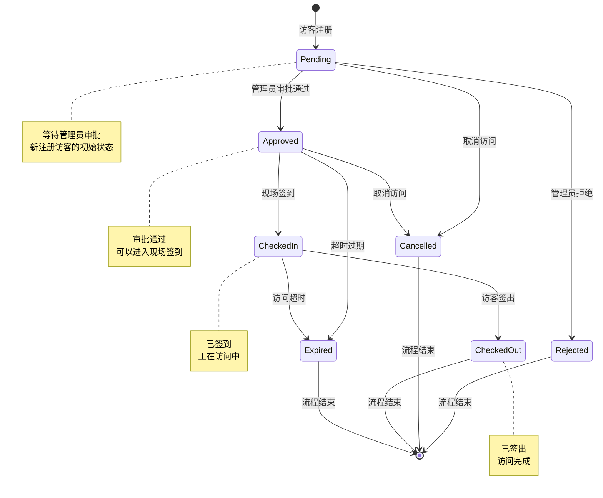
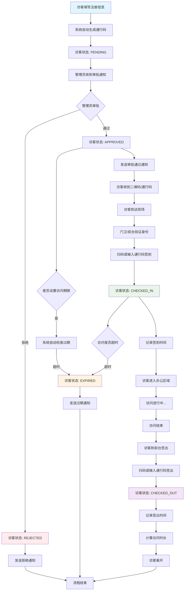
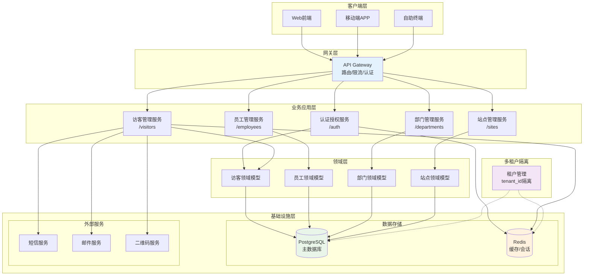
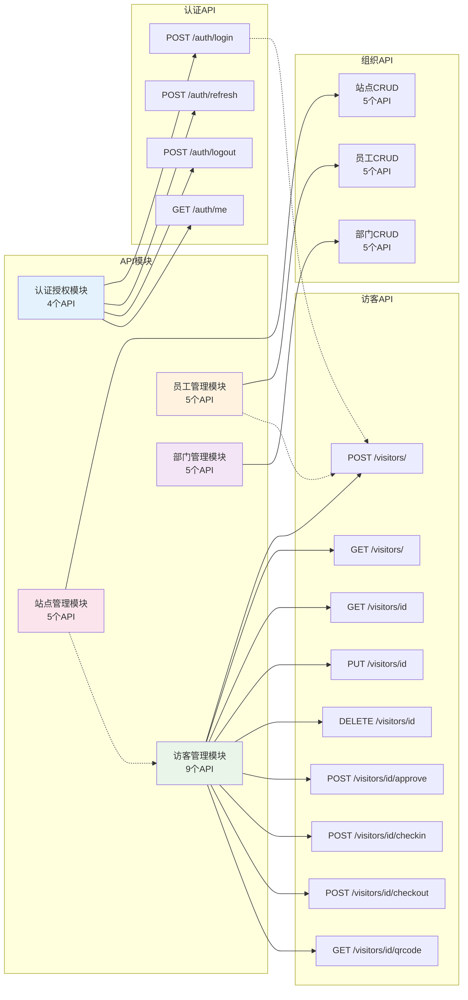
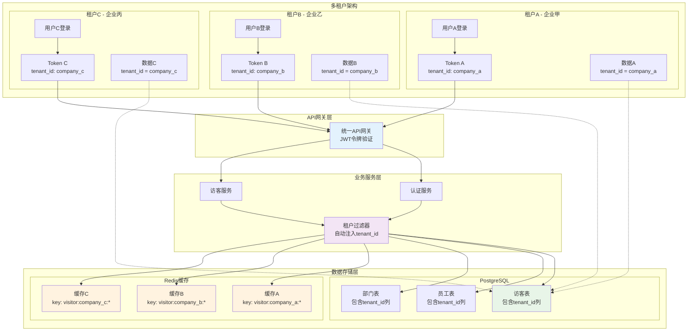

# 访客管理系统 - 业务流程图和状态转换图

## 📋 文档信息
- **文档名称**: 访客管理系统业务流程图和状态转换图
- **创建日期**: 2025-06-09
- **创建者**: 产品经理AI
- **版本**: v1.0
- **关联文档**: 
  - [完整API文档](./Visitor_Management_Complete_API_Documentation.md)
  - [需求分析文档](./Visitor_Management_Requirements_Analysis_Task.md)

---

## 🎯 图表概览

本文档包含访客管理系统的核心业务流程图表，帮助理解系统的业务逻辑、状态转换和架构设计。

### 📊 图表清单
1. **访客状态转换图** - 访客生命周期中的状态变化
2. **完整业务流程图** - 从注册到签出的完整流程
3. **系统架构图** - 技术架构和模块关系
4. **API模块关系图** - 各API模块的组织结构
5. **多租户架构图** - 多租户数据隔离机制

---

## 📋 1. 访客状态转换图

### 状态定义说明

| 状态 | 英文名称 | 描述 | 可执行操作 |
|------|----------|------|------------|
| 待审批 | PENDING | 访客注册后的初始状态 | 管理员审批、取消访问 |
| 已通过 | APPROVED | 管理员审批通过 | 现场签到、取消访问 |
| 已拒绝 | REJECTED | 管理员审批拒绝 | 流程结束 |
| 已签到 | CHECKED_IN | 访客已签到进入 | 访客签出 |
| 已签出 | CHECKED_OUT | 访客已签出离开 | 流程结束 |
| 已取消 | CANCELLED | 访问申请被取消 | 流程结束 |
| 已过期 | EXPIRED | 访问时间过期 | 流程结束 |

### 状态转换规则

**初始状态**: 访客注册后自动设置为 `PENDING`

**状态转换路径**:
1. `PENDING` → `APPROVED` (管理员审批通过)
2. `PENDING` → `REJECTED` (管理员审批拒绝)
3. `PENDING` → `CANCELLED` (取消访问)
4. `APPROVED` → `CHECKED_IN` (现场签到)
5. `APPROVED` → `CANCELLED` (取消访问)
6. `APPROVED` → `EXPIRED` (超时过期)
7. `CHECKED_IN` → `CHECKED_OUT` (访客签出)
8. `CHECKED_IN` → `EXPIRED` (访问超时)

**终止状态**: `REJECTED`, `CANCELLED`, `CHECKED_OUT`, `EXPIRED`

**注意事项**:
- 状态转换是单向的，不可逆转
- 系统会自动检查访问时限，超时自动转为 `EXPIRED`
- 每次状态变更都会记录操作时间和操作人

---

## 🔄 2. 完整业务流程图

### 主要流程阶段

#### 阶段1：访客注册
- 访客填写个人信息和访问目的
- 系统自动生成唯一通行码
- 访客状态设为 `PENDING`
- 发送审批通知给管理员

#### 阶段2：管理员审批
- 管理员查看访客信息
- 根据访问目的和政策进行审批
- **审批通过**: 状态转为 `APPROVED`，发送通知和二维码
- **审批拒绝**: 状态转为 `REJECTED`，发送拒绝通知

#### 阶段3：现场签到
- 访客到达现场
- 门卫/前台验证身份
- 扫码或输入通行码签到
- 状态转为 `CHECKED_IN`，记录签到时间

#### 阶段4：访问过程
- 访客进入办公区域
- 系统持续监控访问状态
- 检查是否超时过期

#### 阶段5：签出离开
- 访问结束，访客到前台签出
- 扫码或输入通行码签出
- 状态转为 `CHECKED_OUT`
- 自动计算访问时长

### 异常处理流程

#### 超时过期
- 系统定期检查访问时限
- 超时自动转为 `EXPIRED` 状态
- 发送过期通知

#### 取消访问
- 访客或管理员可在 `PENDING` 或 `APPROVED` 状态下取消
- 状态转为 `CANCELLED`

---

## 🏗️ 3. 系统架构图

### 架构层次说明

#### 客户端层
- **Web前端**: 管理员操作界面
- **移动端APP**: 访客自助注册和查询
- **自助终端**: 现场签到签出设备

#### 网关层
- **API Gateway**: 统一入口，负责路由、限流、认证

#### 业务应用层
- **认证授权服务**: 用户登录、JWT令牌管理
- **访客管理服务**: 核心业务逻辑
- **员工管理服务**: 员工信息维护
- **部门管理服务**: 组织架构管理
- **站点管理服务**: 多站点支持

#### 领域层
- **访客领域模型**: 访客相关业务规则
- **员工领域模型**: 员工相关业务规则
- **部门领域模型**: 部门相关业务规则
- **站点领域模型**: 站点相关业务规则

#### 基础设施层
- **PostgreSQL**: 主数据库，存储业务数据
- **Redis**: 缓存和会话存储
- **外部服务**: 短信、邮件、二维码生成

#### 多租户隔离
- **租户管理**: 基于 `tenant_id` 的数据隔离机制

---

## 🔗 4. API模块关系图

### 模块划分

#### 认证授权模块 (4个API)
- `POST /auth/login` - 用户登录
- `POST /auth/refresh` - 刷新令牌
- `POST /auth/logout` - 用户登出
- `GET /auth/me` - 获取用户信息

#### 访客管理模块 (9个API)
- `POST /visitors/` - 创建访客
- `GET /visitors/` - 获取访客列表
- `GET /visitors/{id}` - 获取访客详情
- `PUT /visitors/{id}` - 更新访客信息
- `DELETE /visitors/{id}` - 删除访客
- `POST /visitors/{id}/approve` - 审批访客
- `POST /visitors/{id}/checkin` - 访客签到
- `POST /visitors/{id}/checkout` - 访客签出
- `GET /visitors/{id}/qrcode` - 获取二维码

#### 组织管理模块 (15个API)
- **员工管理**: 5个标准CRUD API
- **部门管理**: 5个标准CRUD API
- **站点管理**: 5个标准CRUD API

### 模块依赖关系

#### 核心依赖
- 所有业务模块依赖认证授权模块
- 访客管理依赖员工管理（被访问人）
- 员工管理依赖部门管理（所属部门）
- 员工管理依赖站点管理（工作地点）
- 访客管理依赖站点管理（访问地点）

#### 数据关联
- 访客 → 员工（被访问人）
- 访客 → 站点（访问地点）
- 员工 → 部门（所属部门）
- 员工 → 站点（工作地点）
- 部门 → 站点（部门位置）

---

## 🏢 5. 多租户架构图

### 多租户隔离机制

#### 租户识别
- **JWT令牌**: 包含 `tenant_id` 字段
- **自动注入**: API网关自动解析租户信息
- **默认租户**: 未指定时使用 `"default"`

#### 数据隔离
- **行级隔离**: 所有表包含 `tenant_id` 列
- **强制过滤**: 所有查询自动添加租户条件
- **索引优化**: 基于 `tenant_id` 的复合索引

#### 缓存隔离
- **键命名**: 缓存键包含租户ID
- **独立空间**: 不同租户的缓存完全隔离
- **清理策略**: 按租户进行缓存管理

### 租户示例

#### 企业甲 (company_a)
- 用户登录获得 `tenant_id: company_a` 的令牌
- 只能访问属于 `company_a` 的数据
- 缓存键格式: `visitor:company_a:*`

#### 企业乙 (company_b)
- 用户登录获得 `tenant_id: company_b` 的令牌
- 只能访问属于 `company_b` 的数据
- 缓存键格式: `visitor:company_b:*`

#### 企业丙 (company_c)
- 用户登录获得 `tenant_id: company_c` 的令牌
- 只能访问属于 `company_c` 的数据
- 缓存键格式: `visitor:company_c:*`

### 安全保障

#### 数据完全隔离
- 跨租户数据访问在代码层面不可能
- 数据库查询强制包含租户过滤条件
- 缓存访问基于租户键进行隔离

#### 权限验证
- JWT令牌验证租户身份
- API级别的租户权限检查
- 操作审计包含租户信息

---

## 📋 6. 业务场景案例

### 案例1：完整访客流程

#### 背景
张三（ABC公司）要拜访李四（XYZ公司产品部）

#### 流程步骤
1. **注册**: 张三在XYZ公司访客系统填写信息，选择李四作为被访问人
2. **审批**: 李四收到通知，查看张三信息后审批通过
3. **通知**: 张三收到审批通过邮件和访客二维码
4. **到达**: 张三到达XYZ公司前台
5. **签到**: 前台扫描张三的二维码或输入通行码，完成签到
6. **访问**: 张三进入办公区域与李四会面
7. **签出**: 会面结束，张三在前台签出离开
8. **完成**: 系统记录完整的访问记录和时长

### 案例2：多租户场景

#### 背景
同一套系统服务多家企业

#### 租户隔离
- **A公司租户**: `tenant_id: company_a`
  - A公司员工只能看到A公司的访客
  - A公司访客只能选择A公司员工作为被访问人
- **B公司租户**: `tenant_id: company_b`
  - B公司数据与A公司完全隔离
  - 使用相同的系统但数据互不干扰

---

## 🔄 7. 状态变更事件

### 事件驱动架构

系统采用事件驱动架构，每次状态变更都会触发相应事件：

#### 访客创建事件
- **事件**: `VisitorCreatedEvent`
- **触发时机**: 访客注册成功
- **后续动作**: 发送审批通知

#### 访客审批事件
- **事件**: `VisitorApprovedEvent` / `VisitorRejectedEvent`
- **触发时机**: 管理员完成审批
- **后续动作**: 发送通知邮件/短信

#### 访客签到事件
- **事件**: `VisitorCheckedInEvent`
- **触发时机**: 访客完成签到
- **后续动作**: 记录访问日志、更新统计

#### 访客签出事件
- **事件**: `VisitorCheckedOutEvent`
- **触发时机**: 访客完成签出
- **后续动作**: 计算访问时长、生成报告

#### 访客过期事件
- **事件**: `VisitorExpiredEvent`
- **触发时机**: 系统检测到访问超时
- **后续动作**: 发送过期通知、更新状态

---

## 📊 8. 统计和报表

### 访客统计维度

#### 时间维度
- 日访客量统计
- 月访客量统计
- 年度访客趋势

#### 状态维度
- 各状态访客数量分布
- 审批通过率统计
- 访问完成率统计

#### 业务维度
- 热门被访问员工排行
- 访问目的分析
- 访问时长分析

#### 租户维度
- 按租户的访客量统计
- 租户活跃度分析
- 资源使用情况

---

## 🔧 9. 扩展和集成

### 系统集成点

#### 身份认证集成
- LDAP/AD域账户集成
- SSO单点登录集成
- 多因素认证(MFA)集成

#### 通知集成
- 企业微信/钉钉通知
- 短信网关集成
- 邮件服务集成

#### 硬件集成
- 闸机设备集成
- 摄像头人脸识别
- 身份证读卡器集成

#### 第三方服务集成
- 地图导航服务
- 车牌识别系统
- 安防监控系统

### 扩展能力

#### 功能扩展
- 访客评价系统
- 访问预约系统
- VIP访客绿色通道
- 访客行为分析

#### 技术扩展
- 微服务拆分
- 消息队列集成
- 分布式部署
- 多数据中心同步

---

## 📋 10. 总结

### 系统特色

#### 业务完整性
- ✅ 覆盖访客完整生命周期
- ✅ 支持复杂审批流程
- ✅ 多维度统计分析
- ✅ 完善的异常处理

#### 技术先进性
- ✅ 微服务架构设计
- ✅ 事件驱动模式
- ✅ 多租户数据隔离
- ✅ 高性能缓存优化

#### 扩展性强
- ✅ 插件化架构
- ✅ 第三方集成友好
- ✅ 水平扩展支持
- ✅ 云原生部署

### 适用场景

1. **企业办公楼** - 日常访客管理和安全控制
2. **政府机关** - 严格的访客审批和记录
3. **工业园区** - 多企业共享的访客系统
4. **医院学校** - 特殊场所的访客管理
5. **SaaS服务** - 多租户云服务模式

### 核心价值

- **安全可控**: 完整的访客身份验证和访问控制
- **流程规范**: 标准化的访客管理流程
- **数据驱动**: 丰富的统计分析和报表
- **扩展性强**: 支持定制化开发和集成
- **用户友好**: 简洁直观的操作界面

系统已具备企业级生产环境部署能力，可根据具体业务需求进行定制化开发和功能扩展。 