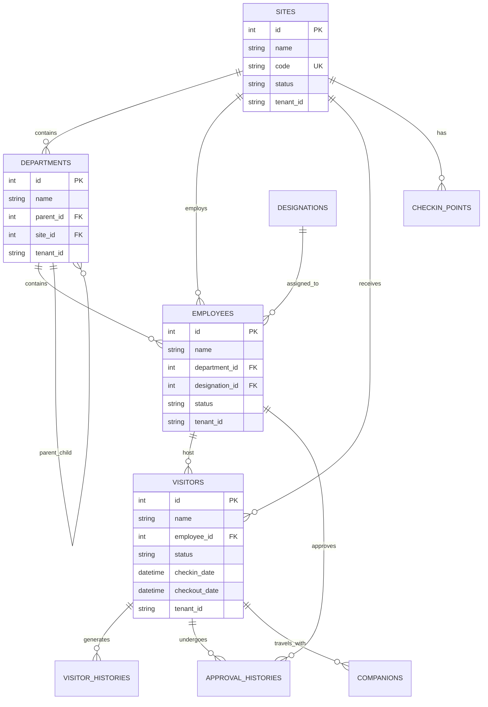

# 数据库设计说明

## 数据库选型

**数据库类型**: PostgreSQL 15+

**选择原因**:
- 优秀的 Python 生态支持（asyncpg、SQLAlchemy）
- 强大的 JSON 支持，适合复杂数据结构
- 行级安全策略（RLS），天然支持多租户架构
- 丰富的索引类型和查询优化能力
- 开源免费，企业级稳定性

## 核心数据表结构

### 1. 站点表 (sites)

| 字段名 | 数据类型 | 约束 | 描述 |
|--------|----------|------|------|
| id | INTEGER | PRIMARY KEY | 站点ID |
| name | VARCHAR(100) | NOT NULL | 站点名称 |
| code | VARCHAR(50) | NOT NULL, UNIQUE | 站点编码 |
| description | TEXT | - | 站点描述 |
| address | VARCHAR(200) | - | 详细地址 |
| city | VARCHAR(50) | - | 城市 |
| province | VARCHAR(50) | - | 省份 |
| postal_code | VARCHAR(10) | - | 邮政编码 |
| country | VARCHAR(50) | DEFAULT '中国' | 国家 |
| phone | VARCHAR(20) | - | 联系电话 |
| email | VARCHAR(100) | - | 联系邮箱 |
| website | VARCHAR(200) | - | 网站地址 |
| latitude | FLOAT | - | 纬度 |
| longitude | FLOAT | - | 经度 |
| status | VARCHAR(20) | DEFAULT 'active' | 站点状态 |
| working_hours_start | VARCHAR(5) | DEFAULT '09:00' | 工作开始时间 |
| working_hours_end | VARCHAR(5) | DEFAULT '18:00' | 工作结束时间 |
| timezone | VARCHAR(50) | DEFAULT 'Asia/Shanghai' | 时区 |
| tenant_id | VARCHAR(50) | NOT NULL, INDEX | 租户ID |
| created_at | TIMESTAMP | DEFAULT NOW() | 创建时间 |
| updated_at | TIMESTAMP | DEFAULT NOW() | 更新时间 |
| created_by | VARCHAR(100) | - | 创建人 |
| updated_by | VARCHAR(100) | - | 更新人 |
| is_deleted | BOOLEAN | DEFAULT FALSE | 是否删除 |
| deleted_at | TIMESTAMP | - | 删除时间 |
| deleted_by | VARCHAR(100) | - | 删除人 |

**索引建议**:
- `idx_sites_tenant_status` (tenant_id, status)
- `idx_sites_code` (code)

### 2. 部门表 (departments)

| 字段名 | 数据类型 | 约束 | 描述 |
|--------|----------|------|------|
| id | INTEGER | PRIMARY KEY | 部门ID |
| name | VARCHAR(100) | NOT NULL | 部门名称 |
| code | VARCHAR(50) | - | 部门编码 |
| description | TEXT | - | 部门描述 |
| parent_id | INTEGER | FK(departments.id) | 上级部门ID |
| sort_order | INTEGER | DEFAULT 0 | 排序顺序 |
| phone | VARCHAR(20) | - | 部门电话 |
| email | VARCHAR(100) | - | 部门邮箱 |
| address | VARCHAR(200) | - | 办公地址 |
| manager_id | INTEGER | FK(employees.id) | 部门经理ID |
| site_id | INTEGER | FK(sites.id) | 所属站点ID |
| tenant_id | VARCHAR(50) | NOT NULL, INDEX | 租户ID |
| created_at | TIMESTAMP | DEFAULT NOW() | 创建时间 |
| updated_at | TIMESTAMP | DEFAULT NOW() | 更新时间 |
| created_by | VARCHAR(100) | - | 创建人 |
| updated_by | VARCHAR(100) | - | 更新人 |
| is_deleted | BOOLEAN | DEFAULT FALSE | 是否删除 |

**索引建议**:
- `idx_departments_tenant_parent` (tenant_id, parent_id)
- `idx_departments_site` (site_id)

### 3. 职位表 (designations)

| 字段名 | 数据类型 | 约束 | 描述 |
|--------|----------|------|------|
| id | INTEGER | PRIMARY KEY | 职位ID |
| name | VARCHAR(100) | NOT NULL | 职位名称 |
| code | VARCHAR(50) | - | 职位编码 |
| description | TEXT | - | 职位描述 |
| level | INTEGER | DEFAULT 1 | 职位级别 |
| site_id | INTEGER | FK(sites.id) | 所属站点ID |
| tenant_id | VARCHAR(50) | NOT NULL, INDEX | 租户ID |
| created_at | TIMESTAMP | DEFAULT NOW() | 创建时间 |
| updated_at | TIMESTAMP | DEFAULT NOW() | 更新时间 |
| created_by | VARCHAR(100) | - | 创建人 |
| updated_by | VARCHAR(100) | - | 更新人 |
| is_deleted | BOOLEAN | DEFAULT FALSE | 是否删除 |

### 4. 员工表 (employees) ⭐ 已更新 (2025-06-07)

| 字段名 | 数据类型 | 约束 | 描述 |
|--------|----------|------|------|
| id | INTEGER | PRIMARY KEY | 员工ID |
| name | VARCHAR(100) | NOT NULL | 员工姓名 |
| **employee_id** | **VARCHAR(50)** | **NOT NULL, UNIQUE** | **员工工号(唯一标识)** |
| email | VARCHAR(100) | - | 邮箱地址 |
| phone_number | VARCHAR(20) | - | 电话号码 |
| gender | VARCHAR(10) | - | 性别 |
| department_id | INTEGER | FK(departments.id) | 部门ID |
| designation_id | INTEGER | FK(designations.id) | 职位ID |
| **position** | **VARCHAR(100)** | **-** | **职位名称** |
| **manager_id** | **INTEGER** | **FK(employees.id)** | **上级员工ID** |
| about | TEXT | - | 个人简介 |
| avatar | VARCHAR(200) | - | 头像URL |
| employee_number | VARCHAR(50) | - | 工号(旧字段,兼容性) |
| **hire_date** | **TIMESTAMP** | **-** | **入职日期** |
| **birth_date** | **TIMESTAMP** | **-** | **出生日期** |
| **address** | **VARCHAR(200)** | **-** | **地址** |
| **emergency_contact** | **VARCHAR(100)** | **-** | **紧急联系人** |
| **emergency_phone** | **VARCHAR(20)** | **-** | **紧急联系电话** |
| **salary** | **FLOAT** | **-** | **薪资** |
| status | VARCHAR(20) | DEFAULT 'active' | 员工状态 |
| related_account_id | VARCHAR(100) | - | 关联账户ID |
| site_id | INTEGER | FK(sites.id) | 所属站点ID |
| tenant_id | VARCHAR(50) | NOT NULL, INDEX | 租户ID |
| created_at | TIMESTAMP | DEFAULT NOW() | 创建时间 |
| updated_at | TIMESTAMP | DEFAULT NOW() | 更新时间 |
| created_by | VARCHAR(100) | - | 创建人 |
| updated_by | VARCHAR(100) | - | 更新人 |
| is_deleted | BOOLEAN | DEFAULT FALSE | 是否删除 |

**索引建议**:
- `idx_employees_tenant_dept` (tenant_id, department_id)
- `idx_employees_email` (email)
- `idx_employees_status` (status)
- **`idx_employees_employee_id` (employee_id) - UNIQUE** ⭐ 新增
- **`idx_employees_manager` (manager_id)** ⭐ 新增

**外键约束**:
- FOREIGN KEY (department_id) REFERENCES departments(id)
- FOREIGN KEY (designation_id) REFERENCES designations(id)
- FOREIGN KEY (site_id) REFERENCES sites(id)
- **FOREIGN KEY (manager_id) REFERENCES employees(id)** ⭐ 新增

**更新说明**:
- 添加了 `employee_id` 字段作为员工的唯一工号标识
- 添加了 `manager_id` 字段支持组织层级关系
- 添加了 `position` 字段存储职位名称
- 添加了员工个人信息字段：`hire_date`, `birth_date`, `address`
- 添加了紧急联系人信息：`emergency_contact`, `emergency_phone`
- 添加了 `salary` 字段存储薪资信息
- 保留了原有的 `employee_number` 字段以确保向后兼容

### 5. 访客表 (visitors)

| 字段名 | 数据类型 | 约束 | 描述 |
|--------|----------|------|------|
| id | INTEGER | PRIMARY KEY | 访客ID |
| pass_code | VARCHAR(50) | - | 通行码 |
| name | VARCHAR(100) | NOT NULL | 访客姓名 |
| email | VARCHAR(100) | - | 邮箱地址 |
| phone_number | VARCHAR(20) | - | 电话号码 |
| identification_no | VARCHAR(50) | - | 证件号码 |
| license_plate_number | VARCHAR(20) | - | 车牌号 |
| address | VARCHAR(200) | - | 地址 |
| gender | VARCHAR(10) | - | 性别 |
| company_name | VARCHAR(100) | - | 公司名称 |
| purpose | VARCHAR(50) | - | 访问目的 |
| comment | TEXT | - | 备注 |
| designation_id | INTEGER | FK(designations.id) | 职位ID |
| employee_id | INTEGER | FK(employees.id) | 被访问员工ID |
| checkin_date | TIMESTAMP | - | 签到时间 |
| checkout_date | TIMESTAMP | - | 签出时间 |
| expected_date | TIMESTAMP | - | 预期访问日期 |
| expected_time | TIME | - | 预期访问时间 |
| avatar | VARCHAR(200) | - | 头像URL |
| trip_code | VARCHAR(100) | - | 行程码 |
| health_code | VARCHAR(100) | - | 健康码 |
| qr_code | VARCHAR(200) | - | 二维码 |
| nucleic_acid_test_report | VARCHAR(200) | - | 核酸检测报告 |
| privacy_policy | BOOLEAN | - | 是否同意隐私政策 |
| promise | BOOLEAN | - | 是否承诺信息真实 |
| status | VARCHAR(20) | DEFAULT 'pending' | 访客状态 |
| approved | BOOLEAN | - | 是否已审批 |
| approval_outcome | VARCHAR(20) | - | 审批结果 |
| approval_comment | TEXT | - | 审批意见 |
| site_id | INTEGER | FK(sites.id) | 站点ID |
| survey_response_value | INTEGER | - | 调查问卷得分 |
| tenant_id | VARCHAR(50) | NOT NULL, INDEX | 租户ID |
| created_at | TIMESTAMP | DEFAULT NOW() | 创建时间 |
| updated_at | TIMESTAMP | DEFAULT NOW() | 更新时间 |
| created_by | VARCHAR(100) | - | 创建人 |
| updated_by | VARCHAR(100) | - | 更新人 |
| is_deleted | BOOLEAN | DEFAULT FALSE | 是否删除 |

**索引建议**:
- `idx_visitors_tenant_status` (tenant_id, status)
- `idx_visitors_employee` (employee_id)
- `idx_visitors_phone` (phone_number)
- `idx_visitors_email` (email)
- `idx_visitors_date` (created_at)

### 6. 访客历史表 (visitor_histories)

| 字段名 | 数据类型 | 约束 | 描述 |
|--------|----------|------|------|
| id | INTEGER | PRIMARY KEY | 历史记录ID |
| visitor_id | INTEGER | FK(visitors.id), NOT NULL | 访客ID |
| action | VARCHAR(50) | NOT NULL | 操作类型 |
| action_time | TIMESTAMP | DEFAULT NOW() | 操作时间 |
| description | TEXT | - | 操作描述 |
| operator | VARCHAR(100) | - | 操作人 |
| ip_address | VARCHAR(45) | - | IP地址 |
| user_agent | VARCHAR(500) | - | 用户代理 |
| tenant_id | VARCHAR(50) | NOT NULL, INDEX | 租户ID |
| created_at | TIMESTAMP | DEFAULT NOW() | 创建时间 |

**索引建议**:
- `idx_visitor_histories_visitor` (visitor_id)
- `idx_visitor_histories_tenant_time` (tenant_id, action_time)

### 7. 审批历史表 (approval_histories)

| 字段名 | 数据类型 | 约束 | 描述 |
|--------|----------|------|------|
| id | INTEGER | PRIMARY KEY | 审批记录ID |
| visitor_id | INTEGER | FK(visitors.id), NOT NULL | 访客ID |
| approver_id | INTEGER | FK(employees.id) | 审批人ID |
| approval_outcome | VARCHAR(20) | NOT NULL | 审批结果 |
| approval_comment | TEXT | - | 审批意见 |
| approval_date | TIMESTAMP | DEFAULT NOW() | 审批时间 |
| tenant_id | VARCHAR(50) | NOT NULL, INDEX | 租户ID |
| created_at | TIMESTAMP | DEFAULT NOW() | 创建时间 |

**索引建议**:
- `idx_approval_histories_visitor` (visitor_id)
- `idx_approval_histories_approver` (approver_id)

### 8. 签到点表 (checkin_points)

| 字段名 | 数据类型 | 约束 | 描述 |
|--------|----------|------|------|
| id | INTEGER | PRIMARY KEY | 签到点ID |
| name | VARCHAR(100) | NOT NULL | 签到点名称 |
| code | VARCHAR(50) | NOT NULL | 签到点编码 |
| description | TEXT | - | 描述 |
| location | VARCHAR(200) | - | 位置描述 |
| is_active | BOOLEAN | DEFAULT TRUE | 是否启用 |
| site_id | INTEGER | FK(sites.id) | 所属站点ID |
| tenant_id | VARCHAR(50) | NOT NULL, INDEX | 租户ID |
| created_at | TIMESTAMP | DEFAULT NOW() | 创建时间 |
| updated_at | TIMESTAMP | DEFAULT NOW() | 更新时间 |
| created_by | VARCHAR(100) | - | 创建人 |
| updated_by | VARCHAR(100) | - | 更新人 |
| is_deleted | BOOLEAN | DEFAULT FALSE | 是否删除 |

### 9. 同行人员表 (companions)

| 字段名 | 数据类型 | 约束 | 描述 |
|--------|----------|------|------|
| id | INTEGER | PRIMARY KEY | 同行人员ID |
| visitor_id | INTEGER | FK(visitors.id), NOT NULL | 访客ID |
| name | VARCHAR(100) | NOT NULL | 同行人姓名 |
| identification_no | VARCHAR(50) | - | 证件号码 |
| phone_number | VARCHAR(20) | - | 电话号码 |
| relationship | VARCHAR(50) | - | 关系 |
| tenant_id | VARCHAR(50) | NOT NULL, INDEX | 租户ID |
| created_at | TIMESTAMP | DEFAULT NOW() | 创建时间 |

## 实体关系图 (ERD)



## 多租户设计

### 行级安全策略 (RLS)

为每个表启用行级安全策略，确保租户间数据隔离：

```sql
-- 启用RLS
ALTER TABLE visitors ENABLE ROW LEVEL SECURITY;

-- 创建策略
CREATE POLICY tenant_isolation ON visitors
    USING (tenant_id = current_setting('app.current_tenant'));

-- 设置当前租户
SET app.current_tenant = 'tenant_123';
```

### 索引优化

所有多租户表都需要在 `tenant_id` 上建立索引，并考虑复合索引：

```sql
-- 单字段索引
CREATE INDEX idx_visitors_tenant ON visitors(tenant_id);

-- 复合索引（查询优化）
CREATE INDEX idx_visitors_tenant_status ON visitors(tenant_id, status);
CREATE INDEX idx_visitors_tenant_date ON visitors(tenant_id, created_at);
```

## 性能优化建议

### 1. 分区策略
对于大量数据的表（如访客表、历史表），可以考虑按时间分区：

```sql
-- 按月分区访客表
CREATE TABLE visitors_y2024m01 PARTITION OF visitors
    FOR VALUES FROM ('2024-01-01') TO ('2024-02-01');
```

### 2. 查询优化
- 使用覆盖索引减少回表查询
- 合理使用部分索引
- 定期更新表统计信息

### 3. 连接池配置
- 设置合适的连接池大小
- 配置连接超时和空闲超时
- 启用连接预热

## 数据完整性约束

### 外键约束
所有外键关系都需要建立约束确保数据一致性：

```sql
ALTER TABLE visitors 
ADD CONSTRAINT fk_visitors_employee 
FOREIGN KEY (employee_id) REFERENCES employees(id);

ALTER TABLE visitors 
ADD CONSTRAINT fk_visitors_site 
FOREIGN KEY (site_id) REFERENCES sites(id);
```

### 检查约束
添加业务规则检查约束：

```sql
-- 访客状态检查
ALTER TABLE visitors 
ADD CONSTRAINT chk_visitor_status 
CHECK (status IN ('pending', 'approved', 'rejected', 'checked_in', 'checked_out', 'cancelled', 'expired'));

-- 签出时间必须晚于签到时间
ALTER TABLE visitors 
ADD CONSTRAINT chk_checkin_checkout 
CHECK (checkout_date IS NULL OR checkout_date > checkin_date);
```

## 备份与恢复策略

### 1. 定期备份
- 每日全量备份
- 每小时增量备份
- WAL日志归档

### 2. 数据保留策略
- 访客数据保留3年
- 审计日志保留7年
- 系统日志保留1年

### 3. 恢复测试
- 月度恢复测试
- 灾难恢复演练
- 数据一致性验证 