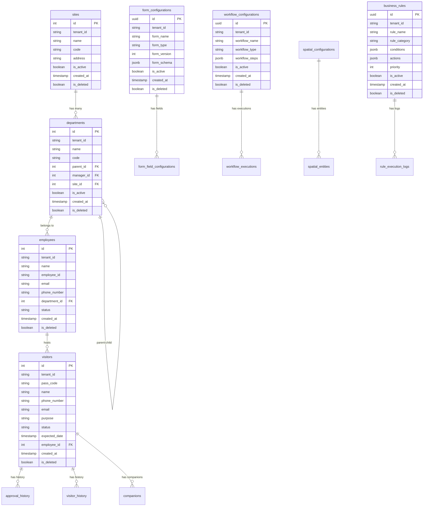

# 后端数据模型设计文档

## 📋 文档信息
- **版本**: v2.0.0
- **创建日期**: 2025-06-17
- **最后更新**: 2025-06-17
- **数据库版本**: 20250608_120000
- **适用角色**: 数据库管理员、后端开发者、架构师

## 🎯 数据模型概述

访客管理系统采用 **PostgreSQL** 作为主数据库，包含 **16个核心数据表**，支持完整的访客管理业务流程和通用化配置引擎。数据模型遵循 **多租户架构**，实现租户级数据隔离。

### 数据库特性
- ✅ **多租户支持**: 所有业务表包含 tenant_id 字段
- ✅ **审计追踪**: 创建者、更新者、删除状态完整记录
- ✅ **软删除**: 逻辑删除，支持数据恢复
- ✅ **JSONB支持**: 灵活的半结构化数据存储
- ✅ **高性能索引**: 34个优化索引，覆盖所有查询场景
- ✅ **完整性约束**: 外键关系、唯一性约束、检查约束

## 🏗️ 数据库架构

### 数据表分类
```
访客管理系统数据表
├── 基础数据表
│   ├── sites (站点)
│   ├── departments (部门)
│   ├── designations (职位)
│   └── employees (员工)
├── 业务数据表
│   ├── visitors (访客)
│   ├── visitor_history (访客历史)
│   ├── approval_history (审批历史)
│   ├── checkin_points (签到点)
│   └── companions (同行人员)
└── 配置引擎表
    ├── form_configurations (表单配置)
    ├── form_field_configurations (表单字段配置)
    ├── spatial_configurations (空间配置)
    ├── spatial_entities (空间实体)
    ├── workflow_configurations (工作流配置)
    ├── workflow_executions (工作流执行)
    ├── business_rules (业务规则)
    └── rule_execution_logs (规则执行日志)
```

## 📊 数据表详细设计

### 基础数据表

#### 1. sites (站点表)
**用途**: 存储组织的物理站点信息

| 字段名 | 数据类型 | 约束 | 说明 |
|--------|----------|------|------|
| id | SERIAL | PRIMARY KEY | 站点ID |
| tenant_id | VARCHAR(100) | NOT NULL | 租户ID |
| name | VARCHAR(255) | NOT NULL | 站点名称 |
| code | VARCHAR(50) | UNIQUE | 站点编码 |
| address | TEXT | | 详细地址 |
| city | VARCHAR(100) | | 城市 |
| province | VARCHAR(100) | | 省份 |
| country | VARCHAR(100) | | 国家 |
| phone | VARCHAR(20) | | 联系电话 |
| email | VARCHAR(255) | | 邮箱地址 |
| is_active | BOOLEAN | DEFAULT TRUE | 是否激活 |
| created_at | TIMESTAMP WITH TIME ZONE | DEFAULT NOW() | 创建时间 |
| updated_at | TIMESTAMP WITH TIME ZONE | DEFAULT NOW() | 更新时间 |
| created_by | VARCHAR(100) | | 创建者 |
| updated_by | VARCHAR(100) | | 更新者 |
| is_deleted | BOOLEAN | DEFAULT FALSE | 软删除标记 |
| deleted_at | TIMESTAMP WITH TIME ZONE | | 删除时间 |
| deleted_by | VARCHAR(100) | | 删除者 |

**索引**:
- `idx_sites_tenant_id` - 租户查询优化
- `idx_sites_code` - 站点编码查询
- `idx_sites_soft_delete` - 软删除查询优化

**业务约束**:
- 同一租户内站点编码唯一
- 站点名称长度限制 2-255 字符

#### 2. departments (部门表)
**用途**: 存储组织的部门层级结构

| 字段名 | 数据类型 | 约束 | 说明 |
|--------|----------|------|------|
| id | SERIAL | PRIMARY KEY | 部门ID |
| tenant_id | VARCHAR(100) | NOT NULL | 租户ID |
| name | VARCHAR(255) | NOT NULL | 部门名称 |
| code | VARCHAR(50) | | 部门编码 |
| description | TEXT | | 部门描述 |
| parent_id | INTEGER | FOREIGN KEY(departments.id) | 父部门ID |
| manager_id | INTEGER | FOREIGN KEY(employees.id) | 部门经理ID |
| site_id | INTEGER | FOREIGN KEY(sites.id) | 所属站点ID |
| is_active | BOOLEAN | DEFAULT TRUE | 是否激活 |
| created_at | TIMESTAMP WITH TIME ZONE | DEFAULT NOW() | 创建时间 |
| updated_at | TIMESTAMP WITH TIME ZONE | DEFAULT NOW() | 更新时间 |
| created_by | VARCHAR(100) | | 创建者 |
| updated_by | VARCHAR(100) | | 更新者 |
| is_deleted | BOOLEAN | DEFAULT FALSE | 软删除标记 |
| deleted_at | TIMESTAMP WITH TIME ZONE | | 删除时间 |
| deleted_by | VARCHAR(100) | | 删除者 |

**索引**:
- `idx_departments_tenant_id` - 租户查询优化
- `idx_departments_parent_id` - 层级查询优化
- `idx_departments_site_id` - 站点关联查询
- `idx_departments_soft_delete` - 软删除查询优化

**业务约束**:
- 不能将自己设为父部门 (防止循环引用)
- 同一父部门下部门名称唯一

#### 3. employees (员工表)
**用途**: 存储员工基本信息和认证信息

| 字段名 | 数据类型 | 约束 | 说明 |
|--------|----------|------|------|
| id | SERIAL | PRIMARY KEY | 员工ID |
| tenant_id | VARCHAR(100) | NOT NULL | 租户ID |
| name | VARCHAR(255) | NOT NULL | 员工姓名 |
| employee_id | VARCHAR(50) | UNIQUE | 工号 |
| email | VARCHAR(255) | UNIQUE | 邮箱地址 |
| phone_number | VARCHAR(20) | | 联系电话 |
| department_id | INTEGER | FOREIGN KEY(departments.id) | 所属部门ID |
| designation_id | INTEGER | FOREIGN KEY(designations.id) | 职位ID |
| position | VARCHAR(100) | | 职位名称 |
| hire_date | DATE | | 入职日期 |
| status | employee_status | DEFAULT 'active' | 员工状态 |
| username | VARCHAR(50) | UNIQUE | 登录用户名 |
| password_hash | VARCHAR(255) | | 密码哈希 |
| last_login | TIMESTAMP WITH TIME ZONE | | 最后登录时间 |
| failed_login_attempts | INTEGER | DEFAULT 0 | 失败登录次数 |
| account_locked_until | TIMESTAMP WITH TIME ZONE | | 账户锁定到期时间 |
| created_at | TIMESTAMP WITH TIME ZONE | DEFAULT NOW() | 创建时间 |
| updated_at | TIMESTAMP WITH TIME ZONE | DEFAULT NOW() | 更新时间 |
| created_by | VARCHAR(100) | | 创建者 |
| updated_by | VARCHAR(100) | | 更新者 |
| is_deleted | BOOLEAN | DEFAULT FALSE | 软删除标记 |
| deleted_at | TIMESTAMP WITH TIME ZONE | | 删除时间 |
| deleted_by | VARCHAR(100) | | 删除者 |

**枚举类型**:
```sql
CREATE TYPE employee_status AS ENUM ('active', 'inactive', 'terminated', 'on_leave');
```

**索引**:
- `idx_employees_tenant_id` - 租户查询优化
- `idx_employees_employee_id` - 工号查询
- `idx_employees_email` - 邮箱查询
- `idx_employees_username` - 用户名查询
- `idx_employees_department_id` - 部门关联查询
- `idx_employees_soft_delete` - 软删除查询优化

### 业务数据表

#### 4. visitors (访客表)
**用途**: 存储访客申请和状态信息

| 字段名 | 数据类型 | 约束 | 说明 |
|--------|----------|------|------|
| id | SERIAL | PRIMARY KEY | 访客ID |
| tenant_id | VARCHAR(100) | NOT NULL | 租户ID |
| pass_code | VARCHAR(50) | UNIQUE | 访客通行码 |
| name | VARCHAR(255) | NOT NULL | 访客姓名 |
| phone_number | VARCHAR(20) | NOT NULL | 联系电话 |
| email | VARCHAR(255) | | 邮箱地址 |
| identification_no | VARCHAR(50) | | 身份证号 |
| company_name | VARCHAR(255) | | 公司名称 |
| purpose | visitor_purpose | NOT NULL | 访问目的 |
| status | visitor_status | DEFAULT 'pending' | 访客状态 |
| expected_date | TIMESTAMP WITH TIME ZONE | NOT NULL | 预约时间 |
| checkin_date | TIMESTAMP WITH TIME ZONE | | 签到时间 |
| checkout_date | TIMESTAMP WITH TIME ZONE | | 签出时间 |
| employee_id | INTEGER | FOREIGN KEY(employees.id) | 接待员工ID |
| approval_outcome | approval_outcome | | 审批结果 |
| approval_comment | TEXT | | 审批意见 |
| comment | TEXT | | 备注信息 |
| created_at | TIMESTAMP WITH TIME ZONE | DEFAULT NOW() | 创建时间 |
| updated_at | TIMESTAMP WITH TIME ZONE | DEFAULT NOW() | 更新时间 |
| created_by | VARCHAR(100) | | 创建者 |
| updated_by | VARCHAR(100) | | 更新者 |
| is_deleted | BOOLEAN | DEFAULT FALSE | 软删除标记 |
| deleted_at | TIMESTAMP WITH TIME ZONE | | 删除时间 |
| deleted_by | VARCHAR(100) | | 删除者 |

**枚举类型**:
```sql
CREATE TYPE visitor_purpose AS ENUM ('business_meeting', 'interview', 'site_visit', 'delivery', 'maintenance', 'other');
CREATE TYPE visitor_status AS ENUM ('pending', 'approved', 'rejected', 'checked_in', 'checked_out', 'cancelled', 'expired');
CREATE TYPE approval_outcome AS ENUM ('approved', 'rejected');
```

**索引**:
- `idx_visitors_tenant_id` - 租户查询优化
- `idx_visitors_pass_code` - 通行码查询
- `idx_visitors_phone` - 电话号码查询
- `idx_visitors_status` - 状态查询
- `idx_visitors_employee_id` - 接待员工查询
- `idx_visitors_expected_date` - 预约时间查询
- `idx_visitors_soft_delete` - 软删除查询优化

#### 5. approval_history (审批历史表)
**用途**: 记录访客审批的完整历史

| 字段名 | 数据类型 | 约束 | 说明 |
|--------|----------|------|------|
| id | SERIAL | PRIMARY KEY | 历史记录ID |
| tenant_id | VARCHAR(100) | NOT NULL | 租户ID |
| visitor_id | INTEGER | FOREIGN KEY(visitors.id) | 访客ID |
| approver_id | INTEGER | FOREIGN KEY(employees.id) | 审批人ID |
| outcome | approval_outcome | NOT NULL | 审批结果 |
| comment | TEXT | | 审批意见 |
| approval_date | TIMESTAMP WITH TIME ZONE | DEFAULT NOW() | 审批时间 |
| created_at | TIMESTAMP WITH TIME ZONE | DEFAULT NOW() | 创建时间 |
| created_by | VARCHAR(100) | | 创建者 |
| is_deleted | BOOLEAN | DEFAULT FALSE | 软删除标记 |
| deleted_at | TIMESTAMP WITH TIME ZONE | | 删除时间 |
| deleted_by | VARCHAR(100) | | 删除者 |

**索引**:
- `idx_approval_history_visitor_id` - 访客查询
- `idx_approval_history_approver_id` - 审批人查询
- `idx_approval_history_date` - 时间范围查询

### 配置引擎表

#### 6. form_configurations (表单配置表)
**用途**: 存储动态表单的配置信息

| 字段名 | 数据类型 | 约束 | 说明 |
|--------|----------|------|------|
| id | UUID | PRIMARY KEY | 配置ID |
| tenant_id | VARCHAR(100) | NOT NULL | 租户ID |
| form_name | VARCHAR(255) | NOT NULL | 表单名称 |
| form_type | form_type | NOT NULL | 表单类型 |
| form_version | INTEGER | NOT NULL | 表单版本 |
| description | TEXT | | 表单描述 |
| form_schema | JSONB | | 表单结构定义 |
| ui_schema | JSONB | | UI渲染配置 |
| validation_schema | JSONB | | 验证规则配置 |
| is_active | BOOLEAN | DEFAULT TRUE | 是否激活 |
| is_default | BOOLEAN | DEFAULT FALSE | 是否默认 |
| created_at | TIMESTAMP WITH TIME ZONE | DEFAULT NOW() | 创建时间 |
| updated_at | TIMESTAMP WITH TIME ZONE | DEFAULT NOW() | 更新时间 |
| created_by | VARCHAR(100) | | 创建者 |
| updated_by | VARCHAR(100) | | 更新者 |
| is_deleted | BOOLEAN | DEFAULT FALSE | 软删除标记 |
| deleted_at | TIMESTAMP WITH TIME ZONE | | 删除时间 |
| deleted_by | VARCHAR(100) | | 删除者 |

**枚举类型**:
```sql
CREATE TYPE form_type AS ENUM ('visitor_registration', 'employee_registration', 'department_form', 'custom_form');
```

**唯一约束**:
- `uq_form_config_version` - (tenant_id, form_type, form_version) 唯一

**索引**:
- `idx_form_configs_tenant_type` - 租户和类型查询
- `idx_form_configs_active` - 激活状态查询
- `idx_form_configs_soft_delete` - 软删除查询优化

#### 7. form_field_configurations (表单字段配置表)
**用途**: 存储表单字段的详细配置

| 字段名 | 数据类型 | 约束 | 说明 |
|--------|----------|------|------|
| id | UUID | PRIMARY KEY | 字段ID |
| form_config_id | UUID | FOREIGN KEY(form_configurations.id) | 表单配置ID |
| field_key | VARCHAR(100) | NOT NULL | 字段键名 |
| field_label | VARCHAR(255) | NOT NULL | 字段标签 |
| field_type | field_type | NOT NULL | 字段类型 |
| field_order | INTEGER | NOT NULL | 字段顺序 |
| is_required | BOOLEAN | DEFAULT FALSE | 是否必填 |
| is_readonly | BOOLEAN | DEFAULT FALSE | 是否只读 |
| is_visible | BOOLEAN | DEFAULT TRUE | 是否可见 |
| placeholder_text | VARCHAR(255) | | 占位符文本 |
| help_text | TEXT | | 帮助文本 |
| default_value | TEXT | | 默认值 |
| validation_rules | JSONB | | 验证规则 |
| field_options | JSONB | | 字段选项 |
| conditional_logic | JSONB | | 条件逻辑 |
| created_at | TIMESTAMP WITH TIME ZONE | DEFAULT NOW() | 创建时间 |
| updated_at | TIMESTAMP WITH TIME ZONE | DEFAULT NOW() | 更新时间 |

**枚举类型**:
```sql
CREATE TYPE field_type AS ENUM (
    'text', 'textarea', 'number', 'email', 'phone', 'url', 'password',
    'date', 'datetime', 'time', 'select', 'multiselect', 'radio', 'checkbox',
    'file', 'image'
);
```

**索引**:
- `idx_form_fields_config_id` - 表单配置查询
- `idx_form_fields_order` - 字段顺序查询

#### 8. workflow_configurations (工作流配置表)
**用途**: 存储业务工作流的配置信息

| 字段名 | 数据类型 | 约束 | 说明 |
|--------|----------|------|------|
| id | UUID | PRIMARY KEY | 工作流ID |
| tenant_id | VARCHAR(100) | NOT NULL | 租户ID |
| workflow_name | VARCHAR(255) | NOT NULL | 工作流名称 |
| workflow_type | workflow_type | NOT NULL | 工作流类型 |
| description | TEXT | | 工作流描述 |
| workflow_steps | JSONB | NOT NULL | 工作流步骤定义 |
| trigger_conditions | JSONB | | 触发条件 |
| failure_handling | JSONB | | 失败处理策略 |
| timeout_settings | JSONB | | 超时设置 |
| is_active | BOOLEAN | DEFAULT TRUE | 是否激活 |
| created_at | TIMESTAMP WITH TIME ZONE | DEFAULT NOW() | 创建时间 |
| updated_at | TIMESTAMP WITH TIME ZONE | DEFAULT NOW() | 更新时间 |
| created_by | VARCHAR(100) | | 创建者 |
| updated_by | VARCHAR(100) | | 更新者 |
| is_deleted | BOOLEAN | DEFAULT FALSE | 软删除标记 |
| deleted_at | TIMESTAMP WITH TIME ZONE | | 删除时间 |
| deleted_by | VARCHAR(100) | | 删除者 |

**枚举类型**:
```sql
CREATE TYPE workflow_type AS ENUM ('visitor_approval', 'employee_onboarding', 'custom_workflow');
```

**索引**:
- `idx_workflow_configs_tenant_type` - 租户和类型查询
- `idx_workflow_configs_active` - 激活状态查询

#### 9. business_rules (业务规则表)
**用途**: 存储动态业务规则配置

| 字段名 | 数据类型 | 约束 | 说明 |
|--------|----------|------|------|
| id | UUID | PRIMARY KEY | 规则ID |
| tenant_id | VARCHAR(100) | NOT NULL | 租户ID |
| rule_name | VARCHAR(255) | NOT NULL | 规则名称 |
| rule_category | rule_category | NOT NULL | 规则分类 |
| description | TEXT | | 规则描述 |
| conditions | JSONB | NOT NULL | 条件表达式 |
| actions | JSONB | NOT NULL | 动作定义 |
| priority | INTEGER | DEFAULT 100 | 优先级 |
| is_active | BOOLEAN | DEFAULT TRUE | 是否激活 |
| execution_count | INTEGER | DEFAULT 0 | 执行次数 |
| last_executed | TIMESTAMP WITH TIME ZONE | | 最后执行时间 |
| created_at | TIMESTAMP WITH TIME ZONE | DEFAULT NOW() | 创建时间 |
| updated_at | TIMESTAMP WITH TIME ZONE | DEFAULT NOW() | 更新时间 |
| created_by | VARCHAR(100) | | 创建者 |
| updated_by | VARCHAR(100) | | 更新者 |
| is_deleted | BOOLEAN | DEFAULT FALSE | 软删除标记 |
| deleted_at | TIMESTAMP WITH TIME ZONE | | 删除时间 |
| deleted_by | VARCHAR(100) | | 删除者 |

**枚举类型**:
```sql
CREATE TYPE rule_category AS ENUM ('validation', 'notification', 'automation', 'security');
```

**索引**:
- `idx_business_rules_tenant_category` - 租户和分类查询
- `idx_business_rules_priority` - 优先级查询
- `idx_business_rules_active` - 激活状态查询

## 🔗 数据表关系图

### 实体关系图 (ERD)


## 🚀 数据库性能优化

### 索引策略

#### 主要索引列表
| 索引名 | 表名 | 字段 | 类型 | 用途 |
|--------|------|------|------|------|
| `idx_sites_tenant_id` | sites | tenant_id | B-tree | 租户隔离查询 |
| `idx_departments_tenant_parent` | departments | tenant_id, parent_id | 复合 | 部门层级查询 |
| `idx_employees_tenant_dept` | employees | tenant_id, department_id | 复合 | 部门员工查询 |
| `idx_visitors_tenant_status` | visitors | tenant_id, status | 复合 | 访客状态查询 |
| `idx_visitors_expected_date` | visitors | expected_date | B-tree | 时间范围查询 |
| `idx_form_configs_tenant_type` | form_configurations | tenant_id, form_type | 复合 | 表单类型查询 |
| `idx_approval_history_visitor` | approval_history | visitor_id | B-tree | 审批历史查询 |

#### 条件索引
```sql
-- 软删除优化索引
CREATE INDEX idx_sites_active ON sites (tenant_id, is_active) WHERE is_deleted = false;
CREATE INDEX idx_employees_active ON employees (tenant_id, status) WHERE is_deleted = false;

-- 部分索引：仅对激活的配置建索引
CREATE INDEX idx_form_configs_active ON form_configurations (tenant_id, form_type) 
WHERE is_active = true AND is_deleted = false;
```

### 查询优化示例

#### 高效的租户隔离查询
```sql
-- 优化前：全表扫描
SELECT * FROM visitors WHERE name LIKE '%张%';

-- 优化后：使用租户索引
SELECT * FROM visitors 
WHERE tenant_id = 'default_tenant' 
  AND is_deleted = false 
  AND name LIKE '%张%';
```

#### 复合查询优化
```sql
-- 访客状态统计查询
SELECT status, COUNT(*) 
FROM visitors 
WHERE tenant_id = ? 
  AND is_deleted = false 
  AND expected_date >= CURRENT_DATE - INTERVAL '30 days'
GROUP BY status;

-- 使用覆盖索引
CREATE INDEX idx_visitors_status_stats ON visitors 
(tenant_id, is_deleted, expected_date, status);
```

## 🔐 数据安全设计

### 多租户安全
```sql
-- 行级安全策略示例
ALTER TABLE visitors ENABLE ROW LEVEL SECURITY;

CREATE POLICY tenant_isolation_policy ON visitors
    FOR ALL
    TO application_role
    USING (tenant_id = current_setting('app.current_tenant'));
```

### 审计追踪
```sql
-- 自动更新触发器
CREATE OR REPLACE FUNCTION update_updated_at_column()
RETURNS TRIGGER AS $$
BEGIN
    NEW.updated_at = NOW();
    RETURN NEW;
END;
$$ language 'plpgsql';

-- 应用到所有审计表
CREATE TRIGGER update_visitors_updated_at BEFORE UPDATE ON visitors
    FOR EACH ROW EXECUTE FUNCTION update_updated_at_column();
```

### 软删除管理
```sql
-- 软删除触发器
CREATE OR REPLACE FUNCTION handle_soft_delete()
RETURNS TRIGGER AS $$
BEGIN
    IF NEW.is_deleted = true AND OLD.is_deleted = false THEN
        NEW.deleted_at = NOW();
        NEW.deleted_by = current_setting('app.current_user', true);
    END IF;
    RETURN NEW;
END;
$$ language 'plpgsql';
```

## 📊 数据备份与恢复

### 备份策略
```sql
-- 全量备份
pg_dump -h localhost -U postgres -d visitormanagement > backup_full.sql

-- 增量备份 (使用 WAL 文件)
SELECT pg_start_backup('incremental_backup');

-- 数据验证
SELECT COUNT(*) FROM visitors WHERE is_deleted = false;
SELECT COUNT(*) FROM form_configurations WHERE is_active = true;
```

### 数据清理策略
```sql
-- 定期清理过期访客记录 (保留1年)
DELETE FROM visitors 
WHERE is_deleted = true 
  AND deleted_at < NOW() - INTERVAL '1 year';

-- 归档历史数据
INSERT INTO visitors_archive 
SELECT * FROM visitors 
WHERE expected_date < NOW() - INTERVAL '2 years';
```

## 🔄 数据迁移管理

### Alembic迁移版本
| 版本 | 日期 | 描述 |
|------|------|------|
| 20250607_203857 | 2025-06-07 | 数据库性能优化 |
| 20250607_210000 | 2025-06-07 | 访客状态枚举完善 |
| 20250608_120000 | 2025-06-08 | 配置引擎表创建 |
| 20250617_143000 | 2025-06-17 | 配置引擎审计字段添加 |

### 数据迁移最佳实践
```python
# 迁移脚本示例
def upgrade():
    # 1. 创建新表
    op.create_table('new_table', ...)
    
    # 2. 数据迁移
    connection = op.get_bind()
    connection.execute("""
        INSERT INTO new_table (old_field, new_field)
        SELECT old_field, 'default_value'
        FROM old_table
        WHERE condition = true
    """)
    
    # 3. 创建索引
    op.create_index('idx_new_table_field', 'new_table', ['field'])
```

## 📈 监控与维护

### 性能监控查询
```sql
-- 查询慢查询
SELECT query, mean_time, calls, total_time
FROM pg_stat_statements
ORDER BY mean_time DESC
LIMIT 10;

-- 索引使用情况
SELECT schemaname, tablename, indexname, idx_scan, idx_tup_read
FROM pg_stat_user_indexes
ORDER BY idx_scan DESC;

-- 表大小监控
SELECT 
    schemaname,
    tablename,
    pg_size_pretty(pg_total_relation_size(tablename::regclass)) as size
FROM pg_tables
WHERE schemaname = 'public'
ORDER BY pg_total_relation_size(tablename::regclass) DESC;
```

### 数据质量检查
```sql
-- 数据完整性检查
SELECT 'visitors' as table_name, COUNT(*) as total_count,
       COUNT(*) FILTER (WHERE is_deleted = false) as active_count
FROM visitors
UNION ALL
SELECT 'employees', COUNT(*), COUNT(*) FILTER (WHERE is_deleted = false)
FROM employees;

-- 外键一致性检查
SELECT v.id, v.employee_id
FROM visitors v
LEFT JOIN employees e ON v.employee_id = e.id
WHERE v.employee_id IS NOT NULL AND e.id IS NULL;
```

---

## 📞 技术支持

### 数据库维护
- **负责人**: 数据库管理员
- **备份频率**: 每日全量备份，实时增量备份
- **监控指标**: 查询性能、存储空间、连接数

### 相关文档
- [后端系统架构概览](./Backend_System_Architecture.md)
- [后端API完整参考手册](./Backend_API_Reference.md)
- [数据库迁移指南](./Database_Migration_Guide.md)
- [后端开发者指南](./Backend_Developer_Guide.md) 