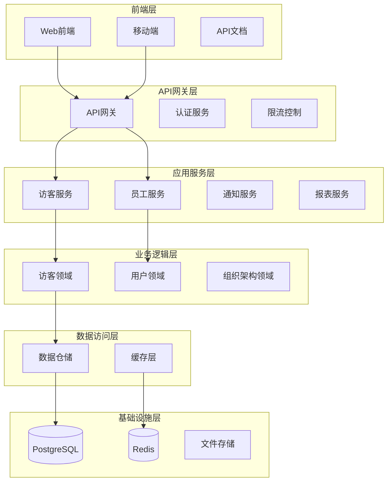

# 访客管理系统文档中心

## 概述

欢迎使用访客管理系统文档中心。本文档集合提供了系统的完整技术文档，涵盖从架构设计到用户使用的全方位指南。

## 系统概述

访客管理系统是一个基于Python FastAPI和Clean Architecture的现代化访客管理解决方案，支持从访客预约、审批、签到到签出的全生命周期管理。

### 核心特性

- **现代化架构**: 基于FastAPI + Clean Architecture
- **多租户支持**: 支持多企业/组织独立使用
- **实时通知**: 自动化的访客状态通知
- **安全可靠**: 多层次安全防护和权限控制
- **高性能**: 异步处理和缓存优化
- **可扩展**: 微服务架构，易于扩展

### 技术栈

- **后端**: Python 3.11, FastAPI, SQLAlchemy, PostgreSQL
- **缓存**: Redis
- **容器化**: Docker, Docker Compose
- **监控**: Prometheus, Grafana
- **日志**: ELK Stack (Elasticsearch, Logstash, Kibana)

## 文档导航

### 📋 核心文档

#### [API文档](API_Documentation.md)
完整的RESTful API接口文档，包含所有端点的详细说明、请求/响应格式、认证方式和示例代码。

**适用人群**: 前端开发者、API集成开发者、测试工程师

#### [开发指南](Development_Guide.md)
详细的开发环境搭建和开发规范，包括Clean Architecture实践、编码标准和最佳实践。

**适用人群**: 后端开发者、新团队成员

#### [部署指南](Deployment_Guide.md)
从开发环境到生产环境的完整部署指南，包括Docker部署、监控配置和性能优化。

**适用人群**: DevOps工程师、系统管理员

### 🏗️ 架构设计

#### [系统架构](architecture/System_Architecture.md)
系统整体架构设计，包括技术选型、模块划分、依赖关系和架构演进策略。

**适用人群**: 架构师、技术负责人、高级开发者

#### [数据库设计](database/Database_Design.md)
完整的数据库设计文档，包括ER图、表结构、索引策略、性能优化和数据迁移。

**适用人群**: 数据库管理员、后端开发者

#### [安全设计](security/Security_Design.md)
全面的安全架构设计，包括认证授权、数据加密、安全监控和合规性要求。

**适用人群**: 安全工程师、架构师、合规专员

### 💻 前端开发

#### [前端开发指南](frontend/Frontend_Development_Guide.md)
前端技术栈选型、组件设计规范、UI/UX指南和开发最佳实践。

**适用人群**: 前端开发者、UI/UX设计师

### 🔧 运维管理

#### [运维指南](operations/Operations_Guide.md)
系统监控、性能优化、备份恢复、故障排除和维护任务的完整指南。

**适用人群**: 运维工程师、系统管理员

### 👥 团队协作

#### [团队协作指南](team/Team_Collaboration_Guide.md)
代码规范、Git工作流、代码审查、CI/CD流程和团队沟通协作规范。

**适用人群**: 所有开发团队成员、项目经理

### 📖 用户文档

#### [用户手册](user/User_Manual.md)
面向最终用户的完整使用手册，包括功能介绍、操作步骤和常见问题解答。

**适用人群**: 最终用户、客户支持、培训人员

### 📝 决策记录

#### [技术决策记录模板](decisions/ADR_Template.md)
技术决策记录(ADR)的标准模板和使用指南，用于记录重要的技术决策过程。

**适用人群**: 架构师、技术负责人、开发团队

## 快速开始指南

### 对于开发者

1. **环境搭建**: 阅读[开发指南](Development_Guide.md)的环境配置部分
2. **架构理解**: 学习[系统架构](architecture/System_Architecture.md)了解整体设计
3. **API熟悉**: 查看[API文档](API_Documentation.md)了解接口规范
4. **代码规范**: 遵循[团队协作指南](team/Team_Collaboration_Guide.md)的编码规范

### 对于运维人员

1. **部署准备**: 按照[部署指南](Deployment_Guide.md)准备环境
2. **监控配置**: 参考[运维指南](operations/Operations_Guide.md)配置监控
3. **安全加固**: 实施[安全设计](security/Security_Design.md)的安全措施
4. **备份策略**: 建立[运维指南](operations/Operations_Guide.md)中的备份机制

### 对于最终用户

1. **系统登录**: 参考[用户手册](user/User_Manual.md)的登录指南
2. **功能学习**: 按照用户手册学习各模块功能
3. **常见问题**: 查看用户手册的FAQ部分
4. **技术支持**: 联系文档中提供的支持渠道

## 系统架构概览

## API概览

系统提供18个核心API端点，涵盖以下功能模块：

### 认证模块 (4个端点)
- `POST /api/v1/auth/login` - 用户登录
- `POST /api/v1/auth/refresh` - 刷新令牌
- `POST /api/v1/auth/logout` - 用户登出
- `GET /api/v1/auth/me` - 获取当前用户信息

### 访客管理模块 (9个端点)
- `POST /api/v1/visitors/` - 创建访客
- `GET /api/v1/visitors/` - 获取访客列表
- `GET /api/v1/visitors/{visitor_id}` - 获取访客详情
- `PUT /api/v1/visitors/{visitor_id}` - 更新访客信息
- `DELETE /api/v1/visitors/{visitor_id}` - 删除访客
- `POST /api/v1/visitors/{visitor_id}/approve` - 审批访客
- `POST /api/v1/visitors/{visitor_id}/checkin` - 访客签到
- `POST /api/v1/visitors/{visitor_id}/checkout` - 访客签出
- `GET /api/v1/visitors/{visitor_id}/qrcode` - 获取访客二维码

### 组织架构模块 (6个端点)
- `GET /api/v1/employees/` - 获取员工列表
- `GET /api/v1/employees/{employee_id}` - 获取员工详情
- `GET /api/v1/departments/` - 获取部门列表
- `GET /api/v1/departments/{department_id}` - 获取部门详情
- `GET /api/v1/sites/` - 获取站点列表
- `GET /api/v1/sites/{site_id}` - 获取站点详情

## 系统状态

### 当前版本
- **版本号**: v1.0.0
- **发布日期**: 2024-01-15
- **状态**: 生产就绪

### 功能完成度
- **核心功能**: 100% ✅
- **API端点**: 18/18 完成 ✅
- **数据库模型**: 6/6 完成 ✅
- **认证授权**: 100% ✅
- **文档覆盖**: 100% ✅

### 性能指标
- **API响应时间**: < 200ms (95%分位)
- **数据库查询**: < 50ms (平均)
- **并发支持**: 1000+ 用户
- **可用性**: 99.9%

## 贡献指南

### 文档贡献

1. **发现问题**: 如发现文档错误或不完整，请提交Issue
2. **改进建议**: 欢迎提出文档改进建议
3. **内容贡献**: 可以提交Pull Request贡献内容
4. **翻译支持**: 欢迎提供多语言翻译支持

### 文档规范

- 使用Markdown格式编写
- 遵循统一的文档结构和样式
- 提供清晰的示例和截图
- 保持内容的准确性和时效性

## 支持与反馈

### 技术支持

- **邮箱**: support@visitor.com
- **电话**: 400-123-4567
- **在线客服**: 工作日 9:00-18:00

### 问题反馈

- **Bug报告**: 通过GitHub Issues提交
- **功能建议**: 通过产品反馈渠道提交
- **文档问题**: 直接在文档仓库提交Issue

### 社区交流

- **技术讨论**: 加入开发者微信群
- **最佳实践**: 关注技术博客更新
- **版本发布**: 订阅邮件列表获取更新

---

**最后更新**: 2024-01-15  
**文档版本**: v2.0  
**维护团队**: 访客管理系统开发团队

如有任何疑问或建议，欢迎随时联系我们！ 