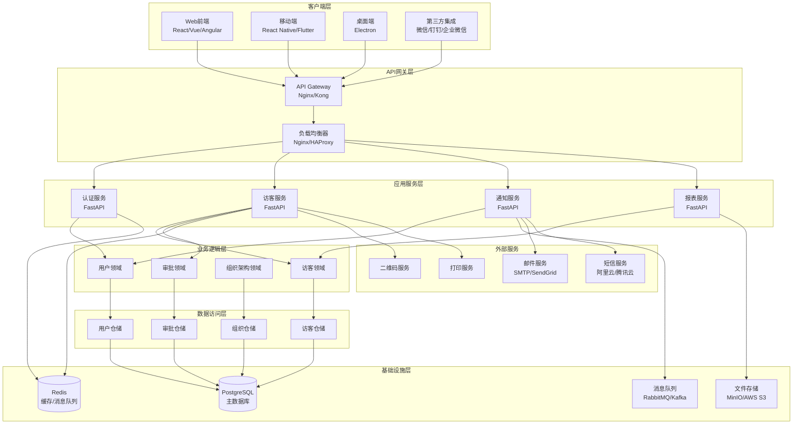

# 访客管理系统架构设计

## 概述

访客管理系统采用现代化的微服务架构设计，基于Clean Architecture原则，实现了高内聚、低耦合的系统架构。系统从原始的.NET Blazor Server架构迁移到Python FastAPI + 前端分离的架构，提供更好的可扩展性和维护性。

## 系统架构图



## 架构层次说明

### 1. 客户端层 (Presentation Layer)

#### Web前端
- **技术选型**: React 18+ / Vue 3+ / Angular 15+
- **状态管理**: Redux Toolkit / Vuex / NgRx
- **UI组件库**: Ant Design / Element Plus / Angular Material
- **构建工具**: Vite / Webpack 5
- **特性**:
  - 响应式设计，支持多设备访问
  - PWA支持，离线功能
  - 实时通信 (WebSocket)
  - 国际化支持

#### 移动端
- **技术选型**: React Native / Flutter
- **特性**:
  - 原生性能体验
  - 二维码扫描
  - 推送通知
  - 离线数据同步

#### 第三方集成
- **微信小程序**: 访客预约和签到
- **企业微信**: 员工通知和审批
- **钉钉**: 企业内部集成

### 2. API网关层 (Gateway Layer)

#### API网关职责
- **路由管理**: 请求路由和负载均衡
- **认证授权**: 统一的身份验证
- **限流熔断**: API访问控制
- **监控日志**: 请求追踪和性能监控
- **协议转换**: HTTP/WebSocket/gRPC

#### 技术实现
```nginx
# Nginx配置示例
upstream visitor_backend {
    server backend1:8000 weight=3;
    server backend2:8000 weight=2;
    server backend3:8000 weight=1;
}

server {
    listen 80;
    server_name api.visitor.com;
    
    location /api/v1/ {
        proxy_pass http://visitor_backend;
        proxy_set_header Host $host;
        proxy_set_header X-Real-IP $remote_addr;
        proxy_set_header X-Forwarded-For $proxy_add_x_forwarded_for;
    }
    
    location /ws/ {
        proxy_pass http://visitor_backend;
        proxy_http_version 1.1;
        proxy_set_header Upgrade $http_upgrade;
        proxy_set_header Connection "upgrade";
    }
}
```

### 3. 应用服务层 (Application Services)

#### 服务划分原则
- **单一职责**: 每个服务专注特定业务领域
- **高内聚**: 相关功能聚合在同一服务
- **低耦合**: 服务间通过API通信
- **无状态**: 服务实例可水平扩展

#### 核心服务

##### 认证服务 (Auth Service)
```python
# 服务职责
class AuthService:
    async def login(self, credentials: LoginDTO) -> TokenResponse
    async def refresh_token(self, refresh_token: str) -> TokenResponse
    async def logout(self, token: str) -> None
    async def verify_token(self, token: str) -> UserInfo
    async def get_permissions(self, user_id: str) -> List[Permission]
```

##### 访客服务 (Visitor Service)
```python
# 服务职责
class VisitorService:
    async def create_visitor(self, visitor_dto: CreateVisitorDTO) -> VisitorDTO
    async def approve_visitor(self, visitor_id: str, approval: ApprovalDTO) -> VisitorDTO
    async def checkin_visitor(self, visitor_id: str, checkin_data: CheckinDTO) -> VisitorDTO
    async def checkout_visitor(self, visitor_id: str) -> VisitorDTO
    async def generate_qr_code(self, visitor_id: str) -> QRCodeDTO
```

### 4. 业务逻辑层 (Domain Layer)

#### Clean Architecture实现

```python
# 领域实体示例
class Visitor:
    def __init__(self, visitor_id: VisitorId, name: str, phone: str):
        self._id = visitor_id
        self._name = name
        self._phone = phone
        self._status = VisitorStatus.PENDING
        self._events: List[DomainEvent] = []
    
    def approve(self, approver: UserId, notes: str) -> None:
        """审批访客"""
        if self._status != VisitorStatus.PENDING:
            raise InvalidOperationError("只能审批待审核的访客")
        
        self._status = VisitorStatus.APPROVED
        self._approved_by = approver
        self._approved_at = datetime.now()
        
        # 发布领域事件
        self._events.append(VisitorApprovedEvent(
            visitor_id=self._id,
            approver_id=approver,
            approved_at=self._approved_at
        ))
    
    def checkin(self, checkin_point: CheckinPointId) -> None:
        """访客签到"""
        if self._status != VisitorStatus.APPROVED:
            raise InvalidOperationError("只有已审批的访客才能签到")
        
        self._status = VisitorStatus.CHECKED_IN
        self._checkin_time = datetime.now()
        self._checkin_point = checkin_point
        
        self._events.append(VisitorCheckedInEvent(
            visitor_id=self._id,
            checkin_time=self._checkin_time,
            checkin_point=checkin_point
        ))
```

#### 领域服务
```python
class VisitorDomainService:
    def __init__(self, visitor_repo: IVisitorRepository):
        self._visitor_repo = visitor_repo
    
    async def can_approve_visitor(self, visitor_id: VisitorId, approver_id: UserId) -> bool:
        """检查是否可以审批访客"""
        visitor = await self._visitor_repo.get_by_id(visitor_id)
        approver = await self._user_repo.get_by_id(approver_id)
        
        # 业务规则：只有部门经理以上级别才能审批
        return approver.has_role(Role.MANAGER) or approver.has_role(Role.ADMIN)
```

### 5. 数据访问层 (Infrastructure Layer)

#### 仓储模式实现
```python
class VisitorRepository(IVisitorRepository):
    def __init__(self, db: AsyncSession):
        self._db = db
    
    async def save(self, visitor: Visitor) -> None:
        """保存访客聚合根"""
        model = VisitorModel.from_domain(visitor)
        self._db.add(model)
        await self._db.commit()
        
        # 发布领域事件
        await self._event_publisher.publish_events(visitor.events)
    
    async def get_by_id(self, visitor_id: VisitorId) -> Optional[Visitor]:
        """根据ID获取访客"""
        result = await self._db.execute(
            select(VisitorModel)
            .options(selectinload(VisitorModel.host_employee))
            .where(VisitorModel.id == visitor_id.value)
        )
        model = result.scalar_one_or_none()
        return model.to_domain() if model else None
```

#### 数据库设计原则
- **聚合根**: 每个聚合有唯一的根实体
- **事务边界**: 一个事务只修改一个聚合
- **最终一致性**: 跨聚合的数据一致性通过事件实现
- **读写分离**: 查询和命令使用不同的模型

### 6. 基础设施层 (Infrastructure Layer)

#### 数据存储策略

##### PostgreSQL (主数据库)
```sql
-- 分区策略
CREATE TABLE visitors_2024 PARTITION OF visitors
FOR VALUES FROM ('2024-01-01') TO ('2025-01-01');

-- 索引策略
CREATE INDEX CONCURRENTLY idx_visitors_phone ON visitors(phone);
CREATE INDEX CONCURRENTLY idx_visitors_visit_date ON visitors(visit_date);
CREATE INDEX CONCURRENTLY idx_visitors_status_tenant ON visitors(status, tenant_id);
```

##### Redis (缓存策略)
```python
class CacheStrategy:
    # 用户会话缓存 (30分钟)
    USER_SESSION_TTL = 1800
    
    # 访客信息缓存 (1小时)
    VISITOR_INFO_TTL = 3600
    
    # 部门员工列表缓存 (24小时)
    DEPARTMENT_EMPLOYEES_TTL = 86400
    
    async def cache_visitor(self, visitor: VisitorDTO) -> None:
        key = f"visitor:{visitor.id}"
        await self.redis.setex(key, self.VISITOR_INFO_TTL, visitor.json())
```

#### 消息队列架构
```python
# 事件发布订阅
class EventBus:
    async def publish(self, event: DomainEvent) -> None:
        """发布领域事件"""
        await self.redis.publish(
            channel=f"events:{event.event_type}",
            message=event.json()
        )
    
    async def subscribe(self, event_type: str, handler: EventHandler) -> None:
        """订阅事件"""
        pubsub = self.redis.pubsub()
        await pubsub.subscribe(f"events:{event_type}")
        
        async for message in pubsub.listen():
            if message['type'] == 'message':
                event = DomainEvent.parse_raw(message['data'])
                await handler.handle(event)
```

## 非功能性需求

### 性能要求
- **响应时间**: API响应时间 < 200ms (95%分位)
- **吞吐量**: 支持1000+ QPS
- **并发用户**: 支持10,000+在线用户
- **数据库**: 查询响应时间 < 100ms

### 可用性要求
- **系统可用性**: 99.9% (年停机时间 < 8.76小时)
- **故障恢复**: RTO < 15分钟, RPO < 5分钟
- **容灾备份**: 异地多活部署

### 安全要求
- **认证**: 多因子认证支持
- **授权**: 基于角色的访问控制
- **数据加密**: 传输加密(TLS 1.3) + 存储加密
- **审计**: 完整的操作审计日志

### 可扩展性要求
- **水平扩展**: 支持服务实例动态扩缩容
- **数据分片**: 支持数据库分库分表
- **多租户**: 支持SaaS多租户模式
- **国际化**: 支持多语言和多时区

## 部署架构

### 开发环境
```yaml
# docker-compose.dev.yml
version: '3.8'
services:
  app:
    build: .
    ports:
      - "8000:8000"
    environment:
      - DEBUG=true
      - LOG_LEVEL=DEBUG
    volumes:
      - .:/app
    depends_on:
      - db
      - redis

  db:
    image: postgres:15
    environment:
      POSTGRES_DB: visitor_dev
      POSTGRES_USER: dev
      POSTGRES_PASSWORD: dev123
    ports:
      - "5432:5432"

  redis:
    image: redis:7-alpine
    ports:
      - "6379:6379"
```

### 生产环境
```yaml
# docker-compose.prod.yml
version: '3.8'
services:
  app:
    image: visitor-management:latest
    deploy:
      replicas: 3
      resources:
        limits:
          cpus: '1.0'
          memory: 1G
        reservations:
          cpus: '0.5'
          memory: 512M
    environment:
      - DEBUG=false
      - LOG_LEVEL=INFO
    networks:
      - visitor-network

  nginx:
    image: nginx:alpine
    ports:
      - "80:80"
      - "443:443"
    volumes:
      - ./nginx.conf:/etc/nginx/nginx.conf
      - ./ssl:/etc/ssl
    depends_on:
      - app
    networks:
      - visitor-network

  db:
    image: postgres:15
    deploy:
      resources:
        limits:
          cpus: '2.0'
          memory: 4G
    environment:
      POSTGRES_DB: visitor_prod
      POSTGRES_USER: visitor
      POSTGRES_PASSWORD: ${DB_PASSWORD}
    volumes:
      - postgres_data:/var/lib/postgresql/data
    networks:
      - visitor-network

networks:
  visitor-network:
    driver: overlay

volumes:
  postgres_data:
```

## 监控和观测

### 应用监控
```python
# 性能监控
from prometheus_client import Counter, Histogram, Gauge

# 指标定义
REQUEST_COUNT = Counter('http_requests_total', 'Total HTTP requests', ['method', 'endpoint'])
REQUEST_DURATION = Histogram('http_request_duration_seconds', 'HTTP request duration')
ACTIVE_VISITORS = Gauge('active_visitors_total', 'Number of active visitors')

# 中间件
@app.middleware("http")
async def metrics_middleware(request: Request, call_next):
    start_time = time.time()
    
    response = await call_next(request)
    
    REQUEST_COUNT.labels(
        method=request.method,
        endpoint=request.url.path
    ).inc()
    
    REQUEST_DURATION.observe(time.time() - start_time)
    
    return response
```

### 日志策略
```python
# 结构化日志
import structlog

logger = structlog.get_logger()

async def create_visitor(visitor_dto: CreateVisitorDTO):
    logger.info(
        "创建访客请求",
        visitor_name=visitor_dto.name,
        visitor_phone=visitor_dto.phone,
        host_employee_id=visitor_dto.host_employee_id,
        request_id=get_request_id()
    )
```

### 健康检查
```python
@app.get("/health")
async def health_check():
    """系统健康检查"""
    checks = {
        "database": await check_database(),
        "redis": await check_redis(),
        "external_services": await check_external_services()
    }
    
    all_healthy = all(checks.values())
    status_code = 200 if all_healthy else 503
    
    return JSONResponse(
        status_code=status_code,
        content={
            "status": "healthy" if all_healthy else "unhealthy",
            "checks": checks,
            "timestamp": datetime.now().isoformat(),
            "version": app.version
        }
    )
```

## 技术债务和改进计划

### 当前技术债务
1. **测试覆盖率**: 目标提升到90%+
2. **API文档**: 完善示例和错误码说明
3. **性能优化**: 数据库查询优化和缓存策略
4. **安全加固**: 安全扫描和漏洞修复

### 未来改进计划
1. **微服务拆分**: 按业务域进一步拆分服务
2. **事件溯源**: 引入事件溯源模式
3. **CQRS**: 实现命令查询职责分离
4. **GraphQL**: 提供GraphQL API支持
5. **AI集成**: 智能访客识别和行为分析

---

本架构设计文档将随着系统演进持续更新，确保架构决策的可追溯性和一致性。 