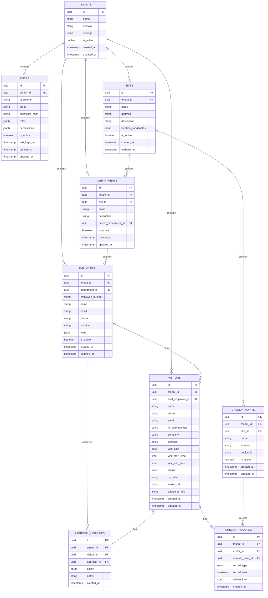

# 数据库设计文档

## 概述

访客管理系统采用PostgreSQL作为主数据库，Redis作为缓存和消息队列。数据库设计遵循第三范式，支持多租户架构，具备良好的扩展性和性能。

## 数据库架构

### 主数据库 (PostgreSQL 15+)
- **用途**: 持久化存储业务数据
- **特性**: ACID事务、复杂查询、JSON支持
- **版本**: PostgreSQL 15+
- **字符集**: UTF-8
- **时区**: UTC

### 缓存数据库 (Redis 7+)
- **用途**: 会话缓存、查询缓存、消息队列
- **特性**: 高性能、内存存储、发布订阅
- **版本**: Redis 7+

## 核心数据模型

### 实体关系图 (ERD)



## 详细表结构

### 基础模型结构

所有表都继承以下基础字段：
```sql
-- 基础模型字段
id INTEGER PRIMARY KEY AUTOINCREMENT,
created_at TIMESTAMP WITH TIME ZONE DEFAULT CURRENT_TIMESTAMP,
updated_at TIMESTAMP WITH TIME ZONE DEFAULT CURRENT_TIMESTAMP,

-- 可审计模型字段（继承基础模型）
created_by VARCHAR(100),
updated_by VARCHAR(100),
is_deleted BOOLEAN DEFAULT FALSE,
deleted_at TIMESTAMP WITH TIME ZONE,
deleted_by VARCHAR(100),

-- 多租户模型字段（继承可审计模型）
tenant_id VARCHAR(50) DEFAULT 'default'
```

### 1. 站点表 (sites)

```sql
CREATE TABLE sites (
    -- 基础字段
    id INTEGER PRIMARY KEY,
    created_at TIMESTAMP WITH TIME ZONE DEFAULT CURRENT_TIMESTAMP,
    updated_at TIMESTAMP WITH TIME ZONE DEFAULT CURRENT_TIMESTAMP,
    created_by VARCHAR(100),
    updated_by VARCHAR(100),
    is_deleted BOOLEAN DEFAULT FALSE,
    deleted_at TIMESTAMP WITH TIME ZONE,
    deleted_by VARCHAR(100),
    tenant_id VARCHAR(50) DEFAULT 'default',
    
    -- 站点特有字段
    name VARCHAR(100) NOT NULL,
    code VARCHAR(50) NOT NULL UNIQUE,
    description TEXT,
    address VARCHAR(200),
    city VARCHAR(50),
    province VARCHAR(50),
    postal_code VARCHAR(10),
    country VARCHAR(50) DEFAULT '中国',
    phone VARCHAR(20),
    email VARCHAR(100),
    website VARCHAR(200),
    latitude FLOAT,
    longitude FLOAT,
    status VARCHAR(20) DEFAULT 'active',
    working_hours_start VARCHAR(5) DEFAULT '09:00',
    working_hours_end VARCHAR(5) DEFAULT '18:00',
    timezone VARCHAR(50) DEFAULT 'Asia/Shanghai'
);

-- 索引
CREATE INDEX idx_sites_tenant_id ON sites(tenant_id);
CREATE INDEX idx_sites_code ON sites(code);
CREATE INDEX idx_sites_status ON sites(status);

-- 注释
COMMENT ON TABLE sites IS '站点表';
COMMENT ON COLUMN sites.code IS '站点编码';
COMMENT ON COLUMN sites.working_hours_start IS '工作时间开始';
COMMENT ON COLUMN sites.working_hours_end IS '工作时间结束';
```

### 2. 用户表 (users)

```sql
CREATE TABLE users (
    id UUID PRIMARY KEY DEFAULT gen_random_uuid(),
    tenant_id UUID NOT NULL REFERENCES tenants(id) ON DELETE CASCADE,
    username VARCHAR(50) NOT NULL,
    email VARCHAR(255) NOT NULL,
    password_hash VARCHAR(255) NOT NULL,
    roles JSONB DEFAULT '[]',
    permissions JSONB DEFAULT '[]',
    is_active BOOLEAN DEFAULT true,
    last_login_at TIMESTAMP WITH TIME ZONE,
    created_at TIMESTAMP WITH TIME ZONE DEFAULT CURRENT_TIMESTAMP,
    updated_at TIMESTAMP WITH TIME ZONE DEFAULT CURRENT_TIMESTAMP,
    
    CONSTRAINT uk_users_tenant_username UNIQUE(tenant_id, username),
    CONSTRAINT uk_users_tenant_email UNIQUE(tenant_id, email)
);

-- 索引
CREATE INDEX idx_users_tenant_id ON users(tenant_id);
CREATE INDEX idx_users_username ON users(username);
CREATE INDEX idx_users_email ON users(email);
CREATE INDEX idx_users_is_active ON users(is_active);

-- 注释
COMMENT ON TABLE users IS '用户表';
COMMENT ON COLUMN users.roles IS '用户角色列表';
COMMENT ON COLUMN users.permissions IS '用户权限列表';
```

### 3. 站点表 (sites)

```sql
CREATE TABLE sites (
    id UUID PRIMARY KEY DEFAULT gen_random_uuid(),
    tenant_id UUID NOT NULL REFERENCES tenants(id) ON DELETE CASCADE,
    name VARCHAR(255) NOT NULL,
    address TEXT,
    description TEXT,
    location_coordinates JSONB, -- {"latitude": 39.9042, "longitude": 116.4074}
    is_active BOOLEAN DEFAULT true,
    created_at TIMESTAMP WITH TIME ZONE DEFAULT CURRENT_TIMESTAMP,
    updated_at TIMESTAMP WITH TIME ZONE DEFAULT CURRENT_TIMESTAMP
);

-- 索引
CREATE INDEX idx_sites_tenant_id ON sites(tenant_id);
CREATE INDEX idx_sites_is_active ON sites(is_active);

-- 注释
COMMENT ON TABLE sites IS '站点表';
COMMENT ON COLUMN sites.location_coordinates IS '地理坐标信息';
```

### 4. 部门表 (departments)

```sql
CREATE TABLE departments (
    id UUID PRIMARY KEY DEFAULT gen_random_uuid(),
    tenant_id UUID NOT NULL REFERENCES tenants(id) ON DELETE CASCADE,
    site_id UUID NOT NULL REFERENCES sites(id) ON DELETE CASCADE,
    name VARCHAR(255) NOT NULL,
    description TEXT,
    parent_department_id UUID REFERENCES departments(id),
    is_active BOOLEAN DEFAULT true,
    created_at TIMESTAMP WITH TIME ZONE DEFAULT CURRENT_TIMESTAMP,
    updated_at TIMESTAMP WITH TIME ZONE DEFAULT CURRENT_TIMESTAMP
);

-- 索引
CREATE INDEX idx_departments_tenant_id ON departments(tenant_id);
CREATE INDEX idx_departments_site_id ON departments(site_id);
CREATE INDEX idx_departments_parent_id ON departments(parent_department_id);
CREATE INDEX idx_departments_is_active ON departments(is_active);

-- 注释
COMMENT ON TABLE departments IS '部门表';
COMMENT ON COLUMN departments.parent_department_id IS '上级部门ID';
```

### 5. 员工表 (employees)

```sql
CREATE TABLE employees (
    id UUID PRIMARY KEY DEFAULT gen_random_uuid(),
    tenant_id UUID NOT NULL REFERENCES tenants(id) ON DELETE CASCADE,
    department_id UUID NOT NULL REFERENCES departments(id) ON DELETE CASCADE,
    employee_number VARCHAR(50) NOT NULL,
    name VARCHAR(255) NOT NULL,
    email VARCHAR(255),
    phone VARCHAR(20),
    position VARCHAR(255),
    roles JSONB DEFAULT '[]',
    is_active BOOLEAN DEFAULT true,
    created_at TIMESTAMP WITH TIME ZONE DEFAULT CURRENT_TIMESTAMP,
    updated_at TIMESTAMP WITH TIME ZONE DEFAULT CURRENT_TIMESTAMP,
    
    CONSTRAINT uk_employees_tenant_number UNIQUE(tenant_id, employee_number)
);

-- 索引
CREATE INDEX idx_employees_tenant_id ON employees(tenant_id);
CREATE INDEX idx_employees_department_id ON employees(department_id);
CREATE INDEX idx_employees_employee_number ON employees(employee_number);
CREATE INDEX idx_employees_name ON employees(name);
CREATE INDEX idx_employees_email ON employees(email);
CREATE INDEX idx_employees_phone ON employees(phone);
CREATE INDEX idx_employees_is_active ON employees(is_active);

-- 注释
COMMENT ON TABLE employees IS '员工表';
COMMENT ON COLUMN employees.employee_number IS '员工工号';
COMMENT ON COLUMN employees.roles IS '员工角色列表';
```

### 6. 访客表 (visitors)

```sql
-- 访客状态枚举
CREATE TYPE visitor_status AS ENUM (
    'pending',      -- 待审批
    'approved',     -- 已审批
    'rejected',     -- 已拒绝
    'checked_in',   -- 已签到
    'checked_out',  -- 已签出
    'expired'       -- 已过期
);

CREATE TABLE visitors (
    id UUID PRIMARY KEY DEFAULT gen_random_uuid(),
    tenant_id UUID NOT NULL REFERENCES tenants(id) ON DELETE CASCADE,
    host_employee_id UUID NOT NULL REFERENCES employees(id),
    name VARCHAR(255) NOT NULL,
    phone VARCHAR(20) NOT NULL,
    email VARCHAR(255),
    id_card_number VARCHAR(50),
    company VARCHAR(255),
    purpose TEXT NOT NULL,
    visit_date DATE NOT NULL,
    visit_start_time TIME,
    visit_end_time TIME,
    status visitor_status DEFAULT 'pending',
    qr_code VARCHAR(255) UNIQUE,
    avatar_url VARCHAR(500),
    additional_info JSONB DEFAULT '{}',
    created_at TIMESTAMP WITH TIME ZONE DEFAULT CURRENT_TIMESTAMP,
    updated_at TIMESTAMP WITH TIME ZONE DEFAULT CURRENT_TIMESTAMP
);

-- 索引
CREATE INDEX idx_visitors_tenant_id ON visitors(tenant_id);
CREATE INDEX idx_visitors_host_employee_id ON visitors(host_employee_id);
CREATE INDEX idx_visitors_phone ON visitors(phone);
CREATE INDEX idx_visitors_visit_date ON visitors(visit_date);
CREATE INDEX idx_visitors_status ON visitors(status);
CREATE INDEX idx_visitors_qr_code ON visitors(qr_code);
CREATE INDEX idx_visitors_created_at ON visitors(created_at);

-- 复合索引
CREATE INDEX idx_visitors_tenant_status ON visitors(tenant_id, status);
CREATE INDEX idx_visitors_tenant_date ON visitors(tenant_id, visit_date);

-- 注释
COMMENT ON TABLE visitors IS '访客表';
COMMENT ON COLUMN visitors.additional_info IS '额外信息JSON';
```

### 7. 审批历史表 (approval_histories)

```sql
-- 审批动作枚举
CREATE TYPE approval_action AS ENUM (
    'approve',   -- 审批通过
    'reject',    -- 审批拒绝
    'modify'     -- 修改信息
);

CREATE TABLE approval_histories (
    id UUID PRIMARY KEY DEFAULT gen_random_uuid(),
    tenant_id UUID NOT NULL REFERENCES tenants(id) ON DELETE CASCADE,
    visitor_id UUID NOT NULL REFERENCES visitors(id) ON DELETE CASCADE,
    approver_id UUID NOT NULL REFERENCES employees(id),
    action approval_action NOT NULL,
    notes TEXT,
    created_at TIMESTAMP WITH TIME ZONE DEFAULT CURRENT_TIMESTAMP
);

-- 索引
CREATE INDEX idx_approval_histories_tenant_id ON approval_histories(tenant_id);
CREATE INDEX idx_approval_histories_visitor_id ON approval_histories(visitor_id);
CREATE INDEX idx_approval_histories_approver_id ON approval_histories(approver_id);
CREATE INDEX idx_approval_histories_created_at ON approval_histories(created_at);

-- 注释
COMMENT ON TABLE approval_histories IS '审批历史表';
```

### 8. 签到点表 (checkin_points)

```sql
CREATE TABLE checkin_points (
    id UUID PRIMARY KEY DEFAULT gen_random_uuid(),
    tenant_id UUID NOT NULL REFERENCES tenants(id) ON DELETE CASCADE,
    site_id UUID NOT NULL REFERENCES sites(id) ON DELETE CASCADE,
    name VARCHAR(255) NOT NULL,
    location VARCHAR(255),
    device_id VARCHAR(255) UNIQUE,
    is_active BOOLEAN DEFAULT true,
    created_at TIMESTAMP WITH TIME ZONE DEFAULT CURRENT_TIMESTAMP,
    updated_at TIMESTAMP WITH TIME ZONE DEFAULT CURRENT_TIMESTAMP
);

-- 索引
CREATE INDEX idx_checkin_points_tenant_id ON checkin_points(tenant_id);
CREATE INDEX idx_checkin_points_site_id ON checkin_points(site_id);
CREATE INDEX idx_checkin_points_device_id ON checkin_points(device_id);
CREATE INDEX idx_checkin_points_is_active ON checkin_points(is_active);

-- 注释
COMMENT ON TABLE checkin_points IS '签到点表';
```

### 9. 签到记录表 (checkin_records)

```sql
-- 记录类型枚举
CREATE TYPE record_type AS ENUM (
    'checkin',   -- 签到
    'checkout'   -- 签出
);

CREATE TABLE checkin_records (
    id UUID PRIMARY KEY DEFAULT gen_random_uuid(),
    tenant_id UUID NOT NULL REFERENCES tenants(id) ON DELETE CASCADE,
    visitor_id UUID NOT NULL REFERENCES visitors(id) ON DELETE CASCADE,
    checkin_point_id UUID NOT NULL REFERENCES checkin_points(id),
    record_type record_type NOT NULL,
    record_time TIMESTAMP WITH TIME ZONE DEFAULT CURRENT_TIMESTAMP,
    device_info JSONB DEFAULT '{}',
    created_at TIMESTAMP WITH TIME ZONE DEFAULT CURRENT_TIMESTAMP
);

-- 索引
CREATE INDEX idx_checkin_records_tenant_id ON checkin_records(tenant_id);
CREATE INDEX idx_checkin_records_visitor_id ON checkin_records(visitor_id);
CREATE INDEX idx_checkin_records_checkin_point_id ON checkin_records(checkin_point_id);
CREATE INDEX idx_checkin_records_record_time ON checkin_records(record_time);
CREATE INDEX idx_checkin_records_record_type ON checkin_records(record_type);

-- 复合索引
CREATE INDEX idx_checkin_records_visitor_type ON checkin_records(visitor_id, record_type);

-- 注释
COMMENT ON TABLE checkin_records IS '签到记录表';
COMMENT ON COLUMN checkin_records.device_info IS '设备信息JSON';
```

## 数据库约束和触发器

### 1. 更新时间触发器

```sql
-- 创建更新时间函数
CREATE OR REPLACE FUNCTION update_updated_at_column()
RETURNS TRIGGER AS $$
BEGIN
    NEW.updated_at = CURRENT_TIMESTAMP;
    RETURN NEW;
END;
$$ language 'plpgsql';

-- 为所有需要的表添加触发器
CREATE TRIGGER update_tenants_updated_at 
    BEFORE UPDATE ON tenants 
    FOR EACH ROW EXECUTE FUNCTION update_updated_at_column();

CREATE TRIGGER update_users_updated_at 
    BEFORE UPDATE ON users 
    FOR EACH ROW EXECUTE FUNCTION update_updated_at_column();

CREATE TRIGGER update_sites_updated_at 
    BEFORE UPDATE ON sites 
    FOR EACH ROW EXECUTE FUNCTION update_updated_at_column();

CREATE TRIGGER update_departments_updated_at 
    BEFORE UPDATE ON departments 
    FOR EACH ROW EXECUTE FUNCTION update_updated_at_column();

CREATE TRIGGER update_employees_updated_at 
    BEFORE UPDATE ON employees 
    FOR EACH ROW EXECUTE FUNCTION update_updated_at_column();

CREATE TRIGGER update_visitors_updated_at 
    BEFORE UPDATE ON visitors 
    FOR EACH ROW EXECUTE FUNCTION update_updated_at_column();

CREATE TRIGGER update_checkin_points_updated_at 
    BEFORE UPDATE ON checkin_points 
    FOR EACH ROW EXECUTE FUNCTION update_updated_at_column();
```

### 2. 数据验证约束

```sql
-- 访客表约束
ALTER TABLE visitors ADD CONSTRAINT chk_visitors_visit_time 
    CHECK (visit_start_time < visit_end_time);

ALTER TABLE visitors ADD CONSTRAINT chk_visitors_visit_date 
    CHECK (visit_date >= CURRENT_DATE);

ALTER TABLE visitors ADD CONSTRAINT chk_visitors_phone 
    CHECK (phone ~ '^[0-9+\-\s()]+$');

-- 员工表约束
ALTER TABLE employees ADD CONSTRAINT chk_employees_email 
    CHECK (email ~ '^[A-Za-z0-9._%+-]+@[A-Za-z0-9.-]+\.[A-Za-z]{2,}$');

-- 用户表约束
ALTER TABLE users ADD CONSTRAINT chk_users_email 
    CHECK (email ~ '^[A-Za-z0-9._%+-]+@[A-Za-z0-9.-]+\.[A-Za-z]{2,}$');
```

### 3. 行级安全策略 (RLS)

```sql
-- 启用行级安全
ALTER TABLE visitors ENABLE ROW LEVEL SECURITY;
ALTER TABLE employees ENABLE ROW LEVEL SECURITY;
ALTER TABLE departments ENABLE ROW LEVEL SECURITY;
ALTER TABLE sites ENABLE ROW LEVEL SECURITY;

-- 创建租户隔离策略
CREATE POLICY tenant_isolation_visitors ON visitors
    USING (tenant_id = current_setting('app.current_tenant_id')::UUID);

CREATE POLICY tenant_isolation_employees ON employees
    USING (tenant_id = current_setting('app.current_tenant_id')::UUID);

CREATE POLICY tenant_isolation_departments ON departments
    USING (tenant_id = current_setting('app.current_tenant_id')::UUID);

CREATE POLICY tenant_isolation_sites ON sites
    USING (tenant_id = current_setting('app.current_tenant_id')::UUID);
```

## 数据分区策略

### 1. 访客表按时间分区

```sql
-- 创建分区表
CREATE TABLE visitors_partitioned (
    LIKE visitors INCLUDING ALL
) PARTITION BY RANGE (visit_date);

-- 创建分区
CREATE TABLE visitors_2024_q1 PARTITION OF visitors_partitioned
    FOR VALUES FROM ('2024-01-01') TO ('2024-04-01');

CREATE TABLE visitors_2024_q2 PARTITION OF visitors_partitioned
    FOR VALUES FROM ('2024-04-01') TO ('2024-07-01');

CREATE TABLE visitors_2024_q3 PARTITION OF visitors_partitioned
    FOR VALUES FROM ('2024-07-01') TO ('2024-10-01');

CREATE TABLE visitors_2024_q4 PARTITION OF visitors_partitioned
    FOR VALUES FROM ('2024-10-01') TO ('2025-01-01');

-- 自动创建分区函数
CREATE OR REPLACE FUNCTION create_monthly_partition(table_name text, start_date date)
RETURNS void AS $$
DECLARE
    partition_name text;
    end_date date;
BEGIN
    partition_name := table_name || '_' || to_char(start_date, 'YYYY_MM');
    end_date := start_date + interval '1 month';
    
    EXECUTE format('CREATE TABLE IF NOT EXISTS %I PARTITION OF %I
                    FOR VALUES FROM (%L) TO (%L)',
                   partition_name, table_name, start_date, end_date);
END;
$$ LANGUAGE plpgsql;
```

### 2. 签到记录表按时间分区

```sql
-- 创建分区表
CREATE TABLE checkin_records_partitioned (
    LIKE checkin_records INCLUDING ALL
) PARTITION BY RANGE (record_time);

-- 按月分区
CREATE TABLE checkin_records_2024_01 PARTITION OF checkin_records_partitioned
    FOR VALUES FROM ('2024-01-01') TO ('2024-02-01');
```

## 索引优化策略

### 1. 复合索引

```sql
-- 访客查询优化
CREATE INDEX idx_visitors_tenant_status_date ON visitors(tenant_id, status, visit_date);
CREATE INDEX idx_visitors_host_date ON visitors(host_employee_id, visit_date);

-- 签到记录查询优化
CREATE INDEX idx_checkin_records_visitor_time ON checkin_records(visitor_id, record_time DESC);
CREATE INDEX idx_checkin_records_point_time ON checkin_records(checkin_point_id, record_time DESC);

-- 审批历史查询优化
CREATE INDEX idx_approval_histories_visitor_time ON approval_histories(visitor_id, created_at DESC);
```

### 2. 部分索引

```sql
-- 只为活跃记录创建索引
CREATE INDEX idx_visitors_active ON visitors(tenant_id, visit_date) 
    WHERE status IN ('pending', 'approved', 'checked_in');

CREATE INDEX idx_employees_active ON employees(department_id, name) 
    WHERE is_active = true;
```

### 3. 表达式索引

```sql
-- 支持不区分大小写的搜索
CREATE INDEX idx_visitors_name_lower ON visitors(lower(name));
CREATE INDEX idx_employees_name_lower ON employees(lower(name));

-- 支持电话号码搜索（去除特殊字符）
CREATE INDEX idx_visitors_phone_clean ON visitors(regexp_replace(phone, '[^0-9]', '', 'g'));
```

## 视图定义

### 1. 访客详情视图

```sql
CREATE VIEW visitor_details AS
SELECT 
    v.id,
    v.tenant_id,
    v.name,
    v.phone,
    v.email,
    v.company,
    v.purpose,
    v.visit_date,
    v.visit_start_time,
    v.visit_end_time,
    v.status,
    v.qr_code,
    v.avatar_url,
    v.created_at,
    v.updated_at,
    -- 接待员工信息
    e.name as host_employee_name,
    e.email as host_employee_email,
    e.phone as host_employee_phone,
    e.position as host_employee_position,
    -- 部门信息
    d.name as department_name,
    -- 站点信息
    s.name as site_name,
    s.address as site_address,
    -- 最新审批信息
    ah.action as latest_approval_action,
    ah.notes as latest_approval_notes,
    ah.created_at as latest_approval_time,
    approver.name as approver_name,
    -- 签到信息
    checkin.record_time as checkin_time,
    checkout.record_time as checkout_time,
    cp_in.name as checkin_point_name,
    cp_out.name as checkout_point_name
FROM visitors v
LEFT JOIN employees e ON v.host_employee_id = e.id
LEFT JOIN departments d ON e.department_id = d.id
LEFT JOIN sites s ON d.site_id = s.id
LEFT JOIN LATERAL (
    SELECT action, notes, created_at, approver_id
    FROM approval_histories 
    WHERE visitor_id = v.id 
    ORDER BY created_at DESC 
    LIMIT 1
) ah ON true
LEFT JOIN employees approver ON ah.approver_id = approver.id
LEFT JOIN LATERAL (
    SELECT record_time, checkin_point_id
    FROM checkin_records 
    WHERE visitor_id = v.id AND record_type = 'checkin'
    ORDER BY record_time DESC 
    LIMIT 1
) checkin ON true
LEFT JOIN LATERAL (
    SELECT record_time, checkin_point_id
    FROM checkin_records 
    WHERE visitor_id = v.id AND record_type = 'checkout'
    ORDER BY record_time DESC 
    LIMIT 1
) checkout ON true
LEFT JOIN checkin_points cp_in ON checkin.checkin_point_id = cp_in.id
LEFT JOIN checkin_points cp_out ON checkout.checkin_point_id = cp_out.id;
```

### 2. 统计视图

```sql
CREATE VIEW daily_visitor_stats AS
SELECT 
    tenant_id,
    visit_date,
    COUNT(*) as total_visitors,
    COUNT(*) FILTER (WHERE status = 'pending') as pending_count,
    COUNT(*) FILTER (WHERE status = 'approved') as approved_count,
    COUNT(*) FILTER (WHERE status = 'rejected') as rejected_count,
    COUNT(*) FILTER (WHERE status = 'checked_in') as checked_in_count,
    COUNT(*) FILTER (WHERE status = 'checked_out') as checked_out_count
FROM visitors
GROUP BY tenant_id, visit_date;

CREATE VIEW department_visitor_stats AS
SELECT 
    d.tenant_id,
    d.id as department_id,
    d.name as department_name,
    DATE_TRUNC('month', v.visit_date) as month,
    COUNT(v.id) as visitor_count,
    COUNT(DISTINCT v.host_employee_id) as active_hosts
FROM departments d
LEFT JOIN employees e ON d.id = e.department_id
LEFT JOIN visitors v ON e.id = v.host_employee_id
GROUP BY d.tenant_id, d.id, d.name, DATE_TRUNC('month', v.visit_date);
```

## 数据迁移脚本

### 1. 初始化数据

```sql
-- 插入默认租户
INSERT INTO tenants (id, name, domain, settings) VALUES 
('00000000-0000-0000-0000-000000000001', '默认租户', 'default.local', '{"timezone": "Asia/Shanghai"}');

-- 插入默认站点
INSERT INTO sites (tenant_id, name, address, description) VALUES 
('00000000-0000-0000-0000-000000000001', '总部', '北京市朝阳区', '公司总部大楼');

-- 插入默认部门
INSERT INTO departments (tenant_id, site_id, name, description) VALUES 
('00000000-0000-0000-0000-000000000001', 
 (SELECT id FROM sites WHERE name = '总部' LIMIT 1), 
 '信息技术部', '负责公司IT系统开发和维护');

-- 插入默认管理员用户
INSERT INTO users (tenant_id, username, email, password_hash, roles) VALUES 
('00000000-0000-0000-0000-000000000001', 'admin', 'admin@example.com', 
 '$2b$12$LQv3c1yqBWVHxkd0LHAkCOYz6TtxMQJqhN8/LewdBPj6QJjQX1sFe', -- password: admin123
 '["admin", "user"]');
```

### 2. 数据清理脚本

```sql
-- 清理过期访客记录
DELETE FROM visitors 
WHERE visit_date < CURRENT_DATE - INTERVAL '1 year' 
AND status IN ('checked_out', 'expired', 'rejected');

-- 清理旧的签到记录
DELETE FROM checkin_records 
WHERE created_at < CURRENT_DATE - INTERVAL '2 years';

-- 清理旧的审批历史
DELETE FROM approval_histories 
WHERE created_at < CURRENT_DATE - INTERVAL '2 years';
```

## 性能监控

### 1. 慢查询监控

```sql
-- 启用慢查询日志
ALTER SYSTEM SET log_min_duration_statement = 1000; -- 1秒
ALTER SYSTEM SET log_statement = 'all';
SELECT pg_reload_conf();

-- 查询慢查询统计
SELECT 
    query,
    calls,
    total_time,
    mean_time,
    rows
FROM pg_stat_statements 
ORDER BY total_time DESC 
LIMIT 10;
```

### 2. 索引使用情况

```sql
-- 查询未使用的索引
SELECT 
    schemaname,
    tablename,
    indexname,
    idx_tup_read,
    idx_tup_fetch
FROM pg_stat_user_indexes 
WHERE idx_tup_read = 0 
AND idx_tup_fetch = 0;

-- 查询索引效率
SELECT 
    schemaname,
    tablename,
    indexname,
    idx_scan,
    idx_tup_read,
    idx_tup_fetch,
    idx_tup_read::float / NULLIF(idx_scan, 0) as avg_tuples_per_scan
FROM pg_stat_user_indexes 
ORDER BY idx_scan DESC;
```

### 3. 表大小监控

```sql
-- 查询表大小
SELECT 
    schemaname,
    tablename,
    pg_size_pretty(pg_total_relation_size(schemaname||'.'||tablename)) as size,
    pg_total_relation_size(schemaname||'.'||tablename) as size_bytes
FROM pg_tables 
WHERE schemaname = 'public'
ORDER BY size_bytes DESC;
```

## 备份和恢复策略

### 1. 逻辑备份

```bash
#!/bin/bash
# 每日备份脚本
BACKUP_DIR="/backup/postgresql"
DATE=$(date +%Y%m%d_%H%M%S)
DB_NAME="visitor_management"

# 创建备份目录
mkdir -p $BACKUP_DIR

# 执行备份
pg_dump -h localhost -U postgres -d $DB_NAME \
    --format=custom \
    --compress=9 \
    --file=$BACKUP_DIR/visitor_management_$DATE.dump

# 保留最近30天的备份
find $BACKUP_DIR -name "*.dump" -mtime +30 -delete
```

### 2. 物理备份

```bash
#!/bin/bash
# WAL归档备份
ARCHIVE_DIR="/backup/wal_archive"

# 配置postgresql.conf
# wal_level = replica
# archive_mode = on
# archive_command = 'cp %p /backup/wal_archive/%f'

# 基础备份
pg_basebackup -h localhost -U postgres -D /backup/base_backup -Ft -z -P
```

### 3. 恢复脚本

```bash
#!/bin/bash
# 数据库恢复脚本
BACKUP_FILE=$1
DB_NAME="visitor_management"

if [ -z "$BACKUP_FILE" ]; then
    echo "Usage: $0 <backup_file>"
    exit 1
fi

# 停止应用服务
systemctl stop visitor-management

# 删除现有数据库
dropdb -h localhost -U postgres $DB_NAME

# 创建新数据库
createdb -h localhost -U postgres $DB_NAME

# 恢复数据
pg_restore -h localhost -U postgres -d $DB_NAME $BACKUP_FILE

# 启动应用服务
systemctl start visitor-management
```

---

本数据库设计文档提供了完整的数据模型、索引策略、性能优化和运维方案，确保系统的高性能和可靠性。 