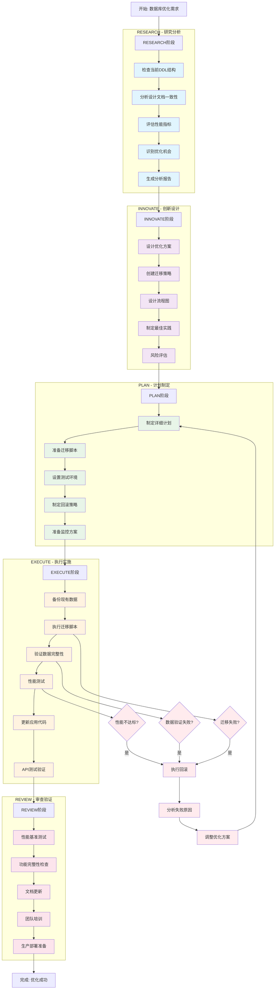
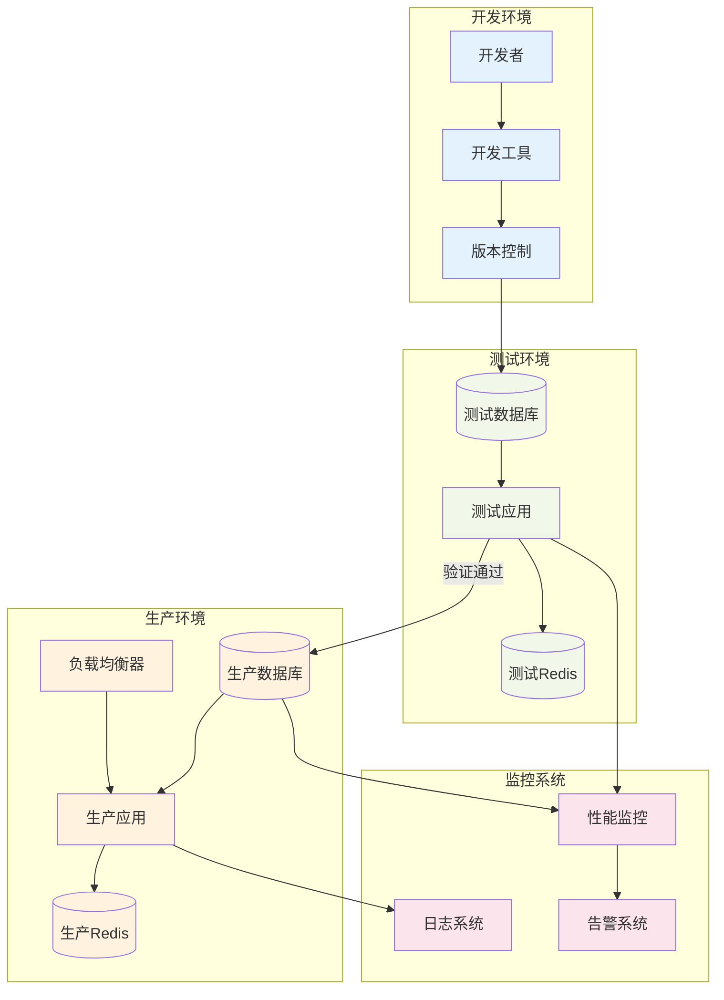
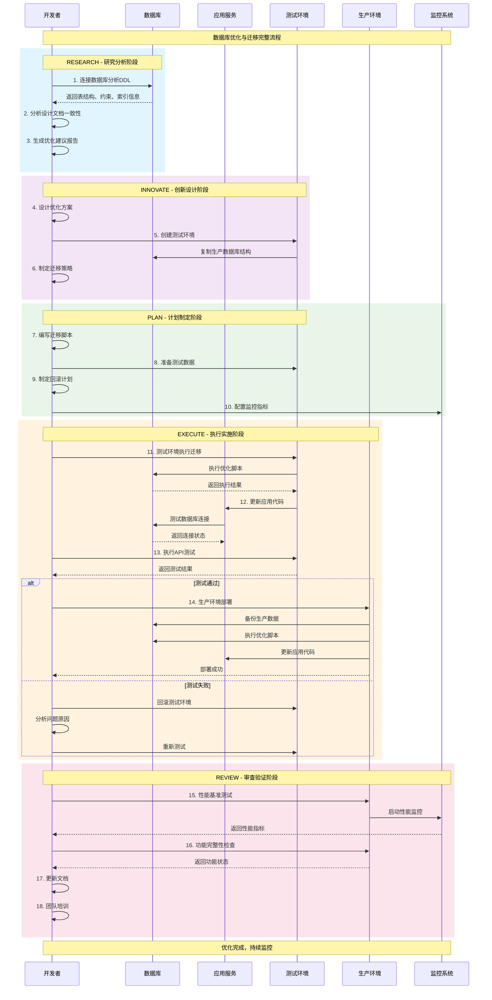
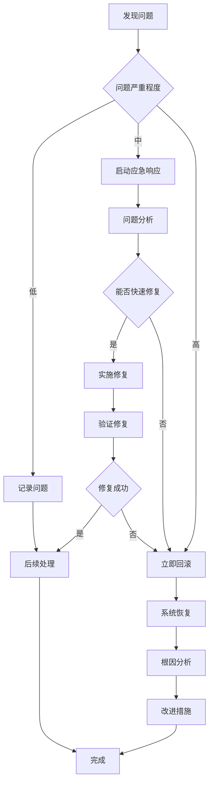
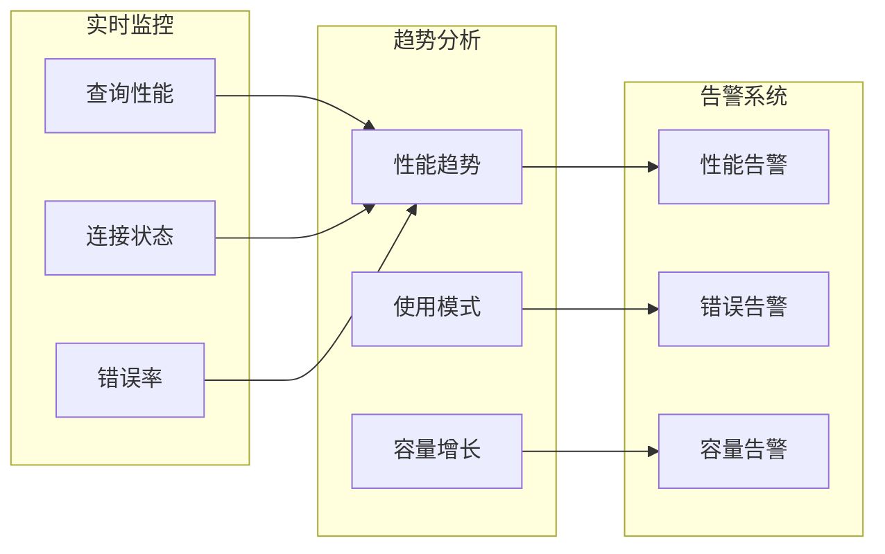

# 数据库优化与迁移操作流程图

## 文档信息
- **版本**: v1.0
- **创建日期**: 2025-06-07
- **最后更新**: 2025-06-07 21:30:00
- **状态**: 生产就绪
- **关联文档**: 
  - [数据库设计文档 v2.0](./Database_Design_v2.md)
  - [系统架构设计](../architecture/System_Architecture.md)

## 概述

本文档详细描述了访客管理系统数据库优化与迁移的完整操作流程，基于RIPER-5协议的五阶段方法论，结合Clean Architecture架构原则，确保数据库优化过程的安全性、可靠性和可追溯性。

---

## 🔄 完整操作流程图

### 主流程 - RIPER-5 五阶段方法论

---

## 🏗️ 系统架构层面的操作流程

### 架构组件交互流程

---

## 🔧 技术实施时序图

### 数据库优化实施流程

---

## 📋 详细操作检查清单

### RESEARCH阶段检查清单

- [ ] **环境准备**
  - [ ] 确认数据库连接权限
  - [ ] 安装必要的分析工具
  - [ ] 准备DDL分析脚本

- [ ] **数据收集**
  - [ ] 获取当前表结构信息
  - [ ] 收集约束和索引信息
  - [ ] 分析枚举类型使用情况
  - [ ] 检查触发器和视图

- [ ] **性能评估**
  - [ ] 查询性能基准测试
  - [ ] 索引使用率分析
  - [ ] 约束违规统计
  - [ ] 多租户隔离效果评估

### INNOVATE阶段检查清单

- [ ] **方案设计**
  - [ ] 优化目标明确定义
  - [ ] 技术方案可行性评估
  - [ ] 风险识别和缓解策略
  - [ ] 性能提升预期量化

- [ ] **迁移策略**
  - [ ] 数据迁移方案设计
  - [ ] 应用代码适配计划
  - [ ] 测试策略制定
  - [ ] 回滚方案准备

### PLAN阶段检查清单

- [ ] **脚本准备**
  - [ ] 迁移SQL脚本编写
  - [ ] Alembic迁移文件创建
  - [ ] 数据验证脚本准备
  - [ ] 回滚脚本编写

- [ ] **环境配置**
  - [ ] 测试环境搭建
  - [ ] 数据库备份策略
  - [ ] 监控系统配置
  - [ ] 告警机制设置

### EXECUTE阶段检查清单

- [ ] **执行前准备**
  - [ ] 生产数据库备份
  - [ ] 应用服务停机计划
  - [ ] 团队成员角色分工
  - [ ] 紧急联系方式确认

- [ ] **迁移执行**
  - [ ] 测试环境迁移验证
  - [ ] 数据完整性检查
  - [ ] 应用代码部署
  - [ ] API功能测试

- [ ] **验证确认**
  - [ ] 性能指标对比
  - [ ] 业务功能验证
  - [ ] 错误日志检查
  - [ ] 用户访问测试

### REVIEW阶段检查清单

- [ ] **性能验证**
  - [ ] 查询响应时间对比
  - [ ] 并发处理能力测试
  - [ ] 资源使用率监控
  - [ ] 系统稳定性评估

- [ ] **文档更新**
  - [ ] 数据库设计文档更新
  - [ ] 操作手册修订
  - [ ] 故障排除指南更新
  - [ ] 团队培训材料准备

---

## 🚨 风险控制与应急预案

### 风险识别矩阵

| 风险类型 | 概率 | 影响 | 风险等级 | 缓解措施 |
|---------|------|------|---------|----------|
| 数据丢失 | 低 | 高 | 中 | 多重备份策略 |
| 迁移失败 | 中 | 高 | 高 | 完整回滚方案 |
| 性能下降 | 中 | 中 | 中 | 性能基准测试 |
| 应用故障 | 中 | 高 | 高 | 分阶段部署 |
| 用户影响 | 低 | 中 | 低 | 维护窗口安排 |

### 应急响应流程

---

## 📊 监控指标与KPI

### 关键性能指标

| 指标类别 | 指标名称 | 目标值 | 监控频率 |
|---------|----------|--------|----------|
| 性能 | 查询响应时间 | < 100ms | 实时 |
| 性能 | 并发连接数 | < 1000 | 实时 |
| 可用性 | 系统可用率 | > 99.9% | 每小时 |
| 数据 | 数据一致性 | 100% | 每日 |
| 容量 | 数据库大小 | 监控增长 | 每日 |
| 容量 | 索引使用率 | > 80% | 每周 |

### 监控仪表板

---

## 📚 相关文档链接

- [数据库设计文档 v2.0](./Database_Design_v2.md)
- [系统架构设计](../architecture/System_Architecture.md)
- [部署指南](../Deployment_Guide.md)
- [开发指南](../Development_Guide.md)

---

**文档维护**: 请在每次流程变更后及时更新此文档  
**联系人**: 数据库管理团队  
**最后更新**: 2025-06-07 21:30:00 