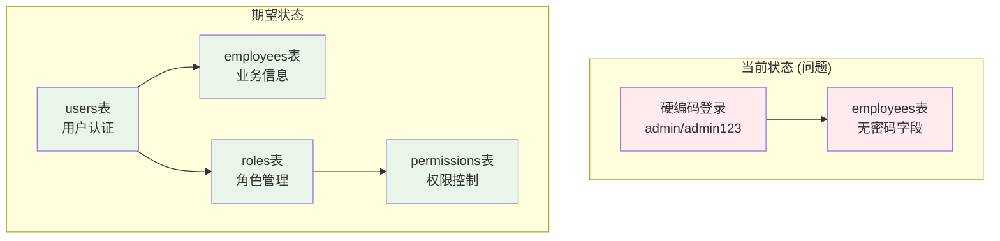

# 用户认证系统设计方案

## 🚨 问题分析

### 当前系统问题
1. **缺失用户表**: 数据库中没有专门的用户认证表
2. **员工表无密码**: employees表缺少password_hash字段
3. **硬编码认证**: auth.py中只支持硬编码的admin/admin123
4. **架构不完整**: 缺少完整的RBAC权限体系

### 架构分析


## 📋 解决方案

### 方案一：扩展员工表（推荐）
**适用场景**: 单体应用，员工即用户

#### 1. 数据库迁移
```sql
-- 添加认证字段到员工表
ALTER TABLE employees ADD COLUMN password_hash VARCHAR(255);
ALTER TABLE employees ADD COLUMN last_login_at TIMESTAMP WITH TIME ZONE;
ALTER TABLE employees ADD COLUMN login_attempts INTEGER DEFAULT 0;
ALTER TABLE employees ADD COLUMN locked_until TIMESTAMP WITH TIME ZONE;
ALTER TABLE employees ADD COLUMN is_active BOOLEAN DEFAULT true;

-- 创建唯一索引
CREATE UNIQUE INDEX idx_employees_email_unique ON employees(email) WHERE email IS NOT NULL;

-- 创建角色表
CREATE TABLE user_roles (
    id SERIAL PRIMARY KEY,
    name VARCHAR(50) UNIQUE NOT NULL,
    description TEXT,
    permissions JSONB,
    tenant_id VARCHAR(50),
    created_at TIMESTAMP WITH TIME ZONE DEFAULT NOW(),
    updated_at TIMESTAMP WITH TIME ZONE DEFAULT NOW()
);

-- 创建员工角色关联表
CREATE TABLE employee_roles (
    employee_id INTEGER REFERENCES employees(id),
    role_id INTEGER REFERENCES user_roles(id),
    granted_at TIMESTAMP WITH TIME ZONE DEFAULT NOW(),
    granted_by VARCHAR(100),
    PRIMARY KEY (employee_id, role_id)
);

-- 插入默认角色
INSERT INTO user_roles (name, description, permissions) VALUES
('admin', '系统管理员', '["*"]'),
('manager', '部门经理', '["visitor:read", "visitor:write", "visitor:approve", "employee:read"]'),
('employee', '普通员工', '["visitor:read", "visitor:create"]'),
('visitor_manager', '访客管理员', '["visitor:*", "department:read", "employee:read"]');
```

#### 2. 更新应用层
```python
# app/domain/entities/employee.py
from passlib.context import CryptContext

pwd_context = CryptContext(schemes=["bcrypt"], deprecated="auto")

class Employee:
    def __init__(self, ...):
        # 现有字段...
        self.password_hash: Optional[str] = None
        self.last_login_at: Optional[datetime] = None
        self.login_attempts: int = 0
        self.locked_until: Optional[datetime] = None
        self.is_active: bool = True
    
    def set_password(self, password: str):
        """设置密码"""
        self.password_hash = pwd_context.hash(password)
    
    def verify_password(self, password: str) -> bool:
        """验证密码"""
        if not self.password_hash:
            return False
        return pwd_context.verify(password, self.password_hash)
    
    def is_locked(self) -> bool:
        """检查账户是否被锁定"""
        if self.locked_until:
            return datetime.now(timezone.utc) < self.locked_until
        return False
```

#### 3. 认证服务
```python
# app/application/services/auth_service.py
class AuthService:
    def __init__(self, employee_repo, role_repo):
        self.employee_repo = employee_repo
        self.role_repo = role_repo
    
    async def authenticate(self, email: str, password: str) -> Optional[Employee]:
        """用户认证"""
        employee = await self.employee_repo.get_by_email(email)
        
        if not employee or not employee.is_active:
            return None
        
        if employee.is_locked():
            raise HTTPException(status_code=423, detail="账户已被锁定")
        
        if not employee.verify_password(password):
            await self._handle_failed_login(employee)
            return None
        
        await self._handle_successful_login(employee)
        return employee
    
    async def _handle_failed_login(self, employee: Employee):
        """处理登录失败"""
        employee.login_attempts += 1
        if employee.login_attempts >= 5:
            employee.locked_until = datetime.now(timezone.utc) + timedelta(minutes=30)
        await self.employee_repo.update(employee)
    
    async def _handle_successful_login(self, employee: Employee):
        """处理登录成功"""
        employee.login_attempts = 0
        employee.locked_until = None
        employee.last_login_at = datetime.now(timezone.utc)
        await self.employee_repo.update(employee)
```

### 方案二：独立用户表
**适用场景**: 多类型用户，需要更灵活的用户管理

#### 1. 数据库设计
```sql
-- 用户表
CREATE TABLE users (
    id SERIAL PRIMARY KEY,
    username VARCHAR(50) UNIQUE NOT NULL,
    email VARCHAR(100) UNIQUE NOT NULL,
    password_hash VARCHAR(255) NOT NULL,
    user_type VARCHAR(20) NOT NULL DEFAULT 'employee', -- employee, admin, visitor
    is_active BOOLEAN DEFAULT true,
    last_login_at TIMESTAMP WITH TIME ZONE,
    login_attempts INTEGER DEFAULT 0,
    locked_until TIMESTAMP WITH TIME ZONE,
    tenant_id VARCHAR(50),
    created_at TIMESTAMP WITH TIME ZONE DEFAULT NOW(),
    updated_at TIMESTAMP WITH TIME ZONE DEFAULT NOW()
);

-- 用户角色关联
CREATE TABLE user_role_assignments (
    user_id INTEGER REFERENCES users(id),
    role_id INTEGER REFERENCES user_roles(id),
    granted_at TIMESTAMP WITH TIME ZONE DEFAULT NOW(),
    granted_by INTEGER REFERENCES users(id),
    PRIMARY KEY (user_id, role_id)
);

-- 更新员工表关联用户
ALTER TABLE employees ADD COLUMN user_id INTEGER REFERENCES users(id);
```

### 方案三：混合方案（推荐企业级）
结合方案一和二的优点，支持内部员工和外部用户

## 🔧 实施步骤

### 第一阶段：基础认证（方案一）
1. 创建数据库迁移脚本
2. 更新Employee实体
3. 实现AuthService
4. 更新auth.py路由
5. 创建用户管理API

### 第二阶段：权限控制
1. 实现RBAC权限系统
2. 创建权限中间件
3. 更新各个API的权限验证
4. 实现权限管理界面

### 第三阶段：安全增强
1. 实现账户锁定机制
2. 添加登录日志
3. 实现密码策略
4. 添加双因子认证（可选）

## 📝 迁移脚本

### 立即可用的迁移方案
```sql
-- 文件: migrations/add_employee_authentication.sql

-- 1. 添加认证字段
ALTER TABLE employees ADD COLUMN IF NOT EXISTS password_hash VARCHAR(255);
ALTER TABLE employees ADD COLUMN IF NOT EXISTS last_login_at TIMESTAMP WITH TIME ZONE;
ALTER TABLE employees ADD COLUMN IF NOT EXISTS login_attempts INTEGER DEFAULT 0;
ALTER TABLE employees ADD COLUMN IF NOT EXISTS locked_until TIMESTAMP WITH TIME ZONE;

-- 2. 确保email唯一性
CREATE UNIQUE INDEX IF NOT EXISTS idx_employees_email_unique ON employees(email) 
WHERE email IS NOT NULL AND NOT is_deleted;

-- 3. 创建默认管理员
UPDATE employees 
SET password_hash = '$2b$12$LQv3c1yqBWVHxkd0LHAkCOYz6TtxMQJqyc3.pNj6SfPnJ8EZXRnKm' -- 'admin123'
WHERE email = 'admin@company.com';

-- 如果不存在默认管理员，创建一个
INSERT INTO employees (
    name, email, employee_id, password_hash, status, tenant_id, created_by
) VALUES (
    'System Admin', 'admin@company.com', 'ADMIN001', 
    '$2b$12$LQv3c1yqBWVHxkd0LHAkCOYz6TtxMQJqyc3.pNj6SfPnJ8EZXRnKm', -- 'admin123'
    'active', 'default', 'system'
) ON CONFLICT (email) DO NOTHING;
```

## 🔐 安全考虑

### 密码策略
- 最小长度8位
- 包含大小写字母、数字、特殊字符
- 定期更换提醒
- 历史密码检查

### 会话管理
- JWT Token有效期设置
- Refresh Token轮换
- 设备绑定（可选）

### 审计日志
- 登录成功/失败记录
- 权限变更记录
- 敏感操作记录

## 📊 监控指标

### 认证相关指标
- 登录成功率
- 账户锁定频率
- 密码重置请求
- 异常登录检测

### 权限相关指标
- 权限拒绝统计
- 权限变更记录
- 角色使用情况

## 🚀 立即行动

建议立即实施方案一的基础版本：
1. 运行数据库迁移脚本
2. 更新认证API
3. 测试基础登录功能
4. 逐步完善权限控制 