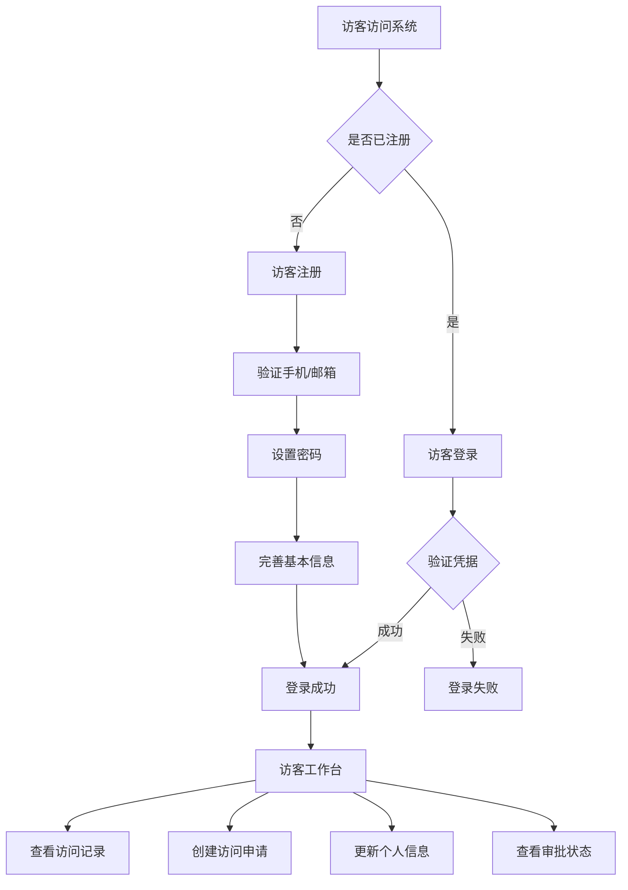

# 访客认证系统设计方案

## 📋 需求分析

### 访客登录场景
1. **访客自助注册**：访客可以自主创建账户
2. **访客登录查看**：查看自己的访问记录、预约状态
3. **访客信息管理**：更新个人信息、上传头像
4. **访问状态跟踪**：实时查看审批进度、签到状态

### 业务流程


## 🔐 认证方案设计

### 方案一：扩展访客表（推荐）
适用于访客即用户的场景

#### 数据库设计
```sql
-- 为访客表添加认证字段
ALTER TABLE visitors ADD COLUMN password_hash VARCHAR(255);
ALTER TABLE visitors ADD COLUMN last_login_at TIMESTAMP WITH TIME ZONE;
ALTER TABLE visitors ADD COLUMN login_attempts INTEGER DEFAULT 0;
ALTER TABLE visitors ADD COLUMN locked_until TIMESTAMP WITH TIME ZONE;
ALTER TABLE visitors ADD COLUMN email_verified BOOLEAN DEFAULT FALSE;
ALTER TABLE visitors ADD COLUMN phone_verified BOOLEAN DEFAULT FALSE;
ALTER TABLE visitors ADD COLUMN verification_code VARCHAR(10);
ALTER TABLE visitors ADD COLUMN verification_expires_at TIMESTAMP WITH TIME ZONE;

-- 确保邮箱和手机唯一性
CREATE UNIQUE INDEX idx_visitors_email_unique ON visitors(email) 
WHERE email IS NOT NULL AND NOT is_deleted;

CREATE UNIQUE INDEX idx_visitors_phone_unique ON visitors(phone_number) 
WHERE phone_number IS NOT NULL AND NOT is_deleted;

-- 创建访客角色
INSERT INTO user_roles (name, description, permissions, tenant_id, created_by) VALUES
('visitor', '访客用户', '["visitor:self:read", "visitor:self:write", "visitor:request:create"]', 'default', 'system'),
('vip_visitor', 'VIP访客', '["visitor:self:read", "visitor:self:write", "visitor:request:create", "visitor:priority"]', 'default', 'system');

-- 创建访客角色关联表
CREATE TABLE IF NOT EXISTS visitor_roles (
    visitor_id INTEGER REFERENCES visitors(id),
    role_id INTEGER REFERENCES user_roles(id),
    granted_at TIMESTAMP WITH TIME ZONE DEFAULT NOW(),
    granted_by VARCHAR(100),
    tenant_id VARCHAR(50),
    PRIMARY KEY (visitor_id, role_id)
);
```

### 方案二：独立访客用户表
适用于需要更复杂用户管理的场景

#### 数据库设计
```sql
-- 创建访客用户表
CREATE TABLE visitor_accounts (
    id SERIAL PRIMARY KEY,
    username VARCHAR(50) UNIQUE,
    email VARCHAR(100) UNIQUE NOT NULL,
    phone_number VARCHAR(20) UNIQUE,
    password_hash VARCHAR(255) NOT NULL,
    is_active BOOLEAN DEFAULT true,
    email_verified BOOLEAN DEFAULT FALSE,
    phone_verified BOOLEAN DEFAULT FALSE,
    last_login_at TIMESTAMP WITH TIME ZONE,
    login_attempts INTEGER DEFAULT 0,
    locked_until TIMESTAMP WITH TIME ZONE,
    verification_code VARCHAR(10),
    verification_expires_at TIMESTAMP WITH TIME ZONE,
    tenant_id VARCHAR(50),
    created_at TIMESTAMP WITH TIME ZONE DEFAULT NOW(),
    updated_at TIMESTAMP WITH TIME ZONE DEFAULT NOW()
);

-- 关联访客表
ALTER TABLE visitors ADD COLUMN visitor_account_id INTEGER REFERENCES visitor_accounts(id);
```

## 🚀 实施方案（方案一）

### 1. 数据库迁移脚本
```sql
-- 文件: migrations/add_visitor_authentication.sql

-- 1. 添加认证字段
ALTER TABLE visitors ADD COLUMN IF NOT EXISTS password_hash VARCHAR(255);
ALTER TABLE visitors ADD COLUMN IF NOT EXISTS last_login_at TIMESTAMP WITH TIME ZONE;
ALTER TABLE visitors ADD COLUMN IF NOT EXISTS login_attempts INTEGER DEFAULT 0;
ALTER TABLE visitors ADD COLUMN IF NOT EXISTS locked_until TIMESTAMP WITH TIME ZONE;
ALTER TABLE visitors ADD COLUMN IF NOT EXISTS email_verified BOOLEAN DEFAULT FALSE;
ALTER TABLE visitors ADD COLUMN IF NOT EXISTS phone_verified BOOLEAN DEFAULT FALSE;
ALTER TABLE visitors ADD COLUMN IF NOT EXISTS verification_code VARCHAR(10);
ALTER TABLE visitors ADD COLUMN IF NOT EXISTS verification_expires_at TIMESTAMP WITH TIME ZONE;

-- 2. 创建唯一索引
CREATE UNIQUE INDEX IF NOT EXISTS idx_visitors_email_unique ON visitors(email) 
WHERE email IS NOT NULL AND (is_deleted IS NULL OR is_deleted = FALSE);

CREATE UNIQUE INDEX IF NOT EXISTS idx_visitors_phone_unique ON visitors(phone_number) 
WHERE phone_number IS NOT NULL AND (is_deleted IS NULL OR is_deleted = FALSE);

-- 3. 插入访客角色
INSERT INTO user_roles (name, description, permissions, tenant_id, created_by) VALUES
('visitor', '访客用户', '["visitor:self:read", "visitor:self:write", "visitor:request:create"]', 'default', 'system'),
('vip_visitor', 'VIP访客', '["visitor:self:read", "visitor:self:write", "visitor:request:create", "visitor:priority"]', 'default', 'system')
ON CONFLICT (name) DO NOTHING;

-- 4. 创建访客角色关联表
CREATE TABLE IF NOT EXISTS visitor_roles (
    visitor_id INTEGER REFERENCES visitors(id),
    role_id INTEGER REFERENCES user_roles(id),
    granted_at TIMESTAMP WITH TIME ZONE DEFAULT NOW(),
    granted_by VARCHAR(100),
    tenant_id VARCHAR(50),
    PRIMARY KEY (visitor_id, role_id)
);

-- 5. 创建测试访客账户
DO $$
DECLARE
    visitor_id INTEGER;
    role_id INTEGER;
BEGIN
    -- 创建测试访客
    INSERT INTO visitors (
        name, email, phone_number, password_hash, 
        email_verified, tenant_id, created_by
    ) VALUES (
        'Test Visitor', 'visitor@example.com', '13800138000',
        '$2b$12$gV3oaJ6mDYBQnl3iw2YDb.RU2YpsgDoXnftZjrv97.UXQ6waDhcA.', -- 'visitor123'
        true, 'default', 'system'
    ) 
    ON CONFLICT (email) DO UPDATE SET
        password_hash = EXCLUDED.password_hash,
        email_verified = EXCLUDED.email_verified
    RETURNING id INTO visitor_id;
    
    -- 分配访客角色
    SELECT id INTO role_id FROM user_roles WHERE name = 'visitor';
    INSERT INTO visitor_roles (visitor_id, role_id, granted_by, tenant_id)
    VALUES (visitor_id, role_id, 'system', 'default')
    ON CONFLICT DO NOTHING;
END $$;
```

### 2. 认证服务更新
```python
# app/api/routes/auth.py 添加访客认证函数

async def authenticate_visitor(email: str, password: str, db: AsyncSession):
    """认证访客用户"""
    from sqlalchemy import text
    
    # 查询访客
    query = text("""
        SELECT v.*, array_agg(r.name) as roles, array_agg(r.permissions) as permissions
        FROM visitors v
        LEFT JOIN visitor_roles vr ON v.id = vr.visitor_id
        LEFT JOIN user_roles r ON vr.role_id = r.id
        WHERE v.email = :email 
        AND (v.is_deleted IS NULL OR v.is_deleted = FALSE)
        GROUP BY v.id
    """)
    
    result = await db.execute(query, {"email": email})
    row = result.fetchone()
    
    if not row:
        return None
    
    # 检查密码
    if not row.password_hash:
        return None
    
    if not pwd_context.verify(password, row.password_hash):
        # 记录失败登录
        update_query = text("""
            UPDATE visitors 
            SET login_attempts = COALESCE(login_attempts, 0) + 1,
                locked_until = CASE 
                    WHEN COALESCE(login_attempts, 0) + 1 >= 3 
                    THEN NOW() + INTERVAL '15 minutes'
                    ELSE locked_until
                END
            WHERE id = :visitor_id
        """)
        await db.execute(update_query, {"visitor_id": row.id})
        await db.commit()
        return None
    
    # 检查账户是否锁定
    if row.locked_until and datetime.now(timezone.utc) < row.locked_until:
        raise HTTPException(
            status_code=status.HTTP_423_LOCKED,
            detail=f"账户已被锁定，请在 {row.locked_until} 后重试"
        )
    
    # 检查邮箱验证
    if not row.email_verified:
        raise HTTPException(
            status_code=status.HTTP_403_FORBIDDEN,
            detail="请先验证邮箱后再登录"
        )
    
    # 登录成功，重置登录尝试
    update_query = text("""
        UPDATE visitors 
        SET login_attempts = 0, 
            locked_until = NULL, 
            last_login_at = NOW()
        WHERE id = :visitor_id
    """)
    await db.execute(update_query, {"visitor_id": row.id})
    await db.commit()
    
    # 处理角色和权限
    roles = [r for r in row.roles if r] if row.roles else ['visitor']
    permissions = []
    if row.permissions:
        for perm_list in row.permissions:
            if perm_list:
                import json
                try:
                    perms = json.loads(perm_list)
                    permissions.extend(perms)
                except:
                    pass
    
    return {
        "id": row.id,
        "name": row.name,
        "email": row.email,
        "phone_number": row.phone_number,
        "user_type": "visitor",
        "tenant_id": row.tenant_id,
        "roles": roles,
        "permissions": list(set(permissions))
    }

# 更新登录路由
@router.post("/visitor/login", response_model=LoginResponse, summary="访客登录")
async def visitor_login(login_data: LoginRequest, db: AsyncSession = Depends(get_db)):
    """访客登录"""
    try:
        user_info = await authenticate_visitor(login_data.username, login_data.password, db)
        
        if not user_info:
            raise HTTPException(
                status_code=status.HTTP_401_UNAUTHORIZED,
                detail="邮箱或密码错误"
            )
        
        # 创建令牌
        tokens = jwt_handler.create_user_tokens(
            user_id=str(user_info["id"]),
            username=user_info["name"],
            tenant_id=user_info["tenant_id"],
            roles=user_info["roles"],
            permissions=user_info["permissions"]
        )
        
        return LoginResponse(
            access_token=tokens["access_token"],
            refresh_token=tokens["refresh_token"],
            token_type=tokens["token_type"],
            expires_in=jwt_handler.access_token_expire_minutes * 60,
            user_info={
                "id": user_info["id"],
                "name": user_info["name"],
                "email": user_info["email"],
                "phone_number": user_info["phone_number"],
                "user_type": "visitor",
                "roles": user_info["roles"]
            }
        )
    
    except HTTPException:
        raise
    except Exception as e:
        raise HTTPException(
            status_code=status.HTTP_500_INTERNAL_SERVER_ERROR,
            detail=f"登录失败: {str(e)}"
        )
```

### 3. 访客注册API
```python
# 访客注册相关模型
class VisitorRegisterRequest(BaseModel):
    """访客注册请求"""
    name: str
    email: EmailStr
    phone_number: str
    password: str
    company_name: Optional[str] = None

class VisitorRegisterResponse(BaseModel):
    """访客注册响应"""
    visitor_id: int
    message: str
    verification_required: bool

@router.post("/visitor/register", response_model=VisitorRegisterResponse, summary="访客注册")
async def visitor_register(register_data: VisitorRegisterRequest, db: AsyncSession = Depends(get_db)):
    """访客注册"""
    try:
        # 检查邮箱是否已存在
        email_check = await db.execute(
            text("SELECT id FROM visitors WHERE email = :email AND (is_deleted IS NULL OR is_deleted = FALSE)"),
            {"email": register_data.email}
        )
        if email_check.fetchone():
            raise HTTPException(
                status_code=status.HTTP_400_BAD_REQUEST,
                detail="邮箱已被注册"
            )
        
        # 生成密码哈希
        password_hash = pwd_context.hash(register_data.password)
        
        # 生成验证码
        import random
        verification_code = str(random.randint(100000, 999999))
        
        # 创建访客账户
        insert_query = text("""
            INSERT INTO visitors (
                name, email, phone_number, password_hash, company_name,
                email_verified, verification_code, verification_expires_at,
                tenant_id, created_by
            ) VALUES (
                :name, :email, :phone_number, :password_hash, :company_name,
                false, :verification_code, NOW() + INTERVAL '24 hours',
                'default', 'self_register'
            ) RETURNING id
        """)
        
        result = await db.execute(insert_query, {
            "name": register_data.name,
            "email": register_data.email,
            "phone_number": register_data.phone_number,
            "password_hash": password_hash,
            "company_name": register_data.company_name,
            "verification_code": verification_code
        })
        visitor_id = result.fetchone()[0]
        
        # 分配默认访客角色
        role_query = text("SELECT id FROM user_roles WHERE name = 'visitor'")
        role_result = await db.execute(role_query)
        role_id = role_result.fetchone()[0]
        
        await db.execute(
            text("INSERT INTO visitor_roles (visitor_id, role_id, granted_by, tenant_id) VALUES (:visitor_id, :role_id, 'system', 'default')"),
            {"visitor_id": visitor_id, "role_id": role_id}
        )
        
        await db.commit()
        
        # TODO: 发送验证邮件
        # await send_verification_email(register_data.email, verification_code)
        
        return VisitorRegisterResponse(
            visitor_id=visitor_id,
            message="注册成功，请查收验证邮件",
            verification_required=True
        )
        
    except HTTPException:
        raise
    except Exception as e:
        await db.rollback()
        raise HTTPException(
            status_code=status.HTTP_500_INTERNAL_SERVER_ERROR,
            detail=f"注册失败: {str(e)}"
        )
```

## 📱 访客端功能规划

### 核心功能
1. **账户管理**
   - 注册、登录、找回密码
   - 邮箱/手机验证
   - 个人信息管理

2. **访问管理**
   - 创建访问申请
   - 查看申请状态
   - 历史访问记录

3. **预约功能**
   - 预约访问时间
   - 选择接待员工
   - 上传必要文件

4. **实时通知**
   - 审批状态变更
   - 访问提醒
   - 重要通知

### API端点规划
```
POST /api/v1/auth/visitor/register     # 访客注册
POST /api/v1/auth/visitor/login        # 访客登录
POST /api/v1/auth/visitor/verify-email # 邮箱验证
POST /api/v1/auth/visitor/reset-password # 重置密码

GET  /api/v1/visitor/profile          # 获取个人信息
PUT  /api/v1/visitor/profile          # 更新个人信息
GET  /api/v1/visitor/visits           # 访问记录
POST /api/v1/visitor/visits           # 创建访问申请
GET  /api/v1/visitor/visits/{id}      # 访问详情
```

## 🔒 安全考虑

### 访客账户安全
- **密码策略**: 最少8位，包含字母数字
- **登录保护**: 3次失败锁定15分钟（比员工更严格）
- **邮箱验证**: 强制验证邮箱后才能使用
- **权限隔离**: 访客只能访问自己的数据

### 数据保护
- **个人信息加密**: 敏感信息加密存储
- **访问日志**: 记录所有访客操作
- **数据清理**: 定期清理过期未验证账户

## 📈 实施优先级

### 第一阶段：基础认证
1. 数据库迁移（添加访客认证字段）
2. 访客登录API
3. 基础权限控制

### 第二阶段：注册流程
1. 访客注册API
2. 邮箱验证功能
3. 密码重置功能

### 第三阶段：完整功能
1. 访客工作台
2. 访问申请功能
3. 通知系统

这个设计方案将为访客提供完整的自助服务能力，大大提升用户体验！ 