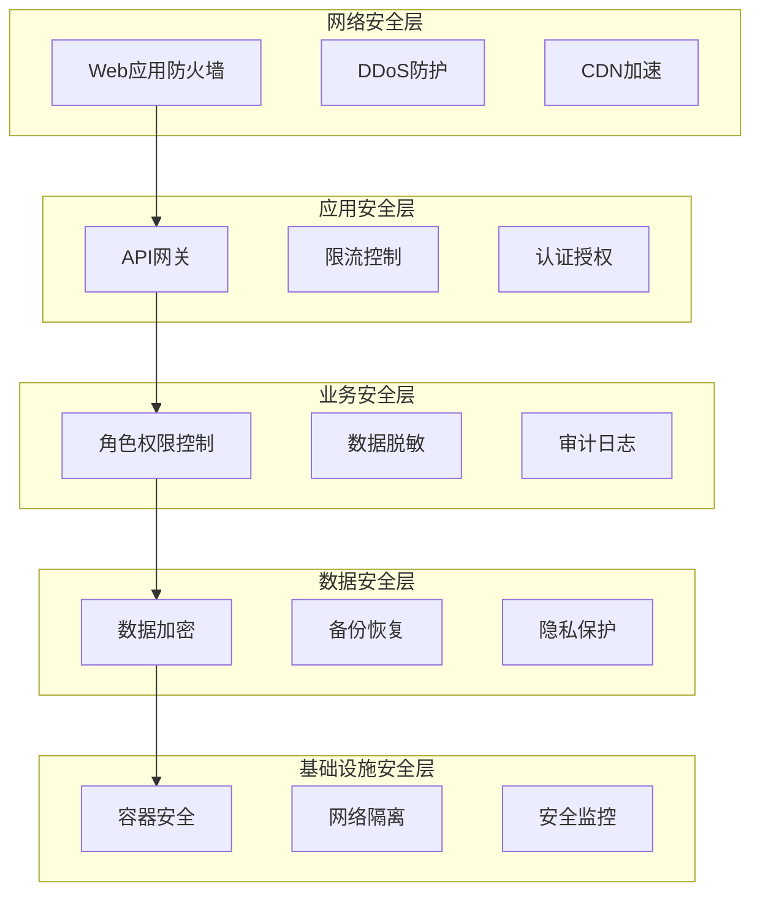

# 安全设计文档

## 概述

访客管理系统采用多层安全防护策略，确保数据安全、用户隐私保护和系统稳定运行。安全设计遵循零信任原则，实现纵深防御。

## 安全架构

### 安全层次模型



## 认证与授权

### 1. JWT认证机制

#### 令牌结构
```python
# JWT Payload结构
{
    "user_id": "12345",
    "username": "admin",
    "tenant_id": "company_a",
    "roles": ["admin", "user"],
    "permissions": ["visitor:read", "visitor:write", "employee:read"],
    "iat": 1640995200,  # 签发时间
    "exp": 1641081600,  # 过期时间
    "jti": "unique_token_id"  # 令牌唯一标识
}
```

#### 双令牌机制
```python
# app/infrastructure/auth/jwt_handler.py
from datetime import datetime, timedelta
from typing import Dict, List, Optional
import jwt
from app.core.config import settings

class JWTHandler:
    def __init__(self):
        self.secret_key = settings.SECRET_KEY
        self.algorithm = "HS256"
        self.access_token_expire = timedelta(minutes=30)
        self.refresh_token_expire = timedelta(days=7)
    
    def create_access_token(self, user_data: Dict) -> str:
        """创建访问令牌"""
        payload = {
            **user_data,
            "type": "access",
            "iat": datetime.utcnow(),
            "exp": datetime.utcnow() + self.access_token_expire
        }
        return jwt.encode(payload, self.secret_key, algorithm=self.algorithm)
    
    def create_refresh_token(self, user_data: Dict) -> str:
        """创建刷新令牌"""
        payload = {
            "user_id": user_data["user_id"],
            "type": "refresh",
            "iat": datetime.utcnow(),
            "exp": datetime.utcnow() + self.refresh_token_expire
        }
        return jwt.encode(payload, self.secret_key, algorithm=self.algorithm)
    
    def verify_token(self, token: str) -> Optional[Dict]:
        """验证令牌"""
        try:
            payload = jwt.decode(token, self.secret_key, algorithms=[self.algorithm])
            return payload
        except jwt.ExpiredSignatureError:
            raise AuthenticationError("令牌已过期")
        except jwt.InvalidTokenError:
            raise AuthenticationError("无效令牌")
```

### 2. 基于角色的访问控制 (RBAC)

#### 权限模型
```python
# app/domain/entities/permission.py
from enum import Enum
from typing import List, Set

class Permission(Enum):
    # 访客管理权限
    VISITOR_READ = "visitor:read"
    VISITOR_WRITE = "visitor:write"
    VISITOR_DELETE = "visitor:delete"
    VISITOR_APPROVE = "visitor:approve"
    
    # 员工管理权限
    EMPLOYEE_READ = "employee:read"
    EMPLOYEE_WRITE = "employee:write"
    EMPLOYEE_DELETE = "employee:delete"
    
    # 系统管理权限
    SYSTEM_CONFIG = "system:config"
    USER_MANAGE = "user:manage"
    AUDIT_VIEW = "audit:view"

class Role(Enum):
    ADMIN = "admin"
    MANAGER = "manager"
    EMPLOYEE = "employee"
    SECURITY = "security"
    VISITOR = "visitor"

# 角色权限映射
ROLE_PERMISSIONS = {
    Role.ADMIN: [
        Permission.VISITOR_READ, Permission.VISITOR_WRITE, Permission.VISITOR_DELETE,
        Permission.VISITOR_APPROVE, Permission.EMPLOYEE_READ, Permission.EMPLOYEE_WRITE,
        Permission.EMPLOYEE_DELETE, Permission.SYSTEM_CONFIG, Permission.USER_MANAGE,
        Permission.AUDIT_VIEW
    ],
    Role.MANAGER: [
        Permission.VISITOR_READ, Permission.VISITOR_WRITE, Permission.VISITOR_APPROVE,
        Permission.EMPLOYEE_READ, Permission.AUDIT_VIEW
    ],
    Role.EMPLOYEE: [
        Permission.VISITOR_READ, Permission.VISITOR_WRITE
    ],
    Role.SECURITY: [
        Permission.VISITOR_READ, Permission.VISITOR_APPROVE, Permission.AUDIT_VIEW
    ],
    Role.VISITOR: [
        Permission.VISITOR_READ
    ]
}
```

#### 权限装饰器
```python
# app/api/dependencies/auth.py
from functools import wraps
from fastapi import HTTPException, Depends
from app.infrastructure.auth.jwt_handler import JWTHandler
from app.domain.entities.permission import Permission

def require_permission(permission: Permission):
    """权限检查装饰器"""
    def decorator(func):
        @wraps(func)
        async def wrapper(*args, **kwargs):
            # 从请求中获取用户信息
            current_user = kwargs.get('current_user')
            if not current_user:
                raise HTTPException(status_code=401, detail="未认证")
            
            # 检查权限
            user_permissions = current_user.get('permissions', [])
            if permission.value not in user_permissions:
                raise HTTPException(status_code=403, detail="权限不足")
            
            return await func(*args, **kwargs)
        return wrapper
    return decorator

# 使用示例
@app.post("/api/v1/visitors/{visitor_id}/approve")
@require_permission(Permission.VISITOR_APPROVE)
async def approve_visitor(
    visitor_id: str,
    approval_data: ApprovalRequest,
    current_user: dict = Depends(get_current_user)
):
    # 审批逻辑
    pass
```

### 3. 多因子认证 (MFA)

#### TOTP实现
```python
# app/infrastructure/auth/mfa.py
import pyotp
import qrcode
from io import BytesIO
import base64

class MFAHandler:
    def __init__(self):
        self.issuer_name = "访客管理系统"
    
    def generate_secret(self) -> str:
        """生成MFA密钥"""
        return pyotp.random_base32()
    
    def generate_qr_code(self, user_email: str, secret: str) -> str:
        """生成二维码"""
        totp_uri = pyotp.totp.TOTP(secret).provisioning_uri(
            name=user_email,
            issuer_name=self.issuer_name
        )
        
        qr = qrcode.QRCode(version=1, box_size=10, border=5)
        qr.add_data(totp_uri)
        qr.make(fit=True)
        
        img = qr.make_image(fill_color="black", back_color="white")
        buffer = BytesIO()
        img.save(buffer, format='PNG')
        
        return base64.b64encode(buffer.getvalue()).decode()
    
    def verify_token(self, secret: str, token: str) -> bool:
        """验证TOTP令牌"""
        totp = pyotp.TOTP(secret)
        return totp.verify(token, valid_window=1)
```

## 数据安全

### 1. 数据加密

#### 传输加密
```nginx
# nginx SSL配置
server {
    listen 443 ssl http2;
    server_name api.visitor.com;
    
    # SSL证书配置
    ssl_certificate /etc/ssl/certs/visitor.crt;
    ssl_certificate_key /etc/ssl/private/visitor.key;
    
    # SSL安全配置
    ssl_protocols TLSv1.2 TLSv1.3;
    ssl_ciphers ECDHE-RSA-AES256-GCM-SHA512:DHE-RSA-AES256-GCM-SHA512;
    ssl_prefer_server_ciphers off;
    ssl_session_cache shared:SSL:10m;
    ssl_session_timeout 10m;
    
    # HSTS
    add_header Strict-Transport-Security "max-age=31536000; includeSubDomains" always;
    
    # 其他安全头
    add_header X-Frame-Options DENY;
    add_header X-Content-Type-Options nosniff;
    add_header X-XSS-Protection "1; mode=block";
    add_header Referrer-Policy "strict-origin-when-cross-origin";
}
```

#### 存储加密
```python
# app/infrastructure/security/encryption.py
from cryptography.fernet import Fernet
from cryptography.hazmat.primitives import hashes
from cryptography.hazmat.primitives.kdf.pbkdf2 import PBKDF2HMAC
import base64
import os

class DataEncryption:
    def __init__(self, password: str):
        self.password = password.encode()
        self.salt = os.urandom(16)
        self.key = self._derive_key()
        self.cipher = Fernet(self.key)
    
    def _derive_key(self) -> bytes:
        """派生加密密钥"""
        kdf = PBKDF2HMAC(
            algorithm=hashes.SHA256(),
            length=32,
            salt=self.salt,
            iterations=100000,
        )
        key = base64.urlsafe_b64encode(kdf.derive(self.password))
        return key
    
    def encrypt(self, data: str) -> str:
        """加密数据"""
        encrypted_data = self.cipher.encrypt(data.encode())
        return base64.urlsafe_b64encode(encrypted_data).decode()
    
    def decrypt(self, encrypted_data: str) -> str:
        """解密数据"""
        encrypted_bytes = base64.urlsafe_b64decode(encrypted_data.encode())
        decrypted_data = self.cipher.decrypt(encrypted_bytes)
        return decrypted_data.decode()

# 敏感字段加密
class SensitiveFieldMixin:
    """敏感字段混入类"""
    
    @property
    def phone_number(self) -> str:
        if hasattr(self, '_encrypted_phone'):
            return encryption.decrypt(self._encrypted_phone)
        return self._phone_number
    
    @phone_number.setter
    def phone_number(self, value: str):
        self._phone_number = value
        self._encrypted_phone = encryption.encrypt(value)
    
    @property
    def id_card_number(self) -> str:
        if hasattr(self, '_encrypted_id_card'):
            return encryption.decrypt(self._encrypted_id_card)
        return self._id_card_number
    
    @id_card_number.setter
    def id_card_number(self, value: str):
        self._id_card_number = value
        self._encrypted_id_card = encryption.encrypt(value)
```

### 2. 数据脱敏

```python
# app/infrastructure/security/data_masking.py
import re
from typing import Optional

class DataMasking:
    @staticmethod
    def mask_phone(phone: str) -> str:
        """手机号脱敏"""
        if not phone or len(phone) < 7:
            return phone
        return phone[:3] + "****" + phone[-4:]
    
    @staticmethod
    def mask_email(email: str) -> str:
        """邮箱脱敏"""
        if not email or '@' not in email:
            return email
        username, domain = email.split('@', 1)
        if len(username) <= 2:
            return email
        return username[:2] + "***@" + domain
    
    @staticmethod
    def mask_id_card(id_card: str) -> str:
        """身份证号脱敏"""
        if not id_card or len(id_card) < 8:
            return id_card
        return id_card[:4] + "**********" + id_card[-4:]
    
    @staticmethod
    def mask_name(name: str) -> str:
        """姓名脱敏"""
        if not name or len(name) <= 1:
            return name
        return name[0] + "*" * (len(name) - 1)

# 在API响应中应用脱敏
class VisitorResponseDTO:
    def __init__(self, visitor: VisitorModel, mask_sensitive: bool = True):
        self.id = visitor.id
        self.name = DataMasking.mask_name(visitor.name) if mask_sensitive else visitor.name
        self.phone = DataMasking.mask_phone(visitor.phone_number) if mask_sensitive else visitor.phone_number
        self.email = DataMasking.mask_email(visitor.email) if mask_sensitive else visitor.email
        # ... 其他字段
```

### 3. 数据备份安全

```bash
#!/bin/bash
# 安全备份脚本
BACKUP_DIR="/secure/backup"
ENCRYPTION_KEY="/secure/keys/backup.key"
DATE=$(date +%Y%m%d_%H%M%S)

# 创建加密备份
pg_dump -h localhost -U postgres visitor_management | \
gpg --cipher-algo AES256 --compress-algo 1 --symmetric \
    --passphrase-file $ENCRYPTION_KEY \
    --output $BACKUP_DIR/visitor_management_$DATE.sql.gpg

# 验证备份完整性
gpg --quiet --batch --decrypt \
    --passphrase-file $ENCRYPTION_KEY \
    $BACKUP_DIR/visitor_management_$DATE.sql.gpg | \
    head -n 1 > /dev/null

if [ $? -eq 0 ]; then
    echo "备份验证成功: $DATE"
else
    echo "备份验证失败: $DATE"
    exit 1
fi
```

## 应用安全

### 1. 输入验证

```python
# app/api/validators/security.py
from pydantic import BaseModel, validator
import re
from typing import Optional

class SecurityValidator(BaseModel):
    @validator('phone_number')
    def validate_phone(cls, v):
        if v and not re.match(r'^[0-9+\-\s()]+$', v):
            raise ValueError('无效的电话号码格式')
        return v
    
    @validator('email')
    def validate_email(cls, v):
        if v and not re.match(r'^[a-zA-Z0-9._%+-]+@[a-zA-Z0-9.-]+\.[a-zA-Z]{2,}$', v):
            raise ValueError('无效的邮箱格式')
        return v
    
    @validator('name')
    def validate_name(cls, v):
        if v and len(v) > 100:
            raise ValueError('姓名长度不能超过100字符')
        # 防止XSS
        if v and re.search(r'[<>"\']', v):
            raise ValueError('姓名包含非法字符')
        return v

# SQL注入防护
class SafeQuery:
    @staticmethod
    def build_where_clause(filters: dict) -> tuple:
        """安全构建WHERE子句"""
        conditions = []
        params = []
        
        for key, value in filters.items():
            if key in ['name', 'phone', 'email']:  # 白名单字段
                conditions.append(f"{key} LIKE ?")
                params.append(f"%{value}%")
        
        where_clause = " AND ".join(conditions) if conditions else "1=1"
        return where_clause, params
```

### 2. 限流和防护

```python
# app/api/middleware/rate_limit.py
from fastapi import Request, HTTPException
from slowapi import Limiter, _rate_limit_exceeded_handler
from slowapi.util import get_remote_address
from slowapi.errors import RateLimitExceeded
import redis

# 创建限流器
limiter = Limiter(key_func=get_remote_address)
redis_client = redis.Redis(host='localhost', port=6379, db=1)

class RateLimitMiddleware:
    def __init__(self, app):
        self.app = app
    
    async def __call__(self, scope, receive, send):
        if scope["type"] == "http":
            request = Request(scope, receive)
            
            # 检查IP黑名单
            client_ip = get_remote_address(request)
            if self.is_blacklisted(client_ip):
                response = HTTPException(status_code=403, detail="IP已被封禁")
                await response(scope, receive, send)
                return
            
            # 检查异常行为
            if await self.detect_suspicious_activity(request):
                await self.add_to_blacklist(client_ip, duration=3600)  # 封禁1小时
        
        await self.app(scope, receive, send)
    
    def is_blacklisted(self, ip: str) -> bool:
        """检查IP是否在黑名单中"""
        return redis_client.exists(f"blacklist:{ip}")
    
    async def add_to_blacklist(self, ip: str, duration: int):
        """添加IP到黑名单"""
        redis_client.setex(f"blacklist:{ip}", duration, "1")
    
    async def detect_suspicious_activity(self, request: Request) -> bool:
        """检测可疑活动"""
        client_ip = get_remote_address(request)
        
        # 检查请求频率
        key = f"requests:{client_ip}"
        current_requests = redis_client.incr(key)
        if current_requests == 1:
            redis_client.expire(key, 60)  # 1分钟窗口
        
        # 超过阈值认为是可疑活动
        return current_requests > 100

# API端点限流
@app.post("/api/v1/auth/login")
@limiter.limit("5/minute")  # 每分钟最多5次登录尝试
async def login(request: Request, credentials: LoginRequest):
    # 登录逻辑
    pass
```

### 3. CSRF防护

```python
# app/api/middleware/csrf.py
from fastapi import Request, HTTPException
import secrets
import hmac
import hashlib

class CSRFMiddleware:
    def __init__(self, secret_key: str):
        self.secret_key = secret_key
    
    def generate_token(self, session_id: str) -> str:
        """生成CSRF令牌"""
        timestamp = str(int(time.time()))
        message = f"{session_id}:{timestamp}"
        signature = hmac.new(
            self.secret_key.encode(),
            message.encode(),
            hashlib.sha256
        ).hexdigest()
        return f"{timestamp}:{signature}"
    
    def verify_token(self, token: str, session_id: str) -> bool:
        """验证CSRF令牌"""
        try:
            timestamp, signature = token.split(':', 1)
            message = f"{session_id}:{timestamp}"
            expected_signature = hmac.new(
                self.secret_key.encode(),
                message.encode(),
                hashlib.sha256
            ).hexdigest()
            
            # 验证签名和时间戳（5分钟有效期）
            is_valid_signature = hmac.compare_digest(signature, expected_signature)
            is_valid_time = int(time.time()) - int(timestamp) < 300
            
            return is_valid_signature and is_valid_time
        except ValueError:
            return False
```

## 审计与监控

### 1. 审计日志

```python
# app/infrastructure/audit/audit_logger.py
from datetime import datetime
from typing import Dict, Any, Optional
import json
from sqlalchemy.orm import Session

class AuditLogger:
    def __init__(self, db: Session):
        self.db = db
    
    async def log_action(
        self,
        user_id: str,
        action: str,
        resource_type: str,
        resource_id: Optional[str] = None,
        details: Optional[Dict[str, Any]] = None,
        ip_address: Optional[str] = None,
        user_agent: Optional[str] = None
    ):
        """记录审计日志"""
        audit_log = AuditLogModel(
            user_id=user_id,
            action=action,
            resource_type=resource_type,
            resource_id=resource_id,
            details=json.dumps(details) if details else None,
            ip_address=ip_address,
            user_agent=user_agent,
            timestamp=datetime.utcnow()
        )
        
        self.db.add(audit_log)
        await self.db.commit()

# 审计装饰器
def audit_action(action: str, resource_type: str):
    def decorator(func):
        @wraps(func)
        async def wrapper(*args, **kwargs):
            # 执行原函数
            result = await func(*args, **kwargs)
            
            # 记录审计日志
            current_user = kwargs.get('current_user')
            if current_user:
                await audit_logger.log_action(
                    user_id=current_user['user_id'],
                    action=action,
                    resource_type=resource_type,
                    resource_id=getattr(result, 'id', None),
                    details={'function': func.__name__}
                )
            
            return result
        return wrapper
    return decorator

# 使用示例
@audit_action("CREATE", "VISITOR")
async def create_visitor(visitor_data: CreateVisitorRequest):
    # 创建访客逻辑
    pass
```

### 2. 安全监控

```python
# app/infrastructure/monitoring/security_monitor.py
from datetime import datetime, timedelta
from typing import List, Dict
import asyncio

class SecurityMonitor:
    def __init__(self):
        self.alert_thresholds = {
            'failed_logins': 5,  # 5分钟内失败登录次数
            'api_errors': 50,    # 5分钟内API错误次数
            'suspicious_ips': 10  # 单IP异常请求次数
        }
    
    async def monitor_failed_logins(self):
        """监控登录失败"""
        while True:
            try:
                # 查询最近5分钟的失败登录
                recent_failures = await self.get_recent_login_failures()
                
                # 按IP分组统计
                ip_failures = {}
                for failure in recent_failures:
                    ip = failure.ip_address
                    ip_failures[ip] = ip_failures.get(ip, 0) + 1
                
                # 检查是否超过阈值
                for ip, count in ip_failures.items():
                    if count >= self.alert_thresholds['failed_logins']:
                        await self.send_security_alert(
                            f"IP {ip} 在5分钟内登录失败 {count} 次",
                            severity="HIGH"
                        )
                        # 自动封禁IP
                        await self.blacklist_ip(ip, duration=3600)
                
                await asyncio.sleep(60)  # 每分钟检查一次
            except Exception as e:
                logger.error(f"安全监控异常: {e}")
                await asyncio.sleep(60)
    
    async def send_security_alert(self, message: str, severity: str):
        """发送安全告警"""
        alert_data = {
            "message": message,
            "severity": severity,
            "timestamp": datetime.utcnow().isoformat(),
            "system": "visitor_management"
        }
        
        # 发送到监控系统
        await self.send_to_monitoring_system(alert_data)
        
        # 发送邮件通知
        if severity in ["HIGH", "CRITICAL"]:
            await self.send_email_alert(alert_data)
```

### 3. 漏洞扫描

```python
# scripts/security_scan.py
import subprocess
import json
from datetime import datetime

class SecurityScanner:
    def __init__(self):
        self.scan_results = {}
    
    def run_dependency_scan(self):
        """依赖漏洞扫描"""
        try:
            # 使用safety扫描Python依赖
            result = subprocess.run(
                ['safety', 'check', '--json'],
                capture_output=True,
                text=True
            )
            
            if result.returncode != 0:
                vulnerabilities = json.loads(result.stdout)
                self.scan_results['dependencies'] = vulnerabilities
                return vulnerabilities
            
            return []
        except Exception as e:
            print(f"依赖扫描失败: {e}")
            return []
    
    def run_code_scan(self):
        """代码安全扫描"""
        try:
            # 使用bandit扫描Python代码
            result = subprocess.run(
                ['bandit', '-r', 'app/', '-f', 'json'],
                capture_output=True,
                text=True
            )
            
            if result.stdout:
                scan_data = json.loads(result.stdout)
                issues = scan_data.get('results', [])
                self.scan_results['code'] = issues
                return issues
            
            return []
        except Exception as e:
            print(f"代码扫描失败: {e}")
            return []
    
    def generate_report(self):
        """生成安全扫描报告"""
        report = {
            "scan_time": datetime.now().isoformat(),
            "results": self.scan_results,
            "summary": {
                "total_issues": sum(len(issues) for issues in self.scan_results.values()),
                "high_severity": 0,
                "medium_severity": 0,
                "low_severity": 0
            }
        }
        
        # 统计严重程度
        for category, issues in self.scan_results.items():
            for issue in issues:
                severity = issue.get('issue_severity', 'LOW').upper()
                if severity == 'HIGH':
                    report["summary"]["high_severity"] += 1
                elif severity == 'MEDIUM':
                    report["summary"]["medium_severity"] += 1
                else:
                    report["summary"]["low_severity"] += 1
        
        return report

if __name__ == "__main__":
    scanner = SecurityScanner()
    scanner.run_dependency_scan()
    scanner.run_code_scan()
    report = scanner.generate_report()
    
    with open(f"security_report_{datetime.now().strftime('%Y%m%d_%H%M%S')}.json", 'w') as f:
        json.dump(report, f, indent=2)
```

## 合规性要求

### 1. GDPR合规

```python
# app/infrastructure/privacy/gdpr_compliance.py
from datetime import datetime, timedelta
from typing import List, Dict

class GDPRCompliance:
    def __init__(self, db: Session):
        self.db = db
    
    async def handle_data_subject_request(self, request_type: str, user_id: str):
        """处理数据主体请求"""
        if request_type == "access":
            return await self.export_user_data(user_id)
        elif request_type == "deletion":
            return await self.delete_user_data(user_id)
        elif request_type == "rectification":
            return await self.update_user_data(user_id)
        elif request_type == "portability":
            return await self.export_portable_data(user_id)
    
    async def export_user_data(self, user_id: str) -> Dict:
        """导出用户数据"""
        user_data = {
            "personal_info": await self.get_user_personal_info(user_id),
            "visit_history": await self.get_user_visit_history(user_id),
            "approval_history": await self.get_user_approval_history(user_id),
            "audit_logs": await self.get_user_audit_logs(user_id)
        }
        return user_data
    
    async def delete_user_data(self, user_id: str):
        """删除用户数据（符合GDPR要求）"""
        # 软删除，保留必要的审计信息
        await self.soft_delete_user(user_id)
        
        # 匿名化历史记录
        await self.anonymize_user_history(user_id)
        
        # 记录删除操作
        await self.log_deletion_request(user_id)
    
    async def check_data_retention(self):
        """检查数据保留期限"""
        # 查找超过保留期限的数据
        expired_data = await self.find_expired_data()
        
        for data in expired_data:
            if data.can_be_deleted():
                await self.schedule_deletion(data)
```

### 2. 数据保留策略

```python
# app/infrastructure/privacy/data_retention.py
from datetime import datetime, timedelta

class DataRetentionPolicy:
    RETENTION_PERIODS = {
        'visitor_records': timedelta(days=365 * 2),  # 2年
        'audit_logs': timedelta(days=365 * 7),       # 7年
        'access_logs': timedelta(days=90),           # 90天
        'backup_files': timedelta(days=365 * 1),     # 1年
    }
    
    async def apply_retention_policy(self):
        """应用数据保留策略"""
        for data_type, retention_period in self.RETENTION_PERIODS.items():
            cutoff_date = datetime.utcnow() - retention_period
            await self.cleanup_expired_data(data_type, cutoff_date)
    
    async def cleanup_expired_data(self, data_type: str, cutoff_date: datetime):
        """清理过期数据"""
        if data_type == 'visitor_records':
            # 删除过期访客记录
            expired_visitors = await self.db.execute(
                select(VisitorModel)
                .where(VisitorModel.created_at < cutoff_date)
                .where(VisitorModel.status.in_(['checked_out', 'expired']))
            )
            
            for visitor in expired_visitors.scalars():
                await self.anonymize_visitor_record(visitor)
```

## 安全配置清单

### 1. 生产环境安全配置

```yaml
# docker-compose.prod.yml 安全配置
version: '3.8'
services:
  app:
    image: visitor-management:latest
    environment:
      - DEBUG=false
      - SECRET_KEY=${SECRET_KEY}  # 强密钥
      - DATABASE_URL=${DATABASE_URL}
      - REDIS_URL=${REDIS_URL}
      - ALLOWED_HOSTS=${ALLOWED_HOSTS}
      - CORS_ORIGINS=${CORS_ORIGINS}
    security_opt:
      - no-new-privileges:true
    read_only: true
    tmpfs:
      - /tmp
    user: "1000:1000"  # 非root用户
    
  db:
    image: postgres:15
    environment:
      - POSTGRES_PASSWORD=${DB_PASSWORD}
    volumes:
      - postgres_data:/var/lib/postgresql/data:Z
    security_opt:
      - no-new-privileges:true
    user: "999:999"
```

### 2. 安全检查脚本

```bash
#!/bin/bash
# security_check.sh - 安全配置检查脚本

echo "=== 访客管理系统安全检查 ==="

# 检查SSL证书
echo "检查SSL证书..."
openssl x509 -in /etc/ssl/certs/visitor.crt -text -noout | grep "Not After"

# 检查密码强度
echo "检查数据库密码强度..."
if [[ ${DB_PASSWORD} =~ ^.{12,}$ ]] && [[ ${DB_PASSWORD} =~ [A-Z] ]] && [[ ${DB_PASSWORD} =~ [a-z] ]] && [[ ${DB_PASSWORD} =~ [0-9] ]]; then
    echo "✓ 数据库密码强度符合要求"
else
    echo "✗ 数据库密码强度不足"
fi

# 检查防火墙状态
echo "检查防火墙状态..."
ufw status | grep "Status: active" && echo "✓ 防火墙已启用" || echo "✗ 防火墙未启用"

# 检查Docker安全配置
echo "检查Docker安全配置..."
docker inspect visitor-management | jq '.[0].HostConfig.SecurityOpt' | grep "no-new-privileges" && echo "✓ Docker安全配置正确"

# 检查文件权限
echo "检查关键文件权限..."
ls -la /etc/ssl/private/ | grep "600" && echo "✓ SSL私钥权限正确"

echo "=== 安全检查完成 ==="
```

---

本安全设计文档提供了全面的安全防护策略和实施方案，确保访客管理系统在各个层面都具备强大的安全防护能力。 