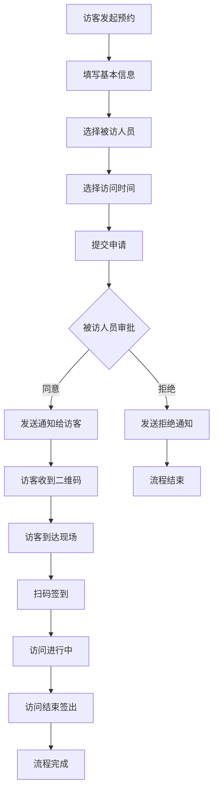
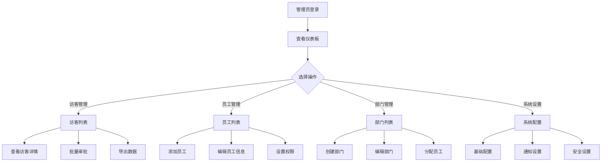
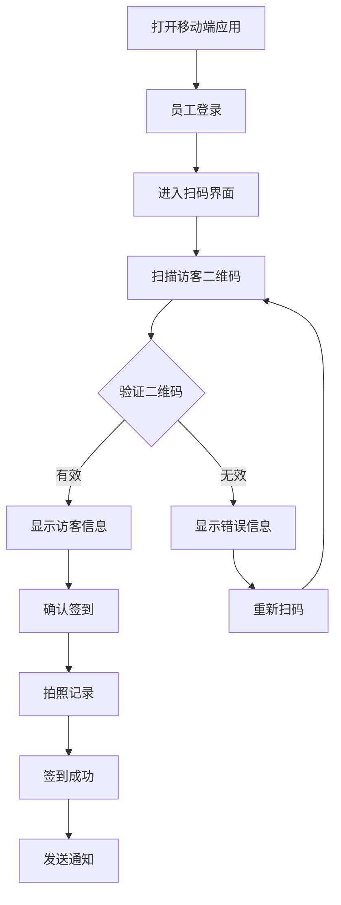
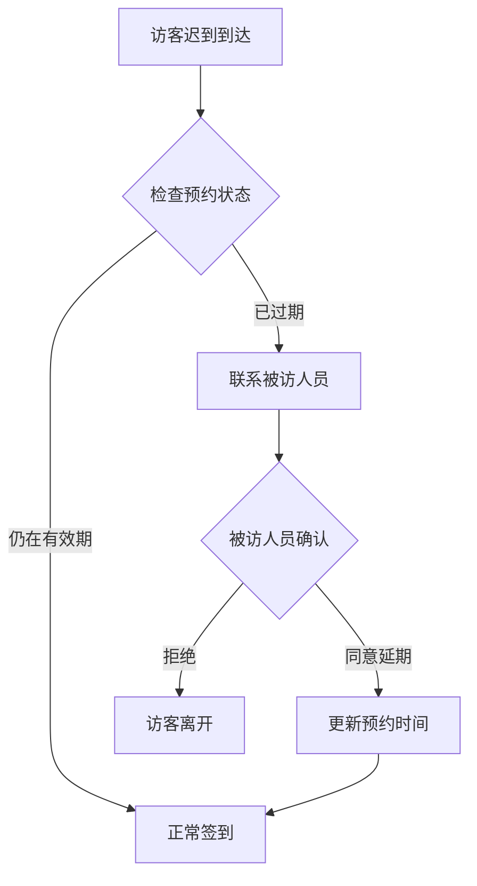
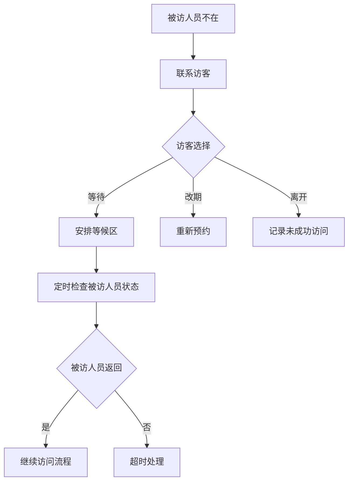
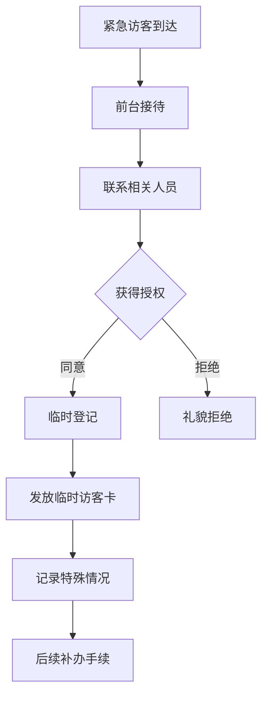

# 访客管理系统用户操作流程图

## 概述

本文档描述了访客管理系统中各类用户的操作流程，包括管理员、员工和访客的主要使用场景。

## 用户角色定义

### 1. 系统管理员
- 拥有最高权限
- 负责系统配置和用户管理
- 可以查看所有数据和报表

### 2. 部门管理员
- 管理本部门的访客审批
- 查看部门相关数据
- 管理部门员工信息

### 3. 普通员工
- 接待访客
- 查看自己相关的访客信息
- 进行访客签到操作

### 4. 访客
- 提交访问申请
- 查看审批状态
- 进行签到签出

## 主要业务流程

### 1. 访客预约流程



### 2. 管理员操作流程



### 3. 移动端签到流程



## 详细操作流程

### 访客预约详细流程

#### 步骤1: 访客信息填写
1. 访客姓名 (必填)
2. 手机号码 (必填)
3. 身份证号 (可选)
4. 公司名称 (必填)
5. 职位 (可选)
6. 邮箱地址 (可选)

#### 步骤2: 访问信息设置
1. 访问目的选择
   - 商务洽谈
   - 技术交流
   - 项目评审
   - 面试招聘
   - 其他 (需说明)

2. 被访人员选择
   - 按部门筛选
   - 搜索员工姓名
   - 选择具体人员

3. 访问时间安排
   - 访问日期
   - 开始时间
   - 结束时间
   - 是否重复访问

#### 步骤3: 附加信息
1. 同行人员信息
2. 车辆信息 (如需)
3. 特殊需求说明
4. 相关文件上传

### 审批流程详细说明

#### 一级审批 (被访人员)
1. 接收审批通知
2. 查看访客详细信息
3. 做出审批决定
   - 同意: 进入下一步
   - 拒绝: 填写拒绝原因
   - 转交: 指定其他审批人

#### 二级审批 (部门主管) - 可选
1. 高级别访客需要
2. 敏感区域访问
3. 特殊时间段访问

#### 审批结果处理
1. 同意后自动生成二维码
2. 发送短信/邮件通知访客
3. 更新访客状态
4. 记录审批日志

### 现场签到流程

#### 访客到达
1. 出示二维码或身份证
2. 前台验证身份
3. 测量体温 (如需)
4. 发放访客卡

#### 扫码签到
1. 员工使用移动端扫码
2. 验证访客身份
3. 拍照记录
4. 确认签到时间
5. 通知被访人员

#### 访问过程
1. 访客佩戴访客卡
2. 在指定区域活动
3. 被访人员陪同

#### 签出流程
1. 访问结束后签出
2. 归还访客卡
3. 记录签出时间
4. 更新访客状态

## 异常处理流程

### 访客迟到处理


### 被访人员不在处理


### 紧急访客处理


## 系统管理流程

### 用户权限管理
1. **角色定义**
   - 系统管理员
   - 部门管理员
   - 普通员工
   - 访客

2. **权限分配**
   - 功能权限
   - 数据权限
   - 操作权限

3. **权限审核**
   - 定期权限检查
   - 异常权限报警
   - 权限变更记录

### 数据备份流程
1. **自动备份**
   - 每日增量备份
   - 每周全量备份
   - 备份文件验证

2. **手动备份**
   - 重要操作前备份
   - 系统升级前备份
   - 数据迁移备份

### 系统监控流程
1. **性能监控**
   - 响应时间监控
   - 并发用户监控
   - 资源使用监控

2. **安全监控**
   - 登录异常监控
   - 操作异常监控
   - 数据访问监控

## 移动端特殊流程

### APP端操作流程
1. **首页概览**
   - 查看今日统计
   - 快速操作入口
   - 最近访客列表

2. **扫码签到**
   - 打开扫码界面
   - 扫描访客二维码
   - 确认访客信息
   - 完成签到操作

3. **访客管理**
   - 查看访客列表
   - 筛选和搜索
   - 查看访客详情
   - 进行审批操作

### 小程序端操作流程
1. **微信授权登录**
   - 获取微信用户信息
   - 绑定系统账户
   - 设置用户权限

2. **轻量化操作**
   - 简化的界面设计
   - 核心功能快速访问
   - 微信生态集成

## 数据流转图

### 访客数据流转
```
访客申请 → 审批流程 → 二维码生成 → 现场签到 → 访问记录 → 数据统计
    ↓         ↓         ↓         ↓         ↓         ↓
  数据库    通知系统   二维码库   签到记录   访问日志   报表系统
```

### 通知数据流转
```
触发事件 → 通知规则 → 消息生成 → 发送渠道 → 送达确认 → 状态更新
    ↓         ↓         ↓         ↓         ↓         ↓
  事件监听   规则引擎   消息队列   短信/邮件   回执处理   日志记录
```

## 性能优化建议

### 前端优化
1. **页面加载优化**
   - 图片懒加载
   - 代码分割
   - 缓存策略

2. **交互优化**
   - 防抖处理
   - 节流控制
   - 骨架屏显示

### 后端优化
1. **数据库优化**
   - 索引优化
   - 查询优化
   - 连接池管理

2. **接口优化**
   - 响应压缩
   - 缓存机制
   - 异步处理

## 安全考虑

### 数据安全
1. **敏感信息加密**
   - 身份证号加密存储
   - 手机号脱敏显示
   - 密码哈希处理

2. **访问控制**
   - JWT令牌验证
   - 权限中间件
   - API限流

### 操作安全
1. **审计日志**
   - 关键操作记录
   - 异常行为监控
   - 日志定期分析

2. **数据备份**
   - 定期备份策略
   - 灾难恢复计划
   - 备份数据验证

---

*本流程图将根据系统使用情况和用户反馈持续优化更新* 