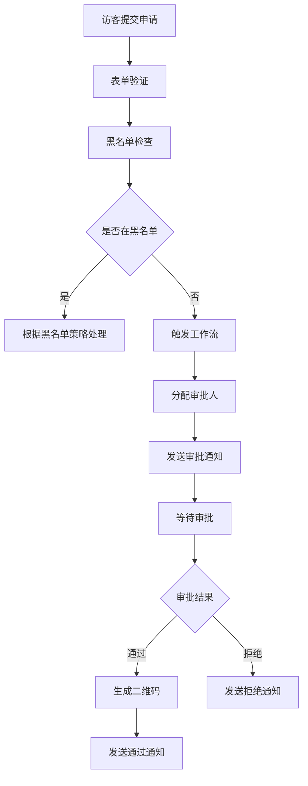
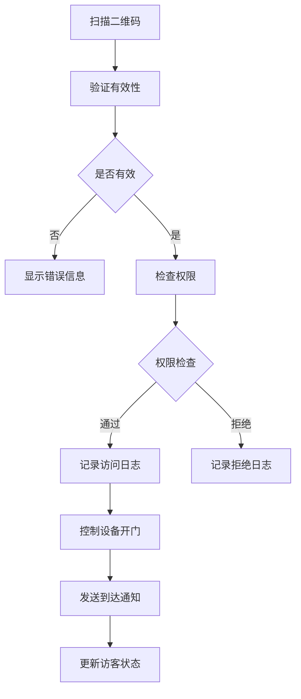
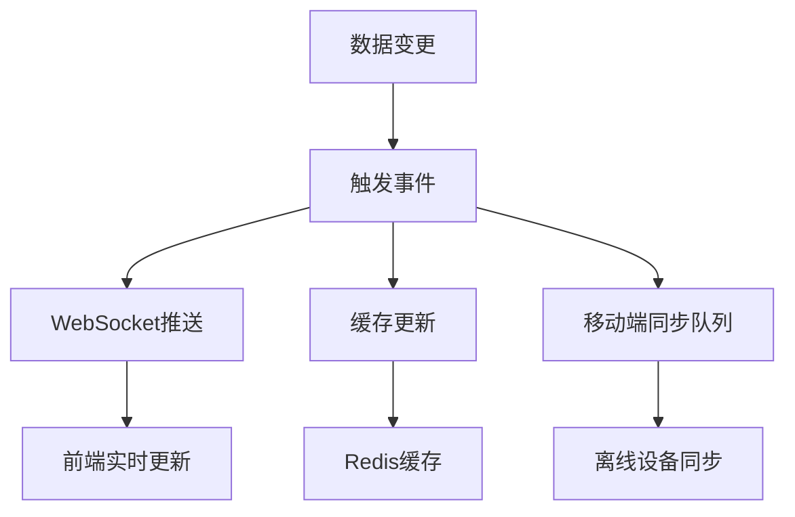

# 数据库设计文档

## 版本信息
- 版本: v1.0
- 更新日期: 2025-06-18
- 状态: 设计中

## 数据库选型

### 主数据库: PostgreSQL 15+
**选择理由**:
- 强ACID事务支持，确保数据一致性
- 优秀的JSON支持，适合配置引擎存储
- 丰富的索引类型，支持复杂查询
- 成熟的多租户支持
- 优秀的并发性能

### 缓存: Redis 7+
**用途**:
- 会话存储
- 实时数据缓存
- 消息队列
- 限流计数器

### 时序数据: TimescaleDB
**用途**:
- 设备监控数据
- 访问日志分析
- 性能指标收集

## 核心实体设计

### 1. 租户表 (tenants)
```sql
CREATE TABLE tenants (
    id UUID PRIMARY KEY DEFAULT gen_random_uuid(),
    name VARCHAR(255) NOT NULL,
    code VARCHAR(50) UNIQUE NOT NULL,
    status tenant_status DEFAULT 'active',
    settings JSONB DEFAULT '{}',
    created_at TIMESTAMP WITH TIME ZONE DEFAULT NOW(),
    updated_at TIMESTAMP WITH TIME ZONE DEFAULT NOW(),
    expires_at TIMESTAMP WITH TIME ZONE
);

CREATE TYPE tenant_status AS ENUM ('active', 'suspended', 'expired');
```

### 2. 用户表 (users)
```sql
CREATE TABLE users (
    id UUID PRIMARY KEY DEFAULT gen_random_uuid(),
    tenant_id UUID NOT NULL REFERENCES tenants(id),
    username VARCHAR(50) UNIQUE NOT NULL,
    email VARCHAR(255) UNIQUE NOT NULL,
    password_hash VARCHAR(255) NOT NULL,
    role user_role NOT NULL,
    status user_status DEFAULT 'active',
    profile JSONB DEFAULT '{}',
    permissions TEXT[] DEFAULT '{}',
    created_at TIMESTAMP WITH TIME ZONE DEFAULT NOW(),
    updated_at TIMESTAMP WITH TIME ZONE DEFAULT NOW(),
    last_login_at TIMESTAMP WITH TIME ZONE
);

CREATE TYPE user_role AS ENUM ('admin', 'employee', 'security', 'reception', 'gate', 'department_head');
CREATE TYPE user_status AS ENUM ('active', 'inactive', 'locked');
```

### 3. 部门表 (departments)
```sql
CREATE TABLE departments (
    id UUID PRIMARY KEY DEFAULT gen_random_uuid(),
    tenant_id UUID NOT NULL REFERENCES tenants(id),
    name VARCHAR(255) NOT NULL,
    code VARCHAR(50) NOT NULL,
    parent_id UUID REFERENCES departments(id),
    head_user_id UUID REFERENCES users(id),
    description TEXT,
    settings JSONB DEFAULT '{}',
    created_at TIMESTAMP WITH TIME ZONE DEFAULT NOW(),
    updated_at TIMESTAMP WITH TIME ZONE DEFAULT NOW(),
    
    UNIQUE(tenant_id, code)
);
```

### 4. 员工表 (employees)
```sql
CREATE TABLE employees (
    id UUID PRIMARY KEY DEFAULT gen_random_uuid(),
    tenant_id UUID NOT NULL REFERENCES tenants(id),
    user_id UUID UNIQUE REFERENCES users(id),
    department_id UUID NOT NULL REFERENCES departments(id),
    employee_no VARCHAR(50) NOT NULL,
    name VARCHAR(100) NOT NULL,
    phone VARCHAR(20),
    email VARCHAR(255),
    position VARCHAR(100),
    status employee_status DEFAULT 'active',
    profile JSONB DEFAULT '{}',
    created_at TIMESTAMP WITH TIME ZONE DEFAULT NOW(),
    updated_at TIMESTAMP WITH TIME ZONE DEFAULT NOW(),
    
    UNIQUE(tenant_id, employee_no)
);

CREATE TYPE employee_status AS ENUM ('active', 'inactive', 'on_leave');
```

### 5. 访客表 (visitors)
```sql
CREATE TABLE visitors (
    id UUID PRIMARY KEY DEFAULT gen_random_uuid(),
    tenant_id UUID NOT NULL REFERENCES tenants(id),
    scenario visitor_scenario NOT NULL,
    
    -- 访客基本信息
    visitor_name VARCHAR(100) NOT NULL,
    visitor_phone VARCHAR(20),
    visitor_company VARCHAR(255),
    visitor_id_card VARCHAR(50),
    visitor_photo TEXT,
    
    -- 访问信息
    employee_id UUID REFERENCES employees(id),
    department_id UUID REFERENCES departments(id),
    visit_purpose TEXT,
    visit_date DATE NOT NULL,
    visit_time TIME NOT NULL,
    expected_duration INTEGER, -- 分钟
    visit_location VARCHAR(255),
    
    -- 状态和流程
    status visitor_status DEFAULT 'pending',
    qr_code VARCHAR(255) UNIQUE,
    approval_data JSONB DEFAULT '{}',
    form_data JSONB DEFAULT '{}',
    
    -- 时间戳
    created_at TIMESTAMP WITH TIME ZONE DEFAULT NOW(),
    updated_at TIMESTAMP WITH TIME ZONE DEFAULT NOW(),
    checked_in_at TIMESTAMP WITH TIME ZONE,
    checked_out_at TIMESTAMP WITH TIME ZONE,
    expires_at TIMESTAMP WITH TIME ZONE
);

CREATE TYPE visitor_scenario AS ENUM ('self_apply', 'employee_invite_known', 'employee_invite_unknown', 'batch_invite');
CREATE TYPE visitor_status AS ENUM ('pending', 'approved', 'rejected', 'checked_in', 'checked_out', 'expired');
```

### 6. 访客批次表 (visitor_batches)
```sql
CREATE TABLE visitor_batches (
    id UUID PRIMARY KEY DEFAULT gen_random_uuid(),
    tenant_id UUID NOT NULL REFERENCES tenants(id),
    name VARCHAR(255) NOT NULL,
    scenario visitor_scenario NOT NULL,
    creator_id UUID NOT NULL REFERENCES users(id),
    template_id UUID REFERENCES form_templates(id),
    total_count INTEGER DEFAULT 0,
    approved_count INTEGER DEFAULT 0,
    status batch_status DEFAULT 'processing',
    metadata JSONB DEFAULT '{}',
    created_at TIMESTAMP WITH TIME ZONE DEFAULT NOW(),
    updated_at TIMESTAMP WITH TIME ZONE DEFAULT NOW()
);

CREATE TYPE batch_status AS ENUM ('processing', 'completed', 'cancelled');
```

### 7. 审批流程表 (approvals)
```sql
CREATE TABLE approvals (
    id UUID PRIMARY KEY DEFAULT gen_random_uuid(),
    tenant_id UUID NOT NULL REFERENCES tenants(id),
    visitor_id UUID NOT NULL REFERENCES visitors(id),
    workflow_id UUID REFERENCES workflows(id),
    step_name VARCHAR(100) NOT NULL,
    assignee_id UUID REFERENCES users(id),
    assignee_type assignee_type NOT NULL,
    status approval_status DEFAULT 'pending',
    action approval_action,
    comment TEXT,
    conditions JSONB DEFAULT '{}',
    created_at TIMESTAMP WITH TIME ZONE DEFAULT NOW(),
    processed_at TIMESTAMP WITH TIME ZONE
);

CREATE TYPE assignee_type AS ENUM ('user', 'department_head', 'security', 'auto');
CREATE TYPE approval_status AS ENUM ('pending', 'approved', 'rejected', 'cancelled');
CREATE TYPE approval_action AS ENUM ('approve', 'reject', 'request_info');
```

### 8. 访问日志表 (access_logs)
```sql
CREATE TABLE access_logs (
    id UUID PRIMARY KEY DEFAULT gen_random_uuid(),
    tenant_id UUID NOT NULL REFERENCES tenants(id),
    visitor_id UUID REFERENCES visitors(id),
    action log_action NOT NULL,
    location VARCHAR(255),
    device_id UUID REFERENCES devices(id),
    operator_id UUID REFERENCES users(id),
    verification_method verification_method,
    success BOOLEAN NOT NULL,
    error_message TEXT,
    metadata JSONB DEFAULT '{}',
    created_at TIMESTAMP WITH TIME ZONE DEFAULT NOW()
);

CREATE TYPE log_action AS ENUM ('checkin', 'checkout', 'verify', 'deny');
CREATE TYPE verification_method AS ENUM ('qr_code', 'id_card', 'face_recognition', 'manual');
```

### 9. 设备表 (devices)
```sql
CREATE TABLE devices (
    id UUID PRIMARY KEY DEFAULT gen_random_uuid(),
    tenant_id UUID NOT NULL REFERENCES tenants(id),
    name VARCHAR(255) NOT NULL,
    code VARCHAR(50) NOT NULL,
    type device_type NOT NULL,
    location VARCHAR(255) NOT NULL,
    status device_status DEFAULT 'offline',
    capabilities TEXT[] DEFAULT '{}',
    config JSONB DEFAULT '{}',
    last_heartbeat TIMESTAMP WITH TIME ZONE,
    created_at TIMESTAMP WITH TIME ZONE DEFAULT NOW(),
    updated_at TIMESTAMP WITH TIME ZONE DEFAULT NOW(),
    
    UNIQUE(tenant_id, code)
);

CREATE TYPE device_type AS ENUM ('gate', 'reception', 'kiosk', 'mobile');
CREATE TYPE device_status AS ENUM ('online', 'offline', 'error', 'maintenance');
```

### 10. 通知表 (notifications)
```sql
CREATE TABLE notifications (
    id UUID PRIMARY KEY DEFAULT gen_random_uuid(),
    tenant_id UUID NOT NULL REFERENCES tenants(id),
    recipient_id UUID NOT NULL REFERENCES users(id),
    type notification_type NOT NULL,
    title VARCHAR(255) NOT NULL,
    content TEXT NOT NULL,
    data JSONB DEFAULT '{}',
    channels TEXT[] DEFAULT '{}',
    status notification_status DEFAULT 'pending',
    read_at TIMESTAMP WITH TIME ZONE,
    created_at TIMESTAMP WITH TIME ZONE DEFAULT NOW()
);

CREATE TYPE notification_type AS ENUM ('visitor_arrival', 'approval_request', 'system_alert', 'device_offline');
CREATE TYPE notification_status AS ENUM ('pending', 'sent', 'failed', 'read');
```

## 配置引擎设计

### 11. 表单模板表 (form_templates)
```sql
CREATE TABLE form_templates (
    id UUID PRIMARY KEY DEFAULT gen_random_uuid(),
    tenant_id UUID NOT NULL REFERENCES tenants(id),
    name VARCHAR(255) NOT NULL,
    scenario visitor_scenario NOT NULL,
    version INTEGER DEFAULT 1,
    fields JSONB NOT NULL,
    validation_rules JSONB DEFAULT '{}',
    is_active BOOLEAN DEFAULT true,
    created_at TIMESTAMP WITH TIME ZONE DEFAULT NOW(),
    updated_at TIMESTAMP WITH TIME ZONE DEFAULT NOW()
);
```

### 12. 工作流表 (workflows)
```sql
CREATE TABLE workflows (
    id UUID PRIMARY KEY DEFAULT gen_random_uuid(),
    tenant_id UUID NOT NULL REFERENCES tenants(id),
    name VARCHAR(255) NOT NULL,
    scenario visitor_scenario NOT NULL,
    version INTEGER DEFAULT 1,
    steps JSONB NOT NULL,
    conditions JSONB DEFAULT '{}',
    is_active BOOLEAN DEFAULT true,
    created_at TIMESTAMP WITH TIME ZONE DEFAULT NOW(),
    updated_at TIMESTAMP WITH TIME ZONE DEFAULT NOW()
);
```

### 13. 业务规则表 (business_rules)
```sql
CREATE TABLE business_rules (
    id UUID PRIMARY KEY DEFAULT gen_random_uuid(),
    tenant_id UUID NOT NULL REFERENCES tenants(id),
    name VARCHAR(255) NOT NULL,
    type rule_type NOT NULL,
    conditions JSONB NOT NULL,
    actions JSONB NOT NULL,
    priority INTEGER DEFAULT 0,
    is_active BOOLEAN DEFAULT true,
    created_at TIMESTAMP WITH TIME ZONE DEFAULT NOW(),
    updated_at TIMESTAMP WITH TIME ZONE DEFAULT NOW()
);

CREATE TYPE rule_type AS ENUM ('auto_approval', 'blacklist_check', 'time_restriction', 'capacity_limit');
```

### 14. 黑名单表 (blacklists)
```sql
CREATE TABLE blacklists (
    id UUID PRIMARY KEY DEFAULT gen_random_uuid(),
    tenant_id UUID NOT NULL REFERENCES tenants(id),
    type blacklist_type NOT NULL,
    identifier VARCHAR(255) NOT NULL,
    name VARCHAR(255),
    reason TEXT,
    action blacklist_action NOT NULL,
    created_by UUID NOT NULL REFERENCES users(id),
    expires_at TIMESTAMP WITH TIME ZONE,
    created_at TIMESTAMP WITH TIME ZONE DEFAULT NOW(),
    
    UNIQUE(tenant_id, type, identifier)
);

CREATE TYPE blacklist_type AS ENUM ('person', 'company', 'id_card', 'phone');
CREATE TYPE blacklist_action AS ENUM ('reject', 'require_approval', 'warning');
```

## 索引设计

### 主要索引
```sql
-- 租户相关索引
CREATE INDEX idx_users_tenant_id ON users(tenant_id);
CREATE INDEX idx_visitors_tenant_id ON visitors(tenant_id);
CREATE INDEX idx_departments_tenant_id ON departments(tenant_id);

-- 访客查询索引
CREATE INDEX idx_visitors_status ON visitors(status);
CREATE INDEX idx_visitors_date ON visitors(visit_date);
CREATE INDEX idx_visitors_employee ON visitors(employee_id);
CREATE INDEX idx_visitors_department ON visitors(department_id);
CREATE INDEX idx_visitors_qr_code ON visitors(qr_code);

-- 复合索引
CREATE INDEX idx_visitors_tenant_status_date ON visitors(tenant_id, status, visit_date);
CREATE INDEX idx_visitors_employee_date ON visitors(employee_id, visit_date);

-- 审批索引
CREATE INDEX idx_approvals_visitor ON approvals(visitor_id);
CREATE INDEX idx_approvals_assignee ON approvals(assignee_id);
CREATE INDEX idx_approvals_status ON approvals(status);

-- 访问日志索引
CREATE INDEX idx_access_logs_visitor ON access_logs(visitor_id);
CREATE INDEX idx_access_logs_device ON access_logs(device_id);
CREATE INDEX idx_access_logs_created_at ON access_logs(created_at);

-- 时间范围查询索引
CREATE INDEX idx_access_logs_date_range ON access_logs(created_at) WHERE created_at >= '2025-01-01';

-- JSON字段索引
CREATE INDEX idx_visitors_form_data_gin ON visitors USING GIN(form_data);
CREATE INDEX idx_business_rules_conditions_gin ON business_rules USING GIN(conditions);
```

### 分区表设计

#### 访问日志分区
```sql
-- 按月分区访问日志表
CREATE TABLE access_logs_y2025m01 PARTITION OF access_logs 
FOR VALUES FROM ('2025-01-01') TO ('2025-02-01');

CREATE TABLE access_logs_y2025m02 PARTITION OF access_logs 
FOR VALUES FROM ('2025-02-01') TO ('2025-03-01');

-- 自动创建分区函数
CREATE OR REPLACE FUNCTION create_monthly_partitions(table_name TEXT, start_date DATE, num_months INTEGER)
RETURNS void AS $$
DECLARE
    partition_name TEXT;
    start_range DATE;
    end_range DATE;
    i INTEGER;
BEGIN
    FOR i IN 0..num_months-1 LOOP
        start_range := start_date + (i || ' month')::INTERVAL;
        end_range := start_date + ((i+1) || ' month')::INTERVAL;
        partition_name := table_name || '_y' || EXTRACT(YEAR FROM start_range) || 'm' || LPAD(EXTRACT(MONTH FROM start_range)::TEXT, 2, '0');
        
        EXECUTE format('CREATE TABLE IF NOT EXISTS %I PARTITION OF %I FOR VALUES FROM (%L) TO (%L)',
                      partition_name, table_name, start_range, end_range);
    END LOOP;
END;
$$ LANGUAGE plpgsql;
```

## 数据流设计

### 1. 访客申请流程


### 2. 签到签退流程


### 3. 实时数据同步


## 数据安全设计

### 1. 数据加密
```sql
-- 敏感字段加密
CREATE EXTENSION IF NOT EXISTS pgcrypto;

-- 加密函数
CREATE OR REPLACE FUNCTION encrypt_sensitive_data(data TEXT)
RETURNS TEXT AS $$
BEGIN
    RETURN encode(encrypt(data::bytea, 'encryption_key', 'aes'), 'base64');
END;
$$ LANGUAGE plpgsql;

-- 解密函数
CREATE OR REPLACE FUNCTION decrypt_sensitive_data(encrypted_data TEXT)
RETURNS TEXT AS $$
BEGIN
    RETURN convert_from(decrypt(decode(encrypted_data, 'base64'), 'encryption_key', 'aes'), 'UTF-8');
END;
$$ LANGUAGE plpgsql;
```

### 2. 行级安全策略
```sql
-- 启用行级安全
ALTER TABLE visitors ENABLE ROW LEVEL SECURITY;
ALTER TABLE employees ENABLE ROW LEVEL SECURITY;
ALTER TABLE departments ENABLE ROW LEVEL SECURITY;

-- 租户隔离策略
CREATE POLICY tenant_isolation_visitors ON visitors
    FOR ALL
    TO authenticated_users
    USING (tenant_id = current_setting('app.current_tenant_id')::UUID);

CREATE POLICY tenant_isolation_employees ON employees
    FOR ALL
    TO authenticated_users
    USING (tenant_id = current_setting('app.current_tenant_id')::UUID);
```

### 3. 审计日志
```sql
CREATE TABLE audit_logs (
    id UUID PRIMARY KEY DEFAULT gen_random_uuid(),
    tenant_id UUID NOT NULL,
    table_name VARCHAR(255) NOT NULL,
    record_id UUID NOT NULL,
    action audit_action NOT NULL,
    old_values JSONB,
    new_values JSONB,
    user_id UUID NOT NULL,
    ip_address INET,
    user_agent TEXT,
    created_at TIMESTAMP WITH TIME ZONE DEFAULT NOW()
);

CREATE TYPE audit_action AS ENUM ('INSERT', 'UPDATE', 'DELETE');

-- 审计触发器
CREATE OR REPLACE FUNCTION audit_trigger_func()
RETURNS TRIGGER AS $$
BEGIN
    IF TG_OP = 'DELETE' THEN
        INSERT INTO audit_logs (tenant_id, table_name, record_id, action, old_values, user_id)
        VALUES (OLD.tenant_id, TG_TABLE_NAME, OLD.id, 'DELETE', row_to_json(OLD), current_setting('app.current_user_id')::UUID);
        RETURN OLD;
    ELSIF TG_OP = 'UPDATE' THEN
        INSERT INTO audit_logs (tenant_id, table_name, record_id, action, old_values, new_values, user_id)
        VALUES (NEW.tenant_id, TG_TABLE_NAME, NEW.id, 'UPDATE', row_to_json(OLD), row_to_json(NEW), current_setting('app.current_user_id')::UUID);
        RETURN NEW;
    ELSIF TG_OP = 'INSERT' THEN
        INSERT INTO audit_logs (tenant_id, table_name, record_id, action, new_values, user_id)
        VALUES (NEW.tenant_id, TG_TABLE_NAME, NEW.id, 'INSERT', row_to_json(NEW), current_setting('app.current_user_id')::UUID);
        RETURN NEW;
    END IF;
    RETURN NULL;
END;
$$ LANGUAGE plpgsql;
```

## 性能优化

### 1. 连接池配置
```ini
# PostgreSQL配置优化
max_connections = 200
shared_buffers = 256MB
effective_cache_size = 1GB
work_mem = 4MB
maintenance_work_mem = 64MB
checkpoint_completion_target = 0.9
wal_buffers = 16MB
default_statistics_target = 100
```

### 2. 查询优化
```sql
-- 访客统计查询优化
CREATE MATERIALIZED VIEW visitor_daily_stats AS
SELECT 
    tenant_id,
    visit_date,
    status,
    COUNT(*) as count,
    COUNT(*) FILTER (WHERE checked_in_at IS NOT NULL) as checked_in_count
FROM visitors 
WHERE visit_date >= CURRENT_DATE - INTERVAL '90 days'
GROUP BY tenant_id, visit_date, status;

-- 定期刷新物化视图
CREATE OR REPLACE FUNCTION refresh_visitor_stats()
RETURNS void AS $$
BEGIN
    REFRESH MATERIALIZED VIEW CONCURRENTLY visitor_daily_stats;
END;
$$ LANGUAGE plpgsql;
```

### 3. 缓存策略
```sql
-- Redis缓存键设计
-- 访客信息: visitor:{tenant_id}:{visitor_id}
-- 员工信息: employee:{tenant_id}:{employee_id}
-- 部门信息: department:{tenant_id}:{department_id}
-- 今日访客: visitors:today:{tenant_id}
-- 实时统计: stats:realtime:{tenant_id}
```

## 备份与恢复

### 1. 备份策略
```bash
#!/bin/bash
# 全量备份脚本
pg_dump \
  --host=$DB_HOST \
  --port=$DB_PORT \
  --username=$DB_USER \
  --dbname=$DB_NAME \
  --format=custom \
  --compress=9 \
  --verbose \
  --file=backup_$(date +%Y%m%d_%H%M%S).dump

# 增量备份(WAL归档)
archive_command = 'rsync -a %p /backup/wal_archive/%f'
```

### 2. 恢复流程
```bash
#!/bin/bash
# 恢复脚本
pg_restore \
  --host=$DB_HOST \
  --port=$DB_PORT \
  --username=$DB_USER \
  --dbname=$DB_NAME \
  --verbose \
  --clean \
  --if-exists \
  backup_file.dump
```

## 监控与告警

### 1. 关键指标监控
- 连接数使用率
- 查询响应时间
- 慢查询数量
- 表空间使用率
- 复制延迟

### 2. 告警规则
```yaml
# Prometheus告警规则
groups:
  - name: postgresql
    rules:
      - alert: PostgreSQLDown
        expr: pg_up == 0
        for: 5m
        labels:
          severity: critical
        annotations:
          summary: "PostgreSQL数据库实例下线"
          
      - alert: PostgreSQLSlowQueries
        expr: pg_stat_activity_max_tx_duration{datname!~"template.*"} > 300
        for: 5m
        labels:
          severity: warning
        annotations:
          summary: "检测到慢查询"
```

## 总结

本数据库设计基于PostgreSQL构建了完整的访客管理系统数据架构，具备以下特点：

1. **多租户支持**: 完整的租户隔离和数据安全
2. **配置驱动**: 表单、工作流、业务规则的灵活配置
3. **高性能**: 合理的索引设计和分区策略
4. **数据安全**: 加密、审计、行级安全策略
5. **可扩展性**: 支持水平扩展和读写分离
6. **监控完善**: 全面的性能监控和告警机制

该设计能够很好地支持访客管理系统的各种业务场景，并为未来的功能扩展提供了坚实的数据基础。 