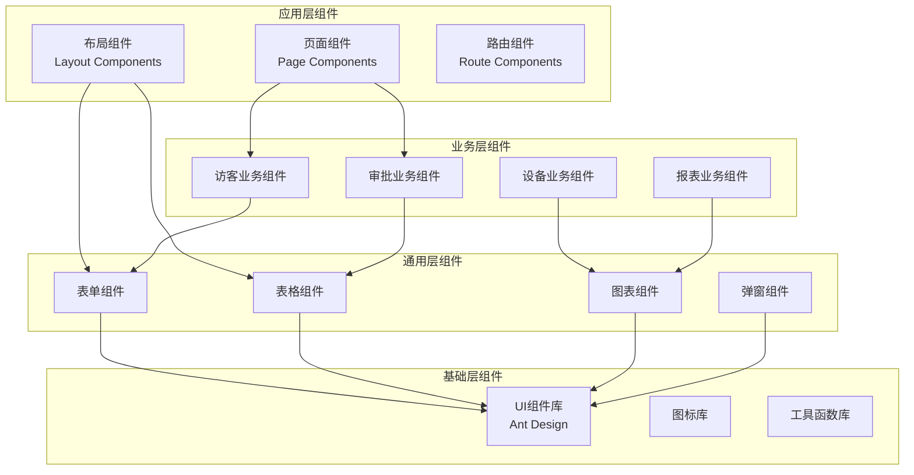
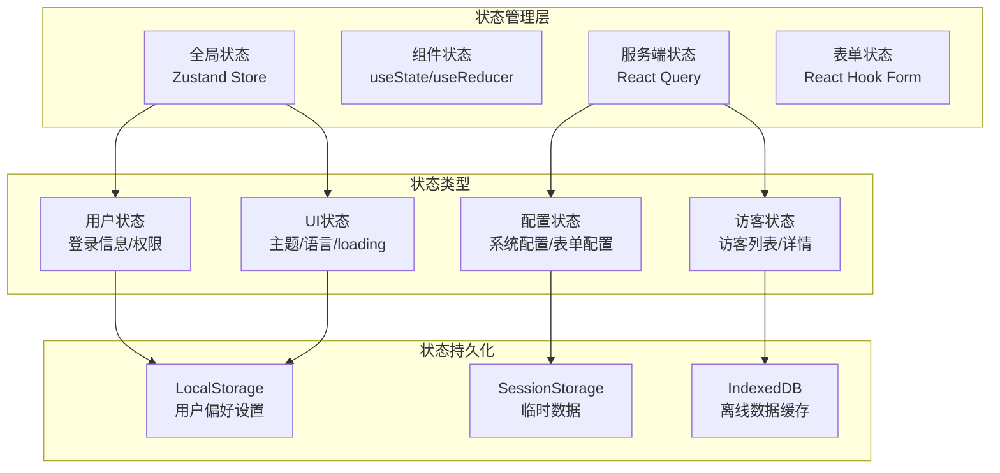

# 访客管理系统前端架构设计

## 📋 文档信息
- **版本**: v2.0.0
- **创建日期**: 2025-06-18
- **最后更新**: 2025-06-18
- **维护者**: 前端架构师AI
- **适用角色**: 前端开发团队、UI/UX设计师、技术负责人
- **依赖文档**: system-overview.md, frontend-requirements.md

## 🎯 文档目标
详细设计基于React生态的多端前端架构，包括技术选型、组件设计、状态管理、性能优化等关键技术方案。

## 🏗️ 前端架构总体设计

### React生态统一技术栈
```
核心技术栈: React 18 + TypeScript 5.0 + Vite 4.0
UI组件库 : Ant Design 5.0 (桌面端) + Ant Design Mobile 2.0 (移动端)
状态管理 : Zustand + React Query
路由管理 : React Router 6.0
构建工具 : Vite + SWC (开发) + Rollup (生产)
代码规范 : ESLint + Prettier + Husky
测试框架 : Vitest + React Testing Library + Playwright
```

### 多端应用架构矩阵
| 应用端 | 框架选型 | UI库 | 特殊需求 | 部署方式 |
|--------|----------|------|----------|----------|
| 管理端 | React + TS | Ant Design Pro | 复杂数据展示 | SPA + CDN |
| 访客端 | React + TS | Ant Design Mobile | 移动优先 | PWA + CDN |
| 门岗端 | React + TS | Ant Design + PWA | 离线支持 | PWA + 本地缓存 |
| 前台端 | React + TS | Ant Design | 简化界面 | PWA + CDN |
| 设备端 | React + TS | 定制组件 | 嵌入式适配 | WebView |

### 移动端备用方案技术栈
```
React Native方案:
- React Native 0.72 + TypeScript
- React Navigation 6.0
- React Native Paper (Material Design)
- AsyncStorage + MMKV

微信小程序方案:
- Taro 3.6 + React + TypeScript
- Taro UI组件库
- Mobx状态管理
- 小程序云开发
```

## 🏛️ 架构分层设计

### 1. 应用层级架构
```
┌─────────────────────────────────────────┐
│              应用层 (App Layer)          │  ← 页面组件、路由配置
├─────────────────────────────────────────┤
│            业务层 (Business Layer)       │  ← 业务组件、Hook逻辑
├─────────────────────────────────────────┤
│            服务层 (Service Layer)        │  ← API服务、状态管理
├─────────────────────────────────────────┤
│            基础层 (Foundation Layer)     │  ← 通用组件、工具函数
└─────────────────────────────────────────┘
```

### 2. 组件架构设计


### 3. 状态管理架构


## 📱 多端应用详细设计

### 1. 管理端应用 (Admin Dashboard)
```typescript
// 技术架构
interface AdminAppArchitecture {
  framework: "React 18 + TypeScript";
  uiLibrary: "Ant Design Pro";
  routing: "React Router 6";
  stateManagement: "Zustand + React Query";
  
  // 核心功能模块
  modules: {
    dashboard: "数据概览仪表板";
    visitorManagement: "访客管理模块";
    userManagement: "用户权限管理";
    systemConfig: "系统配置模块";
    analytics: "数据分析模块";
  };
  
  // 特殊需求
  features: {
    realTimeUpdates: "WebSocket实时更新";
    dataVisualization: "ECharts数据可视化";
    bulkOperations: "批量操作支持";
    exportImport: "数据导入导出";
  };
}
```

**页面结构设计**:
```
src/
├── pages/
│   ├── Dashboard/                 # 仪表板
│   ├── Visitor/                   # 访客管理
│   │   ├── List/                  # 访客列表
│   │   ├── Detail/                # 访客详情
│   │   ├── Approval/              # 审批管理
│   │   └── Statistics/            # 访客统计
│   ├── User/                      # 用户管理
│   ├── System/                    # 系统配置
│   └── Analytics/                 # 数据分析
├── components/
│   ├── Business/                  # 业务组件
│   ├── Common/                    # 通用组件
│   └── Layout/                    # 布局组件
└── hooks/                         # 自定义Hook
```

### 2. 访客端应用 (Visitor Portal)
```typescript
// 移动优先设计
interface VisitorAppArchitecture {
  framework: "React 18 + TypeScript";
  uiLibrary: "Ant Design Mobile";
  pwa: "支持PWA离线访问";
  
  // 核心功能流程
  userJourney: {
    registration: "访客注册申请";
    statusCheck: "申请状态查询";
    qrCodeDisplay: "二维码展示";
    checkinCheckout: "签到签出";
  };
  
  // 移动端优化
  mobileOptimization: {
    touchOptimized: "触摸操作优化";
    offlineSupport: "离线模式支持";
    cameraIntegration: "摄像头集成";
    locationServices: "位置服务";
  };
}
```

**响应式设计断点**:
```css
/* 移动端优先的响应式设计 */
@media (max-width: 767px) {
  /* 手机端: 单列布局，大按钮，简化界面 */
}

@media (min-width: 768px) and (max-width: 1023px) {
  /* 平板端: 双列布局，适中尺寸 */
}

@media (min-width: 1024px) {
  /* 桌面端: 多列布局，完整功能 */
}
```

### 3. 门岗端应用 (Security Gate)
```typescript
interface GateAppArchitecture {
  framework: "React 18 + TypeScript + PWA";
  deployment: "PWA + 专用设备";
  
  // 核心验证功能
  verificationMethods: {
    qrCodeScan: "二维码扫描验证";
    idCardReader: "身份证读取验证";
    faceRecognition: "人脸识别验证";
    manualInput: "手动输入验证";
  };
  
  // 离线支持
  offlineFeatures: {
    dataCache: "访客数据本地缓存";
    offlineVerification: "离线验证功能";
    syncWhenOnline: "联网时数据同步";
  };
  
  // 设备集成
  hardwareIntegration: {
    camera: "摄像头设备";
    cardReader: "身份证读卡器";
    printer: "访客证打印机";
    doorControl: "门禁控制器";
  };
}
```

### 4. 前台端应用 (Reception Desk)
```typescript
interface ReceptionAppArchitecture {
  framework: "React 18 + TypeScript";
  uiLibrary: "Ant Design";
  
  // 接待服务功能
  receptionServices: {
    visitorCheckin: "访客签到服务";
    guestNotification: "被访人通知";
    meetingRoomBooking: "会议室预定";
    visitorGuide: "访客引导服务";
  };
  
  // 多前台协同
  collaboration: {
    multiDesk: "多前台协同管理";
    handover: "班次交接功能";
    backup: "备用接待方案";
  };
}
```

## 🔧 核心技术组件设计

### 1. 动态表单引擎
```typescript
// 表单配置驱动的动态表单组件
interface DynamicFormEngine {
  // 表单配置接口
  configSchema: {
    fields: FormFieldConfig[];
    layout: FormLayoutConfig;
    validation: ValidationRule[];
    conditional: ConditionalLogic[];
  };
  
  // 支持的字段类型
  fieldTypes: {
    text: "文本输入";
    select: "下拉选择";
    radio: "单选按钮";
    checkbox: "多选框";
    date: "日期选择";
    upload: "文件上传";
    cascader: "级联选择";
    custom: "自定义组件";
  };
  
  // 验证规则
  validationTypes: {
    required: "必填验证";
    pattern: "正则验证";
    length: "长度验证";
    custom: "自定义验证";
  };
}

// 动态表单组件实现
const DynamicForm: React.FC<DynamicFormProps> = ({ 
  config, 
  onSubmit, 
  initialValues 
}) => {
  const form = useForm();
  const { fields, layout, validation } = config;
  
  return (
    <Form form={form} onFinish={onSubmit} {...layout}>
      {fields.map(field => (
        <FormField 
          key={field.name}
          config={field}
          validation={validation[field.name]}
        />
      ))}
    </Form>
  );
};
```

### 2. 实时数据同步组件
```typescript
// WebSocket数据同步Hook
const useRealTimeData = <T>(
  endpoint: string,
  options?: RealTimeOptions
) => {
  const [data, setData] = useState<T>();
  const [isConnected, setIsConnected] = useState(false);
  
  useEffect(() => {
    const ws = new WebSocket(endpoint);
    
    ws.onopen = () => setIsConnected(true);
    ws.onmessage = (event) => {
      const newData = JSON.parse(event.data);
      setData(prevData => ({
        ...prevData,
        ...newData
      }));
    };
    ws.onclose = () => setIsConnected(false);
    
    return () => ws.close();
  }, [endpoint]);
  
  return { data, isConnected };
};

// 实时访客状态组件
const VisitorStatusBoard: React.FC = () => {
  const { data: visitors } = useRealTimeData<Visitor[]>(
    '/ws/visitors/status'
  );
  
  return (
    <Card title="实时访客状态">
      {visitors?.map(visitor => (
        <VisitorStatusCard 
          key={visitor.id} 
          visitor={visitor}
        />
      ))}
    </Card>
  );
};
```

### 3. 离线数据缓存系统
```typescript
// 离线数据管理Hook
const useOfflineData = <T>(
  key: string,
  fetcher: () => Promise<T>,
  options?: OfflineOptions
) => {
  const [data, setData] = useState<T>();
  const [isOnline, setIsOnline] = useState(navigator.onLine);
  
  // 离线数据缓存到IndexedDB
  const cacheData = async (data: T) => {
    const db = await openDB('VisitorApp', 1);
    await db.put('cache', data, key);
  };
  
  // 从缓存读取数据
  const loadCachedData = async (): Promise<T | undefined> => {
    const db = await openDB('VisitorApp', 1);
    return await db.get('cache', key);
  };
  
  useEffect(() => {
    const handleOnlineStatus = () => {
      setIsOnline(navigator.onLine);
      if (navigator.onLine) {
        // 联网时同步数据
        fetchAndCache();
      }
    };
    
    const fetchAndCache = async () => {
      try {
        const freshData = await fetcher();
        setData(freshData);
        await cacheData(freshData);
      } catch (error) {
        // 网络错误时使用缓存数据
        const cachedData = await loadCachedData();
        if (cachedData) setData(cachedData);
      }
    };
    
    window.addEventListener('online', handleOnlineStatus);
    window.addEventListener('offline', handleOnlineStatus);
    
    fetchAndCache();
    
    return () => {
      window.removeEventListener('online', handleOnlineStatus);
      window.removeEventListener('offline', handleOnlineStatus);
    };
  }, [key]);
  
  return { data, isOnline };
};
```

### 4. 多语言国际化支持
```typescript
// 国际化配置
const i18nConfig = {
  defaultLanguage: 'zh-CN',
  supportedLanguages: ['zh-CN', 'en-US', 'zh-TW'],
  
  // 语言资源文件
  resources: {
    'zh-CN': () => import('./locales/zh-CN.json'),
    'en-US': () => import('./locales/en-US.json'),
    'zh-TW': () => import('./locales/zh-TW.json'),
  }
};

// 国际化Hook
const useI18n = () => {
  const [language, setLanguage] = useLocalStorage(
    'app-language', 
    i18nConfig.defaultLanguage
  );
  const [translations, setTranslations] = useState({});
  
  const t = useCallback((key: string, params?: Record<string, any>) => {
    let text = translations[key] || key;
    
    // 参数替换
    if (params) {
      Object.entries(params).forEach(([param, value]) => {
        text = text.replace(`{{${param}}}`, value);
      });
    }
    
    return text;
  }, [translations]);
  
  const changeLanguage = async (newLanguage: string) => {
    const resources = await i18nConfig.resources[newLanguage]();
    setTranslations(resources.default);
    setLanguage(newLanguage);
  };
  
  return { t, language, changeLanguage };
};
```

## 📊 性能优化策略

### 1. 代码分割和懒加载
```typescript
// 路由级别的代码分割
const routes = [
  {
    path: '/dashboard',
    component: lazy(() => import('../pages/Dashboard')),
  },
  {
    path: '/visitors',
    component: lazy(() => import('../pages/Visitors')),
  },
  {
    path: '/settings',
    component: lazy(() => import('../pages/Settings')),
  },
];

// 组件级别的懒加载
const LazyChart = lazy(() => 
  import('../components/Chart').then(module => ({
    default: module.Chart
  }))
);

// 动态导入优化
const DynamicImportOptimization = () => {
  const [showChart, setShowChart] = useState(false);
  
  return (
    <div>
      <Button onClick={() => setShowChart(true)}>
        显示图表
      </Button>
      {showChart && (
        <Suspense fallback={<Spin />}>
          <LazyChart />
        </Suspense>
      )}
    </div>
  );
};
```

### 2. 状态管理优化
```typescript
// Zustand store优化
const useVisitorStore = create<VisitorState>((set, get) => ({
  visitors: [],
  loading: false,
  
  // 批量更新减少重渲染
  batchUpdate: (updates: Partial<VisitorState>) => {
    set(state => ({ ...state, ...updates }));
  },
  
  // 选择性订阅
  selectVisitor: (id: string) => 
    get().visitors.find(v => v.id === id),
    
  // 异步操作
  fetchVisitors: async () => {
    set({ loading: true });
    try {
      const visitors = await api.getVisitors();
      set({ visitors, loading: false });
    } catch (error) {
      set({ loading: false });
    }
  },
}));

// 选择性订阅减少重渲染
const VisitorList = () => {
  const visitors = useVisitorStore(state => state.visitors);
  const loading = useVisitorStore(state => state.loading);
  
  return (
    <Spin spinning={loading}>
      {visitors.map(visitor => (
        <VisitorCard key={visitor.id} visitor={visitor} />
      ))}
    </Spin>
  );
};
```

### 3. 列表虚拟化
```typescript
// 大列表虚拟化组件
const VirtualizedTable: React.FC<VirtualTableProps> = ({ 
  data, 
  columns,
  height = 400 
}) => {
  const [visibleRange, setVisibleRange] = useState({ start: 0, end: 50 });
  const containerRef = useRef<HTMLDivElement>(null);
  
  const handleScroll = useCallback(
    throttle((event: React.UIEvent) => {
      const { scrollTop, clientHeight } = event.currentTarget;
      const itemHeight = 50; // 假设每行高度50px
      
      const start = Math.floor(scrollTop / itemHeight);
      const end = start + Math.ceil(clientHeight / itemHeight) + 5;
      
      setVisibleRange({ start, end });
    }, 16), // 60fps
    []
  );
  
  const visibleData = data.slice(visibleRange.start, visibleRange.end);
  
  return (
    <div 
      ref={containerRef}
      style={{ height, overflow: 'auto' }}
      onScroll={handleScroll}
    >
      <div style={{ height: data.length * 50 }}>
        <div style={{ transform: `translateY(${visibleRange.start * 50}px)` }}>
          {visibleData.map((item, index) => (
            <TableRow 
              key={visibleRange.start + index} 
              data={item} 
              columns={columns}
            />
          ))}
        </div>
      </div>
    </div>
  );
};
```

## 🧪 测试策略

### 1. 单元测试
```typescript
// 组件单元测试
describe('VisitorCard Component', () => {
  const mockVisitor = {
    id: '1',
    name: '张三',
    phone: '13800138000',
    status: 'PENDING'
  };
  
  it('应该正确显示访客信息', () => {
    render(<VisitorCard visitor={mockVisitor} />);
    
    expect(screen.getByText('张三')).toBeInTheDocument();
    expect(screen.getByText('13800138000')).toBeInTheDocument();
    expect(screen.getByText('待审批')).toBeInTheDocument();
  });
  
  it('应该响应状态变更', async () => {
    const onStatusChange = jest.fn();
    render(
      <VisitorCard 
        visitor={mockVisitor} 
        onStatusChange={onStatusChange}
      />
    );
    
    const approveButton = screen.getByText('审批通过');
    fireEvent.click(approveButton);
    
    await waitFor(() => {
      expect(onStatusChange).toHaveBeenCalledWith('APPROVED');
    });
  });
});
```

### 2. 集成测试
```typescript
// 页面集成测试
describe('Visitor Management Page', () => {
  beforeEach(() => {
    // Mock API responses
    mockAPI();
  });
  
  it('应该正确加载和显示访客列表', async () => {
    render(<VisitorManagement />);
    
    // 等待数据加载
    await waitFor(() => {
      expect(screen.getByText('访客列表')).toBeInTheDocument();
    });
    
    // 验证列表显示
    expect(screen.getByText('张三')).toBeInTheDocument();
    expect(screen.getByText('李四')).toBeInTheDocument();
  });
  
  it('应该支持搜索和筛选功能', async () => {
    render(<VisitorManagement />);
    
    const searchInput = screen.getByPlaceholderText('搜索访客');
    fireEvent.change(searchInput, { target: { value: '张三' } });
    
    await waitFor(() => {
      expect(screen.getByText('张三')).toBeInTheDocument();
      expect(screen.queryByText('李四')).not.toBeInTheDocument();
    });
  });
});
```

### 3. E2E测试
```typescript
// Playwright E2E测试
test('访客申请完整流程', async ({ page }) => {
  // 访客注册
  await page.goto('/visitor/register');
  await page.fill('[data-testid=name-input]', '王五');
  await page.fill('[data-testid=phone-input]', '13900139000');
  await page.click('[data-testid=submit-button]');
  
  // 验证提交成功
  await expect(page.locator('[data-testid=success-message]'))
    .toContainText('申请已提交');
  
  // 管理员审批
  await page.goto('/admin/approval');
  await page.click('[data-testid=approve-button-王五]');
  
  // 验证状态更新
  await expect(page.locator('[data-testid=visitor-status-王五]'))
    .toContainText('已通过');
});
```

## 🚀 部署和发布策略

### 1. 构建优化配置
```typescript
// Vite生产构建配置
export default defineConfig({
  build: {
    // 代码分割
    rollupOptions: {
      output: {
        manualChunks: {
          vendor: ['react', 'react-dom'],
          antd: ['antd'],
          charts: ['echarts'],
        }
      }
    },
    
    // 压缩优化
    minify: 'terser',
    terserOptions: {
      compress: {
        drop_console: true,
        drop_debugger: true,
      }
    },
    
    // 资源优化
    assetsInlineLimit: 4096,
    chunkSizeWarningLimit: 500,
  },
  
  // PWA配置
  plugins: [
    VitePWA({
      registerType: 'autoUpdate',
      workbox: {
        globPatterns: ['**/*.{js,css,html,ico,png,svg}'],
        runtimeCaching: [
          {
            urlPattern: /^https:\/\/api\./,
            handler: 'NetworkFirst',
            options: {
              cacheName: 'api-cache',
              expiration: {
                maxEntries: 100,
                maxAgeSeconds: 60 * 60 * 24, // 24小时
              },
            },
          },
        ],
      },
    }),
  ],
});
```

### 2. CDN和缓存策略
```nginx
# Nginx配置
server {
    listen 443 ssl;
    server_name visitor.example.com;
    
    # 静态资源缓存
    location ~* \.(js|css|png|jpg|jpeg|gif|ico|svg)$ {
        expires 1y;
        add_header Cache-Control "public, immutable";
        add_header Pragma public;
    }
    
    # HTML文件不缓存
    location ~* \.html$ {
        expires -1;
        add_header Cache-Control "no-cache, no-store, must-revalidate";
    }
    
    # API代理
    location /api/ {
        proxy_pass http://backend:8000;
        proxy_cache api_cache;
        proxy_cache_valid 200 5m;
    }
    
    # SPA路由支持
    location / {
        try_files $uri $uri/ /index.html;
    }
}
```

### 3. 监控和错误追踪
```typescript
// 错误边界组件
class ErrorBoundary extends React.Component {
  constructor(props) {
    super(props);
    this.state = { hasError: false };
  }
  
  static getDerivedStateFromError(error) {
    return { hasError: true };
  }
  
  componentDidCatch(error, errorInfo) {
    // 发送错误到监控系统
    errorTracker.captureException(error, {
      extra: errorInfo,
      tags: {
        component: 'ErrorBoundary'
      }
    });
  }
  
  render() {
    if (this.state.hasError) {
      return <ErrorFallback />;
    }
    
    return this.props.children;
  }
}

// 性能监控
const usePerformanceMonitoring = () => {
  useEffect(() => {
    // 监控首屏加载时间
    const observer = new PerformanceObserver((list) => {
      const entries = list.getEntries();
      entries.forEach((entry) => {
        if (entry.entryType === 'navigation') {
          analytics.track('page_load_time', {
            duration: entry.loadEventEnd - entry.fetchStart,
            page: window.location.pathname,
          });
        }
      });
    });
    
    observer.observe({ entryTypes: ['navigation'] });
    
    return () => observer.disconnect();
  }, []);
};
```

---
**文档版本**: v2.0.0 | **最后更新**: 2025-06-18