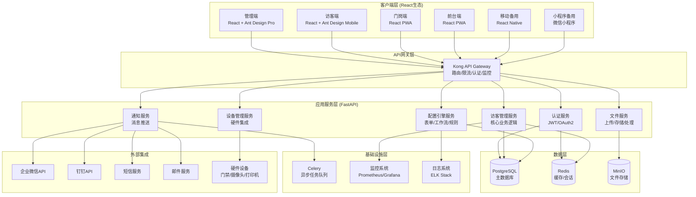
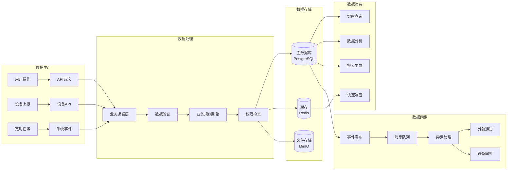
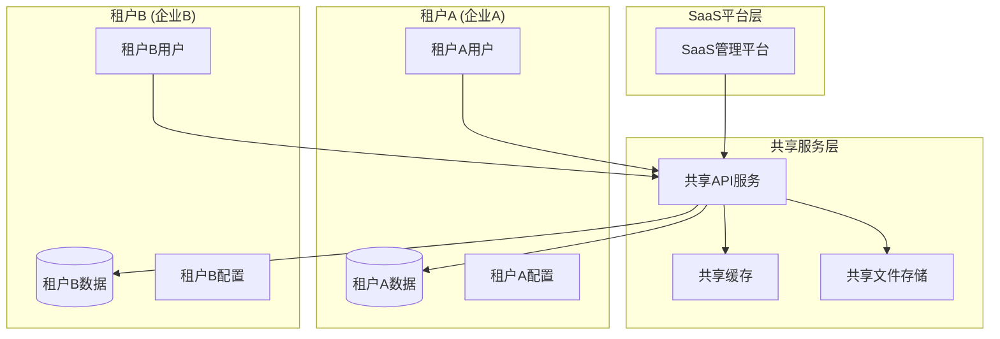
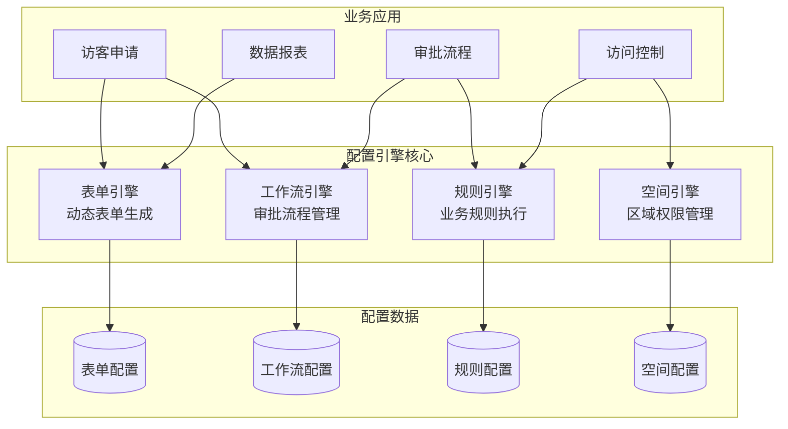
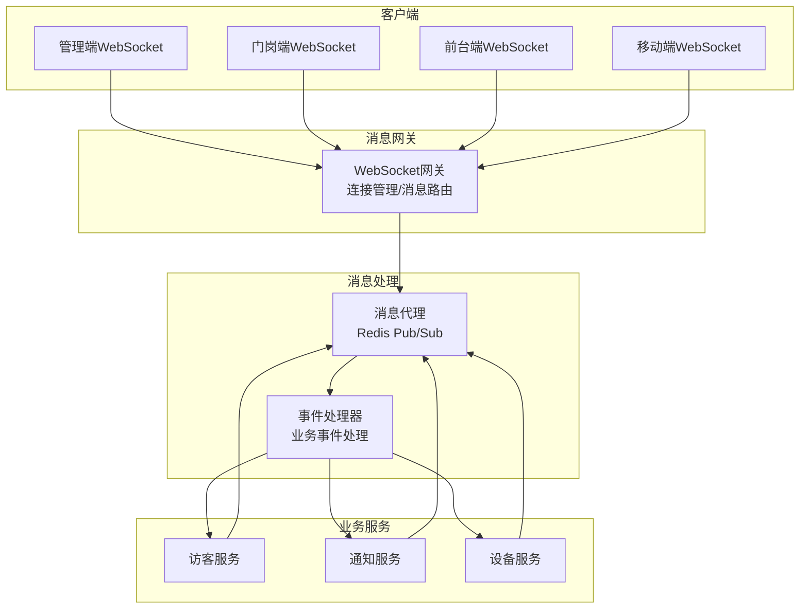
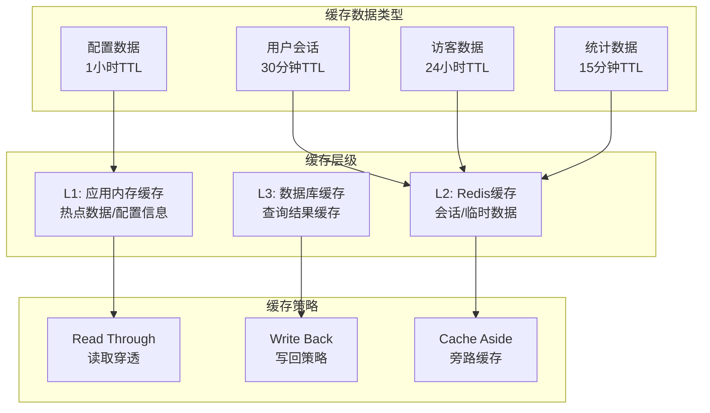
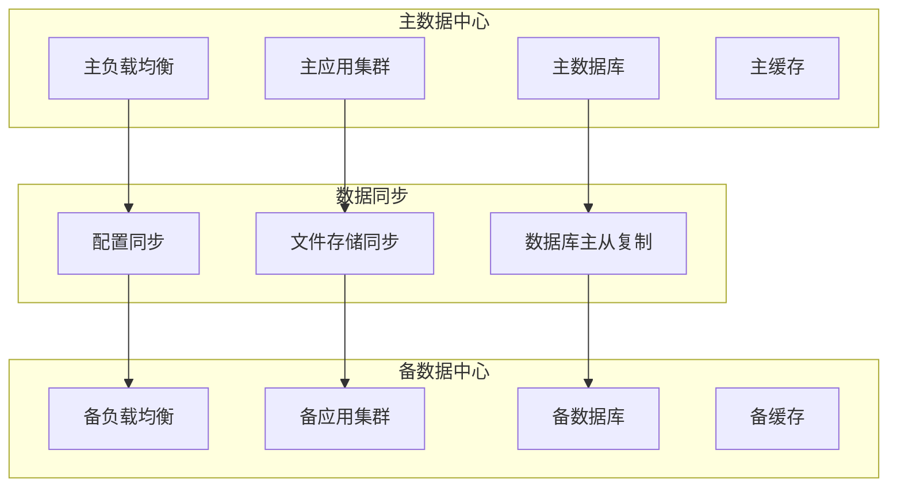
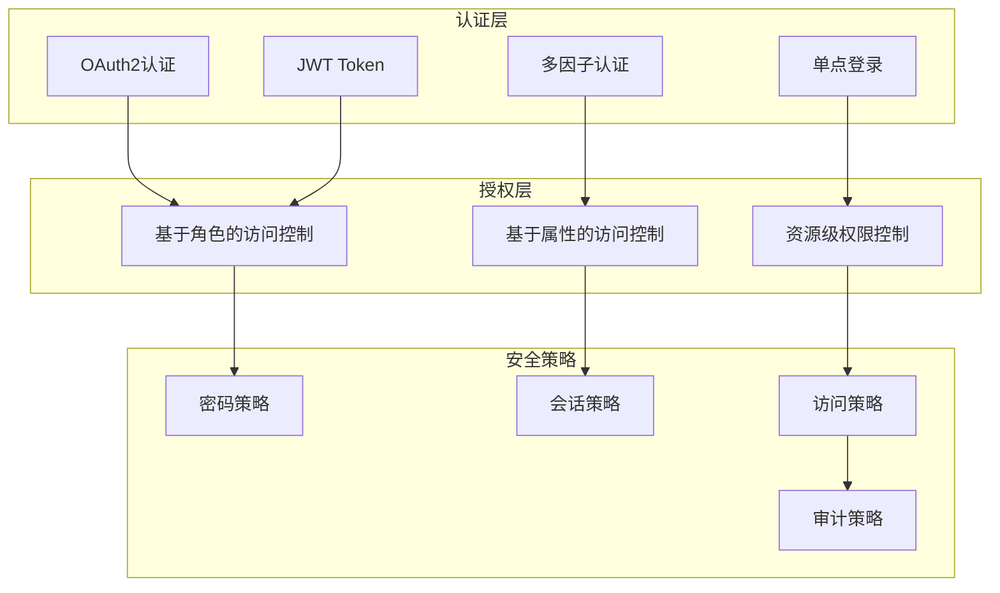

# 访客管理系统架构概览

## 📋 文档信息
- **版本**: v2.0.0
- **创建日期**: 2025-06-18
- **最后更新**: 2025-06-18
- **维护者**: 系统架构师AI
- **适用角色**: 系统架构师、技术负责人、开发团队
- **依赖文档**: PRD.md, functional-requirements.md

## 🎯 文档目标
提供访客管理系统的整体架构设计概述，包括技术选型、架构模式、核心组件和部署方案。

## 🏗️ 系统架构总览

### 架构设计原则
- **领域驱动设计(DDD)**: 基于业务领域建模，清晰的业务边界
- **清洁架构(Clean Architecture)**: 依赖倒置，核心业务逻辑独立
- **微服务架构**: 模块化设计，独立部署和扩展
- **多租户架构**: 数据隔离，共享资源，成本优化
- **事件驱动**: 异步处理，解耦组件，提升性能

### 技术栈选型

#### 前端技术栈 - React生态统一
```
管理端应用    : React 18 + TypeScript + Ant Design Pro
访客端应用    : React 18 + TypeScript + Ant Design Mobile  
门岗端应用    : React 18 + TypeScript + PWA
前台端应用    : React 18 + TypeScript + Ant Design
设备端应用    : React 18 + TypeScript + Embedded WebView

移动端备用方案:
- React Native APP (iOS/Android)
- 微信小程序 (访客端/员工端)
```

#### 后端技术栈 - 已成熟稳定
```
API框架      : FastAPI 0.100+ (Python 3.9+)
数据库       : PostgreSQL 14+ (主库) + Redis 6+ (缓存)
消息队列     : Celery + Redis (异步任务)
认证授权     : JWT + OAuth2 + RBAC
文件存储     : MinIO/阿里云OSS
监控日志     : Prometheus + Grafana + ELK Stack
```

#### 基础设施
```
容器化       : Docker + Docker Compose / Kubernetes
CI/CD        : GitHub Actions / GitLab CI
API网关      : Nginx + Kong/Traefik
负载均衡     : HAProxy / ALB
SSL证书      : Let's Encrypt / 商业证书
```

## 🎨 系统架构图

### 整体架构图


### 数据流架构图


## 🏛️ 核心架构模式

### 1. 清洁架构 (Clean Architecture)
```
┌─────────────────────────────────────────┐
│              Frameworks & Drivers        │  ← Web, Database, External APIs
├─────────────────────────────────────────┤
│           Interface Adapters            │  ← Controllers, Gateways, Presenters  
├─────────────────────────────────────────┤
│              Application                │  ← Use Cases, Services
├─────────────────────────────────────────┤
│               Enterprise                │  ← Entities, Domain Logic
└─────────────────────────────────────────┘
```

**层级职责**:
- **Enterprise Business Rules**: 核心实体和业务规则 (entities/)
- **Application Business Rules**: 应用用例和服务 (application/)
- **Interface Adapters**: 接口适配器和数据转换 (api/, repositories/)
- **Frameworks & Drivers**: 外部框架和驱动 (infrastructure/)

### 2. 领域驱动设计 (DDD)
```
访客管理域 (Visitor Domain)
├── 访客实体 (Visitor Entity)
├── 访问申请 (VisitApplication)
├── 审批流程 (ApprovalProcess)
└── 访客状态 (VisitorStatus)

组织管理域 (Organization Domain)  
├── 租户实体 (Tenant Entity)
├── 部门实体 (Department Entity)
├── 员工实体 (Employee Entity)
└── 权限管理 (Permission Management)

配置引擎域 (Configuration Domain)
├── 表单配置 (Form Configuration)
├── 工作流配置 (Workflow Configuration)
├── 业务规则配置 (Business Rules)
└── 空间配置 (Spatial Configuration)
```

### 3. 多租户架构


**租户隔离策略**:
- **数据隔离**: 每个租户独立的数据库schema
- **配置隔离**: 租户级别的独立配置
- **用户隔离**: 基于tenant_id的用户权限控制
- **资源隔离**: 计算资源按租户分配和监控

## 📱 多端应用架构

### 前端应用矩阵
| 应用端 | 技术栈 | 主要用户 | 核心功能 | 部署方式 |
|--------|--------|----------|----------|----------|
| 管理端 | React + Ant Design Pro | 管理员、HR | 系统配置、数据分析 | Web部署 |
| 访客端 | React + Ant Design Mobile | 访客 | 申请访问、查看状态 | Web + PWA |
| 门岗端 | React + PWA | 门岗人员 | 身份验证、放行控制 | PWA + 专用设备 |
| 前台端 | React + Ant Design | 前台人员 | 访客签到、接待服务 | Web + PWA |
| 设备端 | React + WebView | 硬件设备 | 自助服务、设备控制 | 嵌入式WebView |

### 移动端备用方案
| 方案类型 | 技术实现 | 适用场景 | 功能范围 |
|----------|----------|----------|----------|
| React Native APP | RN + TypeScript | 设备故障备用 | 完整验证功能 |
| 微信小程序 | 微信小程序框架 | 预算限制场景 | 基础验证功能 |
| 移动Web | React + PWA | 临时部署 | 核心验证功能 |

### 响应式设计适配
```
桌面端 (≥1200px)  : 完整功能界面，多列布局
平板端 (768-1199px): 适中功能界面，双列布局  
手机端 (≤767px)   : 核心功能界面，单列布局
```

## 🔧 核心技术组件

### 1. 配置引擎架构


### 2. 实时通信架构


### 3. 缓存架构设计


## 🚀 部署架构

### 开发环境部署
```yaml
开发环境 (Docker Compose):
  - 后端API: 1个容器 (FastAPI)
  - 数据库: 1个容器 (PostgreSQL)  
  - 缓存: 1个容器 (Redis)
  - 前端: 开发服务器 (npm run dev)
  - 文件存储: 本地存储

资源要求:
  - CPU: 4核心
  - 内存: 8GB
  - 存储: 50GB SSD
```

### 测试环境部署  
```yaml
测试环境 (Docker Swarm):
  - 后端API: 2个副本 + 负载均衡
  - 数据库: 主从架构
  - 缓存: Redis Cluster (3节点)
  - 前端: Nginx静态文件服务
  - 文件存储: MinIO集群

资源要求:
  - CPU: 8核心
  - 内存: 16GB  
  - 存储: 200GB SSD
```

### 生产环境部署
```yaml
生产环境 (Kubernetes):
  - 后端API: 3-5个Pod + HPA自动扩缩容
  - 数据库: 高可用PostgreSQL集群 
  - 缓存: Redis Cluster (6节点)
  - 前端: CDN + Nginx集群
  - 文件存储: 高可用MinIO集群
  - 监控: Prometheus + Grafana + ELK

资源要求:
  - CPU: 16-32核心
  - 内存: 64-128GB
  - 存储: 1TB+ SSD (数据) + NVMe (缓存)
```

### 灾备架构


## 📊 性能设计目标

### 响应时间目标
- **API响应**: 平均<200ms, 99%<500ms
- **页面加载**: 首屏<3秒, 交互<1秒
- **数据查询**: 简单查询<100ms, 复杂查询<1秒
- **文件上传**: 10MB文件<30秒

### 并发性能目标
- **同时在线用户**: >1000人
- **API TPS**: >500 TPS
- **数据库连接**: >100并发连接
- **WebSocket连接**: >2000并发连接

### 可用性目标
- **系统可用性**: 99.5% (年停机<43.8小时)
- **核心功能可用性**: 99.9% (年停机<8.76小时)
- **故障恢复时间**: <30分钟
- **数据备份**: RTO<4小时, RPO<1小时

## 🔒 安全架构设计

### 安全防护层级
```
┌─────────────────────────────────────────┐
│           网络安全层                      │  ← WAF, DDoS防护, 网络隔离
├─────────────────────────────────────────┤
│           接入安全层                      │  ← API网关, 限流, 认证
├─────────────────────────────────────────┤
│           应用安全层                      │  ← 输入验证, 权限控制, 加密
├─────────────────────────────────────────┤
│           数据安全层                      │  ← 数据加密, 脱敏, 审计
└─────────────────────────────────────────┘
```

### 认证授权架构


---
**文档版本**: v2.0.0 | **最后更新**: 2025-06-18 