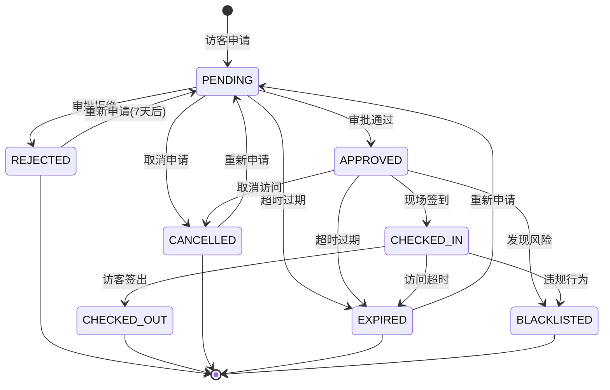
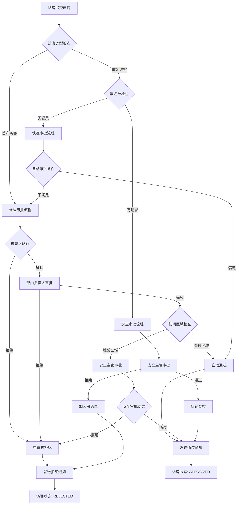

# 访客管理系统业务规则文档

## 📋 文档信息
- **版本**: v2.0.0
- **创建日期**: 2025-06-18
- **最后更新**: 2025-06-18
- **维护者**: 产品经理AI
- **适用角色**: 业务分析师、开发团队、产品经理
- **依赖文档**: PRD.md, functional-requirements.md

## 🎯 文档目标
定义访客管理系统的核心业务规则，包括状态转换、审批流程、权限控制、异常处理等关键业务逻辑。

## 📊 访客状态转换规则

### 状态定义
| 状态代码 | 状态名称 | 中文描述 | 允许操作 |
|----------|----------|----------|----------|
| PENDING | 待审批 | 访客申请已提交，等待审批 | 审批通过、拒绝、取消 |
| APPROVED | 已通过 | 审批通过，等待签到 | 签到、取消访问 |
| REJECTED | 已拒绝 | 审批被拒绝 | 重新申请(限制次数) |
| CHECKED_IN | 已签到 | 访客已签到入园 | 签出、延期申请 |
| CHECKED_OUT | 已签出 | 访客已签出离园 | 无(最终状态) |
| CANCELLED | 已取消 | 访问申请被取消 | 重新申请 |
| EXPIRED | 已过期 | 访问时间已过期 | 重新申请 |
| BLACKLISTED | 黑名单 | 访客被列入黑名单 | 申诉处理 |

### 状态转换矩阵
```
FROM/TO      → PENDING APPROVED REJECTED CHECKED_IN CHECKED_OUT CANCELLED EXPIRED BLACKLISTED
PENDING      →    -       ✓        ✓        -           -           ✓        ✓        ✓
APPROVED     →    -       -        -        ✓           -           ✓        ✓        ✓
REJECTED     →    ✓       -        -        -           -           -        -        ✓
CHECKED_IN   →    -       -        -        -           ✓           -        ✓        ✓
CHECKED_OUT  →    ✓       -        -        -           -           -        -        -
CANCELLED    →    ✓       -        -        -           -           -        -        -
EXPIRED      →    ✓       -        -        -           -           -        -        -
BLACKLISTED  →    -       -        -        -           -           -        -        -
```

### 状态转换业务规则

#### BR-001: 状态转换权限控制
**规则**: 只有特定角色才能执行状态转换操作
- **PENDING → APPROVED/REJECTED**: 仅管理员、部门负责人
- **APPROVED → CHECKED_IN**: 门岗人员、前台人员
- **CHECKED_IN → CHECKED_OUT**: 门岗人员、前台人员、访客本人
- **任意状态 → CANCELLED**: 申请人、管理员
- **任意状态 → BLACKLISTED**: 仅安全主管

#### BR-002: 自动状态转换
**规则**: 系统在特定条件下自动执行状态转换
- **APPROVED → EXPIRED**: 访问时间超过预约结束时间
- **CHECKED_IN → EXPIRED**: 实际访问时间超过最大允许时长
- **PENDING → EXPIRED**: 申请提交后72小时未审批
- **检查频率**: 每15分钟执行一次状态检查

#### BR-003: 状态转换约束条件
**规则**: 状态转换必须满足特定约束条件
- **签到约束**: 只能在预约时间前后2小时内签到
- **签出约束**: 必须在签到后才能签出
- **重复申请约束**: REJECTED/CANCELLED状态7天后才能重新申请
- **黑名单约束**: BLACKLISTED状态需要申诉审核通过才能解除

## 🔄 四大核心业务场景规则

### 场景1: 访客自主申请 (BR-100)

#### BR-101: 申请频率限制
- 同一访客24小时内最多提交3次申请
- 同一手机号每月最多申请20次
- 被拒绝申请后需等待7天才能重新申请同一被访人

#### BR-102: 访问时间约束
- 访问开始时间不能早于当前时间2小时
- 访问结束时间不能超过开始时间后24小时
- 非工作时间访问需要安全主管审批

#### BR-103: 被访人验证
- **个人访问**: 姓名+手机号双重验证，容错率≤10%
- **部门访问**: 自动分配部门负责人为审批人
- 被访人不存在或已离职时自动拒绝申请

### 场景2: 员工邀请已知访客 (BR-200)

#### BR-201: 员工邀请权限
- 普通员工：只能邀请访问自己权限区域的访客
- 部门主管：可邀请访问本部门区域的访客
- 高级管理层：可邀请访问除敏感区域外的所有区域

#### BR-202: 自动审批条件
- 员工权限级别≥3级 且 访客访问非敏感区域 → 自动通过
- 重复访客(30天内成功访问) 且 无黑名单记录 → 自动通过
- 内部会议参与者(系统生成邀请) → 自动通过

#### BR-203: 授权类型规则
- **临时授权**: 有效期≤7天，到期自动失效
- **长期授权**: 有效期≤90天，需要月度审查
- 长期授权仅限VIP访客或重要合作伙伴

### 场景3: 员工邀请未知访客 (BR-300)

#### BR-301: 邀请活动限制
- 每个员工同时最多创建5个有效邀请活动
- 邀请人数上限：普通员工≤50人，主管≤200人
- 邀请链接有效期：默认7天，可设置1-30天

#### BR-302: 访客报名规则
- 邀请码6位数字，24小时内有效
- 同一访客只能报名同一活动一次
- 报名人数达到上限时自动关闭报名

#### BR-303: 批量审批规则
- 员工可设置自动审批条件(如企业白名单)
- 批量审批时如发现黑名单访客需要单独处理
- 批量操作限制：单次最多处理100条记录

### 场景4: 员工批量邀请 (BR-400)

#### BR-401: Excel导入规则
- 支持格式：.xlsx, .csv，最大文件5MB
- 最大导入数量：单次500条记录
- 必填字段验证：姓名、手机号、身份证号、访问目的

#### BR-402: 数据验证规则
- 身份证号格式验证和校验码验证
- 手机号格式验证(支持国内11位手机号)
- 重复数据检测：同一批次内去重，与历史数据比对

#### BR-403: 批量处理规则
- 数据错误率≤20%：继续处理，生成错误报告
- 数据错误率>20%：终止处理，要求重新整理数据
- 成功导入后发送批量通知，失败记录可单独重试

## 🔐 权限控制业务规则

### 角色权限矩阵 (BR-500)

#### BR-501: 基础角色权限
| 角色 | 访客申请 | 访客审批 | 访客查看 | 系统配置 | 数据导出 |
|------|----------|----------|----------|----------|----------|
| 访客 | ✓(自己) | - | ✓(自己) | - | - |
| 员工 | ✓ | ✓(邀请) | ✓(相关) | - | - |
| 部门负责人 | ✓ | ✓(部门) | ✓(部门) | ✓(部门) | ✓(部门) |
| 管理员 | ✓ | ✓ | ✓ | ✓ | ✓ |
| 安全主管 | ✓ | ✓ | ✓ | ✓(安全) | ✓ |
| 门岗人员 | - | - | ✓(验证) | - | - |
| 前台人员 | - | - | ✓(签到) | - | - |

#### BR-502: 区域访问权限
- **公共区域**: 所有访客均可访问(大厅、会议室、餐厅)
- **办公区域**: 需要被访人员确认
- **敏感区域**: 需要安全主管审批(机房、财务室、高管办公室)
- **禁止区域**: 任何访客不可访问(档案室、安全监控室)

#### BR-503: 时间访问权限
- **工作时间**(8:00-18:00): 正常审批流程
- **延时访问**(18:00-22:00): 需要加班证明或特殊审批
- **夜间访问**(22:00-08:00): 仅限紧急情况，需要总经理审批

### 数据访问控制 (BR-520)

#### BR-521: 数据脱敏规则
- **身份证号**: 显示前6位和后4位，中间用*替代
- **手机号**: 显示前3位和后4位，中间用*替代
- **照片**: 非直接相关人员查看时自动模糊处理
- **敏感备注**: 仅创建人和管理员可查看完整内容

#### BR-522: 数据保留策略
- **访客基本信息**: 访客签出后保留30天
- **访问记录**: 永久保留，用于审计
- **照片数据**: 访客签出后7天自动删除
- **日志数据**: 保留1年，过期自动归档

## 🚨 异常处理业务规则

### 黑名单管理 (BR-600)

#### BR-601: 黑名单触发条件
- **手动添加**: 安保人员发现问题行为
- **自动识别**: 频繁申请被拒(1个月内3次以上)
- **异常行为**: 滞留超时、违规访问、恶意操作
- **外部数据**: 法院失信名单、公安黑名单等

#### BR-602: 黑名单处理策略
- **策略1(严格)**: 直接拒绝申请，通知安保部门
- **策略2(审慎)**: 转安全主管人工审批
- **策略3(宽松)**: 正常流程但增加监控记录

#### BR-603: 黑名单解除条件
- **申诉流程**: 访客可提交申诉，提供证明材料
- **审核期限**: 收到申诉后7个工作日内处理
- **解除审批**: 需要安全主管和总经理双重审批

### 紧急事件处理 (BR-700)

#### BR-701: 紧急模式启动
- **启动条件**: 火灾、地震、安全威胁、疫情等
- **启动权限**: 安全主管、总经理、值班领导
- **生效范围**: 全系统或指定区域

#### BR-702: 紧急模式规则
- **新申请暂停**: 停止接受新的访客申请
- **在园访客管控**: 实时统计在园访客数量和位置
- **紧急疏散**: 推送疏散路线，记录疏散状态
- **通信管制**: 关闭非紧急通知，优先紧急信息

#### BR-703: 紧急模式解除
- **解除条件**: 威胁解除，确认安全
- **解除权限**: 启动人员或更高级别领导
- **后续处理**: 生成事件报告，总结改进措施

### 设备故障处理 (BR-800)

#### BR-801: 设备离线检测
- **心跳检测**: 设备每5分钟发送心跳信号
- **离线判定**: 15分钟未收到心跳视为离线
- **告警机制**: 立即通知运维人员和管理员

#### BR-802: 备用验证方案
- **移动端验证**: 启用手机APP或微信小程序验证
- **人工验证**: 门岗人员手动验证身份证件
- **临时通行**: 核心访客可申请临时通行码

#### BR-803: 数据同步恢复
- **离线数据**: 设备恢复后自动上传离线期间数据
- **冲突处理**: 检测并处理数据冲突
- **完整性验证**: 验证数据完整性和一致性

## 📊 业务流程图表

### 访客状态转换图


### 审批流程图


## 📋 规则优先级和冲突解决

### 规则优先级 (BR-900)
1. **P0 - 安全规则**: 黑名单检查、区域访问控制
2. **P1 - 合规规则**: 数据保护、审计要求
3. **P2 - 业务规则**: 申请流程、审批规则
4. **P3 - 用户体验规则**: 便利性功能、界面优化

### 规则冲突解决 (BR-901)
- **安全 vs 便利**: 优先安全，提供替代方案
- **自动 vs 人工**: 关键决策保留人工干预
- **效率 vs 准确**: 在保证准确性前提下提升效率
- **标准 vs 定制**: 提供标准流程+灵活配置选项

---
**文档版本**: v2.0.0 | **最后更新**: 2025-06-18 